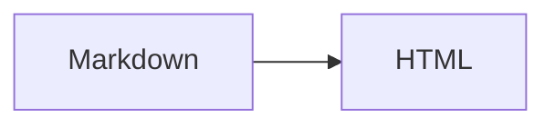

# m2h

[](https://codecov.io/gh/lz-wang/m2h)

`m2h` 是一个使用 Go 实现的命令行工具，用于把 Markdown 转换为 HTML，或在浏览器、终端中预览 Markdown。

> 当前状态：阶段 1–8 已交付；版本命令、共享 Markdown 渲染核心、`convert`、单文件与 React 目录 `preview`、终端 `view`，以及六平台正式发布链路均已可用。具体进度见 [PROGRESS.md](PROGRESS.md)。

## 命令概览

```text
m2h version

m2h convert <file|directory>
    --output/-o
    --glob
    --depth/-d
    --mode
    --width
    --copy-assets
    --unsafe-html

m2h preview <file|directory>
    --host
    --port/-p
    --browser
    --mode
    --width
    --unsafe-html
    --glob
    --depth/-d

m2h view <file>
    --mode
```

## 安装

从 [GitHub Releases](https://github.com/lz-wang/m2h/releases/latest) 下载对应平台和架构的压缩包：

```text
m2h_<version>_linux_{amd64,arm64}.tar.gz
m2h_<version>_darwin_{amd64,arm64}.tar.gz
m2h_<version>_windows_{amd64,arm64}.zip
```

每个包都包含 `m2h`（Windows 为 `m2h.exe`）、`README.md` 和 `LICENSE`，并提供同名 `.sha256` 文件。正式二进制内嵌 WebUI 与样式，不依赖安装目录或当前工作目录中的资源文件。

## 查看版本

```console
$ m2h version
0.8.0

$ m2h --version
0.8.0
```

正式发布只输出不带 `v` 的语义化版本。非 tag 开发构建使用 `dev-<commit date>-<commit7>`，例如 `dev-20260810-a12bc34`；日期取 Git commit date，不取构建日期。

## 转换为 HTML

转换单个文件：

```console
$ m2h convert README.md

$ m2h convert README.md --output public/index.html
```

转换成功时不写 stdout；上述命令分别生成 `README.html` 和 `public/index.html`。

批量转换目录：

```console
$ m2h convert docs --output public/docs
$ m2h convert docs/ --output public/docs --depth 3 --glob '**/plan_*.md'
```

目录末尾是否带 `/` 不影响语义。批量模式保留 Markdown 的相对目录结构；未指定 `--output` 时，HTML 写在源 Markdown 旁边。`--copy-assets` 默认为 `true`，非 Markdown 文件按原相对路径复制。

目录扫描不会递归跟随内部符号链接目录；符号链接文件只有在目标仍位于输入根目录内时才会读取。输出目录位于输入目录内时会从扫描中排除，文件使用临时文件加 rename 写入，批次冲突会在写入前失败。

主要选项：

- `--output, -o`：单文件的目标 HTML，或批量模式的目标目录。
- `--depth, -d`：目录递归深度，默认 `2`（输入目录和向下两层）。
- `--glob`：按相对输入根目录、使用 `/` 分隔的路径匹配 Markdown。
- `--mode`：`light`、`dark` 或 `auto`，默认 `auto`。
- `--width`：`standard`（980px）、`wide`（1280px）或 `full`（不限制最大宽度），默认 `standard`。
- `--unsafe-html`：显式允许 Markdown 中的原始 HTML，默认关闭。

本地资源路径保持不变，本地 Markdown 链接会改写为 HTML 链接：

```text
images/demo.png  -> images/demo.png
guide.md         -> guide.html
../guide.md      -> ../guide.html
https://...      -> 不修改
#install         -> 不修改
```

## 在浏览器中预览

预览单个 Markdown 文件：

```console
$ m2h preview README.md
m2h: previewing /work/m2h/README.md at http://127.0.0.1:8793/

$ m2h preview README.md --host 127.0.0.1 --port 8793 --browser
m2h: previewing /work/m2h/README.md at http://127.0.0.1:8793/
```

日志中的输入路径会解析为本机绝对路径；示例使用 `/work/m2h/README.md`。

单文件模式只显示 GitHub 风格正文，并监听文件所在目录以兼容编辑器的 atomic save；内容变化后通过 SSE 刷新页面。
服务默认监听 `127.0.0.1:8793`，启动后输出实际预览地址；按 Ctrl+C 或向进程发送终止信号会优雅关闭。`--browser` 默认关闭，仅在监听成功后尝试打开系统默认浏览器，打开失败不会停止服务。

Markdown 父目录内的本地图片与附件通过 `/assets/*` 提供；绝对路径、路径穿越、重复编码穿越和越界符号链接都会被拒绝。

浏览一个 Markdown 目录：

```console
$ m2h preview docs
$ m2h preview docs --glob '**/*.md' --depth 4 --mode dark --width wide
```

目录模式打开内嵌的 React 界面，桌面端由文件树侧栏和文档区组成；移动端可通过“切换文件导航”按钮打开侧栏。侧栏顶部可以按文档标题或文件名进行本地搜索，搜索不会发起额外网络请求。当前文件所在目录会自动展开，当前文档使用更明显的背景高亮且切换文件时不会自动滚动；其余目录默认折叠。悬浮文档项可同时查看文件名与文档标题。侧栏支持 `⌘/Ctrl+B` 切换，标题栏中的文档标题和所有功能按钮严格对齐；功能按钮使用悬浮提示，文档标题不显示悬浮提示。拖动后的侧栏宽度与侧栏展开状态会保存在浏览器本地；正文宽度由 URL 保存，不再读取旧版 localStorage 中的宽度数据。

文档路由形如 `/doc/design/architecture.md?mode=auto&width=standard`。选择文件会写入浏览器历史，直接刷新、前进和后退都会恢复对应文档。查询参数 `mode` 与 `width` 始终记录当前主题和正文宽度；界面顶部可随时切换，`--mode` 与 `--width` 决定服务启动时输出和打开的初始 URL。单文件 `preview` 和 `convert` 生成的独立页面同样应用 `--width`。

刷新按钮会重新扫描文件树：当前文档仍存在时保持选择，已删除时依次回退到根目录的 `README.md`、根目录的 `index.md` 或排序后的第一个 Markdown。目录模式不自动监听文件；每次打开文档仍从磁盘读取最新内容。空目录、加载失败、文档删除和附件失败会在界面内给出状态反馈。

目录模式的请求日志采用 `时间戳 | 客户端 IP [方法] 请求位置 [状态码] 耗时` 格式，耗时以毫秒显示并保留一位小数，例如：

```text
2026-08-10 12:34:56 | 127.0.0.1 [GET] /api/document?path=guide.md [200] 1.2ms
```

同一服务提供以下 API：

- `GET /api/files`：返回按相对路径排序的文件列表和 `defaultPath`。每个文件包含 `path`、`name`、由 Go AST 提取的 `title`。
- `GET /api/document?path=<relative-path>`：从磁盘读取最新内容，返回 `path`、`title` 和 Markdown 正文 `html`。
- `GET /assets/<relative-path>`：提供输入根目录内的非 Markdown 附件。
- `GET /doc/<relative-markdown-path>`：返回嵌入的 SPA 入口，支持深链接直接刷新。

页面顶部和浏览器标签标题直接使用 API 返回的 `title`；React 不会重新解析服务端 HTML 来猜测标题。WebUI、组件样式和共享 Markdown CSS 都嵌入单个 Go 二进制，不依赖启动时的工作目录文件。

## 在终端中预览

```console
$ NO_COLOR=1 m2h view guide.md --mode dark
   Guide

  • terminal

$ m2h view README.md --mode auto
```

`view` 使用 Glamour 在当前终端渲染一个本地 Markdown 文件，不启动 Web 服务，也不接受目录或非 Markdown 输入。`--mode` 支持 `light`、`dark` 和默认的 `auto`；`auto` 会在真实终端中探测背景，无法探测或输出被重定向时稳定使用 dark 样式。

设置非空的 `NO_COLOR` 会禁用 ANSI 颜色；管道或文件等非 TTY 输出也会自动移除颜色控制序列。输入读取或渲染失败时不会先写出半截成功内容，取消命令会返回非零退出码。

## Markdown 与页面样式

- Markdown 语法固定为标准 GFM，不提供额外扩展选项；代码块支持语法高亮。
- `convert` 与 `preview` 共用同一个 AST 解析、标题提取、链接改写和完整页面渲染核心；`view` 复用相同的标准 GFM 配置，但使用独立的终端 ANSI renderer，不复制浏览器 HTML/CSS 路径。
- HTML 使用内置的 `github-markdown-css` 5.9.0，正文最大宽度为 `980px`。
- 桌面端正文 padding 为 `45px`；宽度不超过 `767px` 时为 `15px`。
- raw HTML 与危险 URL 默认不渲染，只有显式传入 `--unsafe-html` 才允许 raw HTML。

### 数学公式与图表

数学公式与 Mermaid 图表作为浏览器端 HTML 表现层渲染，目录预览、单文件 `preview` 与 `convert` 输出行为一致；运行时内嵌于二进制，不依赖 CDN，生成的 HTML 可离线打开。

数学公式使用 KaTeX，推荐用 `$...$`（行内）和 `$$...$$`（行间）：

```text
行内：$E = mc^2$

行间：
$$
\int_0^\infty e^{-x^2}\,dx = \frac{\sqrt{\pi}}{2}
$$
```

需要字面美元符号时写作 `\$`。`\(...\)` 与 `\[...\]` 因 CommonMark 反斜杠转义会被吞掉反斜杠，请改用 `$` 形式。

Mermaid 图表使用 `mermaid` 围栏代码块：

````text

````

`convert` 在输出目录写入共享的 `.m2h/` 运行时（KaTeX、Mermaid 与字体），单文件 `preview` 通过 `/m2h-assets/` 路由提供同一套资源。

## 参数错误

未知参数和不适用于当前输入类型的参数会直接失败，不会静默忽略：

```text
Error: unknown option
Error: --glob can only be used when converting a directory
Error: --glob can only be used when previewing a directory
```

## 从源码构建

开发环境入口统一由 Makefile 提供：

```console
$ make setup
$ make build
$ make test
$ make check
$ make build-all
$ make dist
$ make help
```

`make build-all` 交叉构建 linux、darwin、windows 的 amd64/arm64 六个目标；`make dist` 生成六个发布包和 `dist/checksums.txt`。main 与正式 tag workflow 还会在 Linux、macOS、Windows 原生运行 version、convert、preview、view smoke tests。

## 许可证

[MIT](LICENSE)
