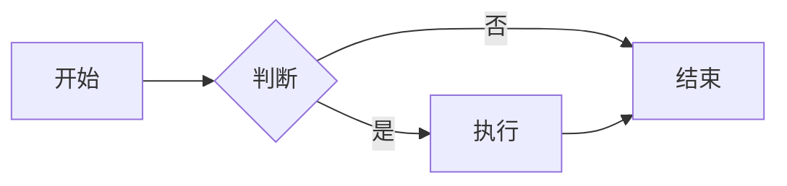
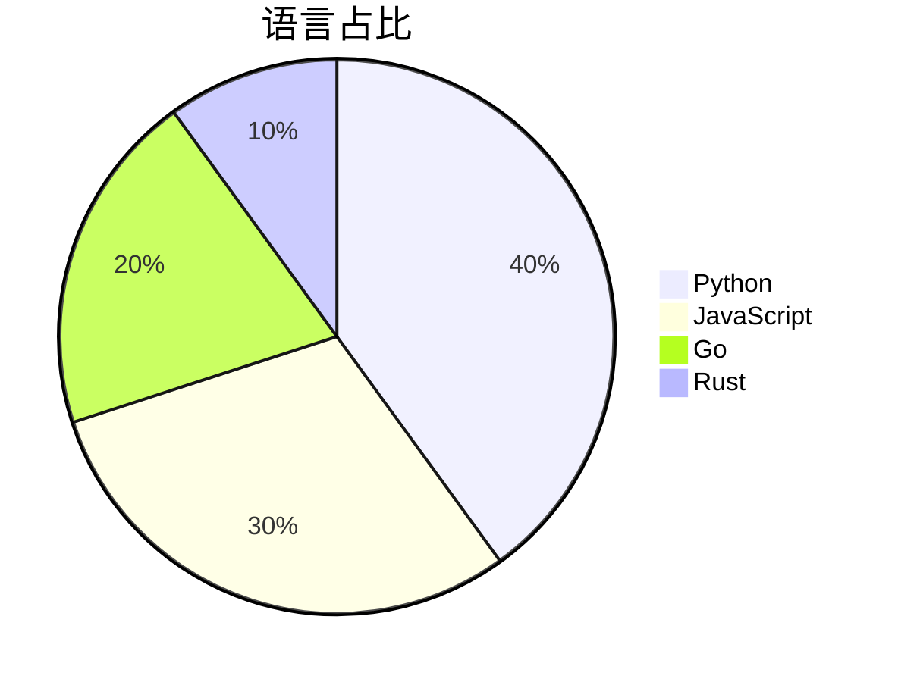
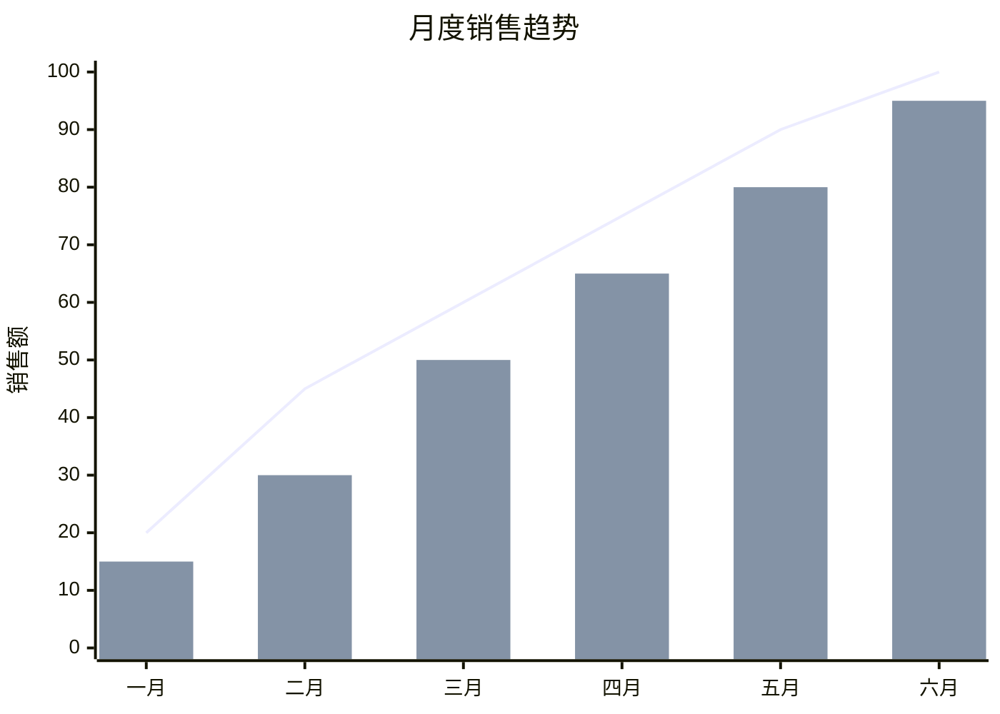

# m2h 支持Markdown语法完整示例


## 1. 标题

### ATX 风格标题（1~6 级）

# H1 一级标题
## H2 二级标题
### H3 三级标题
#### H4 四级标题
##### H5 五级标题
###### H6 六级标题

#### 带闭合井号的标题 ###

### Setext 风格标题

一级标题（下方为等号）
===

二级标题（下方为连字符）
---

> 注意：Setext 标题的底线至少一个字符，`=` 对应 H1，`-` 对应 H2。

## 2. 段落与换行

这是一个普通段落，包含**加粗**、*斜体* 与 `行内代码` 等行内格式。

这是段落的第一行
这是第二行（软换行：源代码换行，但渲染为同一段落内的换行，不产生新段落）。

这是段落的第一行  
这是第二行（行尾两个空格：硬换行，渲染为 `<br>`）。

这是段落的第一行\
这也是硬换行（行尾反斜杠，部分渲染器支持）。

## 3. 文本强调与修饰

*斜体* 与 _斜体_（下划线式，单词中间不生效，如 a_b_c）  
**加粗** 与 __加粗__  
***粗斜体*** 与 ___粗斜体___  
~~删除线~~（GFM 扩展）  
<u>下划线（HTML 标签）</u>  
==高亮==（m2h 扩展，渲染为 `<mark>`）  
^^插入文本^^（m2h 扩展，渲染为 `<ins>`）  
上标<sup>TM</sup>、下标<sub>2</sub>（HTML 标签）  
<kbd>Ctrl</kbd> + <kbd>C</kbd> 按键样式（HTML 标签，m2h 还支持 `++ctrl+c++` 语法，详见第 19 节）

## 4. 列表

### 无序列表（`-` / `*` / `+`）

- 苹果
- 香蕉
- 樱桃
  - 嵌套项 A
  - 嵌套项 B
    - 更深一层

### 有序列表

1. 第一项
2. 第二项
3. 第三项
   1. 嵌套有序项
   2. 嵌套有序项

### 混合列表（有序内嵌无序）

1. 有序项一
   - 嵌套无序项
2. 有序项二
   - 另一个嵌套项

- 无序列表项
  1. 嵌套有序项

### 任务列表（GFM 扩展）

- [x] 已完成任务
- [ ] 未完成任务
- [ ] 带嵌套的任务
  - [x] 子任务已完成
  - [ ] 子任务未完成

## 5. 链接

### 内联式链接

[GitHub](https://github.com)  
[带标题提示的链接](https://github.com "GitHub 首页")  
[相对链接](../docs/readme.md)  
[带格式的链接文本](https://example.com **粗体**)

### 引用式链接

[引用式链接][ref1] 和 [引用式无标题][ref2]，还有[快捷引用式][]。

[ref1]: https://github.com "GitHub"
[ref2]: https://example.com
[快捷引用式]: https://example.com

### 自动链接（尖括号包裹）

访问 <https://github.com> 或发送邮件到 <support@github.com>。

### 裸 URL 自动链接（GFM 扩展，无需尖括号）

自动识别：https://github.com/octocat 以及 www.example.com。

## 6. 图片


### 可点击图片（图片嵌套链接）

[](https://github.com)

### 引用式图片

![引用式图片][img1]

[img1]: https://github.com/fluidicon.png

## 7. 代码

### 行内代码

使用 `code` 或双反引号包裹含反引号的内容：`` `code with backtick` ``。

### 围栏代码块（GFM 扩展）+ 语法高亮

```python
def hello(name: str) -> str:
    """带语法高亮的 Python 代码块"""
    return f"Hello, {name}!"
```

```js
console.log('JavaScript 高亮');
```

### 无语言标注的代码块

```
纯文本代码块，不进行高亮。
```

### 围栏内嵌套反引号（4 个反引号包裹 3 个）

````
可以包含 ``` 三重反引号 ``` 内容
````

### 缩进代码块（四个空格）

    缩进四个空格的代码块。
    第二行。

## 8. 表格（GFM 扩展）

| 语法 | 对齐方式 | 示例 |
| :--- | :---: | ---: |
| `:---` | 左对齐 | 文本靠左 |
| `:---:` | 居中对齐 | 文本居中 |
| `---:` | 右对齐 | 文本靠右 |
| `**加粗**` | 单元格内行内格式 | **加粗** |
| `\|` | 转义管道符 | 单元格内 \| 管道 |

### 不带对齐分隔的简化表格

| 第一列 | 第二列 |
| --- | --- |
| A | B |

## 9. 引用块

> 这是一个引用块。
> 多行引用可以连续使用 `>`。
>
> > 嵌套引用
> >
> > - 引用内的列表
> > - 第二项
>
> 引用内的代码：
>
> ```js
> console.log("hi");
> ```

## 10. 水平分割线

---

***

___

以上三种写法（`---` / `***` / `___`）均渲染为 `<hr>`。

## 11. HTML 块

### HTML 表格

<table>
  <tr>
    <th>名称</th>
    <th>值</th>
  </tr>
  <tr>
    <td>HTML 表格</td>
    <td>42</td>
  </tr>
</table>

### 折叠块（details / summary）

<details>
<summary>点击展开 / 收起</summary>

这里是折叠内容，内部支持 Markdown：

- 列表项
- **加粗文本**

```python
print("inside details")
```

</details>

### 其他内联 HTML

<span style="color:red">红色文字</span>、<mark>标记文字</mark>、<sub>下标</sub>、<sup>上标</sup>。

## 12. 转义字符

\*不是斜体\*  
\# 不是标题  
\[不是链接](https://example.com)  
\` 不是代码  
反斜杠本身需要转义：\\  
\> 不是引用  \- 不是列表  \| 不是表格分隔

## 13. 脚注（GitHub 支持）

GFM（GitHub）支持脚注[^1]，也支持多次引用[^note]和[^note]复用。

[^1]: 第一条脚注的说明文字。
[^note]: 第二条脚注，内部支持**格式**与 `代码`。


## 14. 表情符号

:smile: :rocket: :tada: :heart:  
😀 🚀 🎉 ❤️ （Unicode 直接输入同样有效）

## 15. 标题 ID 与锚点链接

### 自定义锚点 {#custom-anchor}

[跳转到自定义锚点](#custom-anchor)  
[跳转到第 1 节](#1-标题)  
[跳转到第 7 节](#7-代码)

> GitHub 会自动为标题生成锚点：转小写、空格转连字符、移除标点。

## 16. 数学公式（GitHub 支持 LaTeX）

行内公式：$E = mc^2$

独立公式：

$$
\int_{-\infty}^{\infty} e^{-x^2} \, dx = \sqrt{\pi}
$$

## 17. Mermaid 图表（GitHub 支持）

### 流程图



### 饼图



### xychart-beta（标签勿用空字符串、标题勿用 emoji）



## 18. 警告框（GitHub Alerts）

> [!NOTE]
> 有用的信息，用户应当了解，即使跳过也不影响。

> [!TIP]
> 帮助用户更上一层楼的建议。

> [!IMPORTANT]
> 用户成功所必需的关键信息。

> [!WARNING]
> 需要注意的紧急内容。

> [!CAUTION]
> 可能导致负面后果的警告。

## 19. 扩展标记（m2h 扩展）

m2h 在 GFM 之外额外支持一套行内与块级扩展标记，语义借鉴 [PyMdown Extensions](https://facelessuser.github.io/pymdown-extensions/)。下方示例均为实时渲染效果。

### 高亮与插入文本

- `==高亮==` 渲染为 `<mark>`
- `^^插入文本^^` 渲染为 `<ins>`（带下划线）
- 两者都支持内部嵌套其他行内格式

实时示例：这是一句 ==重点高亮== 与 ^^新增插入^^ 的文本，也可以 ==**加粗高亮**==，或把 ^^[链接](https://example.com)^^ 整体标记为插入。

### 键盘按键

`++键+键++` 渲染为一组按键，用 `+` 连接多个键；已知按键会归一化显示（如 `ctrl` → Ctrl），未知按键保留原文。

实时示例：复制用 ++ctrl+c++，切换窗口用 ++alt+tab++，刷新页面按 ++f5++，三键组合 ++ctrl+shift+esc++ 打开任务管理器。

> 注意：`C++`、`a + b` 等普通文本里的 `+` 不会被识别为按键。

### Critic 协作标记（行内）

用 `{ ... }` 包裹的协作标注，适合审阅与修订场景：

| 写法 | 渲染效果 |
| --- | --- |
| `{==文字==}` | {==高亮示例==} |
| `{>>评注<<}` | {>>这里是评注意见<<} |
| `{--删除--}` | {--删除示例--} |
| `{++新增++}` | {++新增示例++} |
| `{~~旧~>新~~}` | {~~旧文本~>新文本~~} |

实时示例：这段文字里 {==有待确认==} 的部分，{>>这里建议精简<<}，同时 {--删除这句--} 并 {++补充一句++}，最后把 {~~v1~>v2~~} 升级。

### Critic 协作标记（块级）

把 `{==`、`{++` 或 `{--` 单独写在一行开启，再用 `==}`、`++}` 或 `--}` 结束，即可标注整段内容；段内仍按正常 Markdown 解析。

{==

这是一整段需要审阅的内容，内部支持完整 Markdown：

- 列表项一
- **加粗的**列表项二

==}

{++

新增的整段说明，同样支持 [链接](https://example.com) 与 `行内代码`。

++}

{--

废弃的整段内容，可以整块删除。

--}

## 20. 组合用法综合示例

> [!TIP]
> **任务看板**示例：任务列表、表格与折叠块组合。
>
> | 状态 | 任务 | 负责人 |
> | :---: | :--- | :--- |
> | ✅ | [ ] 完成设计稿 | @designer |
> | 🚧 | [ ] 开发 API | @dev |
>
> <details>
> <summary>展开细节</summary>
>
> - [x] 需求评审
> - [ ] 编码实现
> - [ ] 测试上线
>
> </details>
