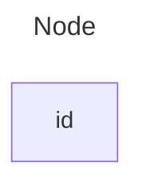
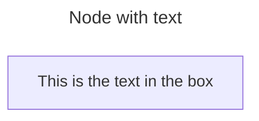
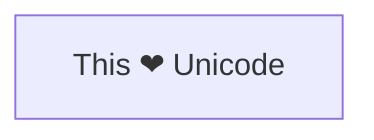
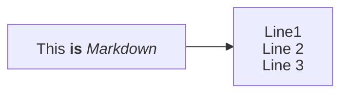
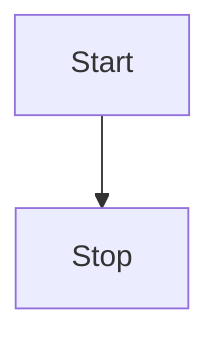
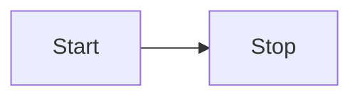
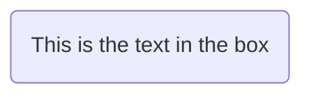
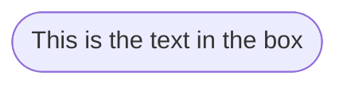
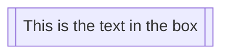
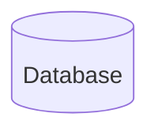

流程图由**节点**（几何形状）和**边**（箭头或线条）组成。Mermaid 代码定义了节点和边的创建方式，支持不同的箭头类型、多方向箭头以及与子图的连接。


> [!WARNING]
> 如果在流程图节点中使用 "end" 这个词，请将整个单词或其中的字母大写（例如 "End" 或 "END"），或应用此 [workaround](https://github.com/mermaid-js/mermaid/issues/1444#issuecomment-639528897)。全部小写的 "end" 会破坏流程图。
>


> [!WARNING]
> 如果使用字母 "o" 或 "x" 作为连接节点的首字母，请在字母前加空格或将字母大写（例如 "dev--- ops"、"dev---Ops"）。输入 "A---oB" 会创建圆形边，输入 "A---xB" 会创建交叉边。
>

### 节点（默认）



````markdown

````

> 节点的 id 就是显示在方框中的内容。

> 除了 `flowchart`，也可以使用 `graph`。

### 带文本的节点

可以设置方框中显示的文本与 id 不同。如果多次设置，将使用最后一次找到的文本。如果后续定义了边的连接，可以省略文本定义，渲染时会使用之前定义的文本。



````markdown

````

#### Unicode 文本

使用 `"` 包裹 unicode 文本。



````markdown

````

#### Markdown 格式

使用双引号和反引号 `` "` text `" `` 包裹 markdown 文本。



````markdown

````

### 方向

此语句声明流程图的方向。

声明流程图从上到下（`TD` 或 `TB`）：



````markdown

````

声明流程图从左到右（`LR`）：



````markdown

````

可能的流程图方向：

- TB - 从上到下
- TD - 从上到下（同 TB）
- BT - 从下到上
- RL - 从右到左
- LR - 从左到右

## 节点形状

### 圆角节点



````markdown

````

### 体育场形节点



````markdown

````

### 子程序形状节点



````markdown

````

### 圆柱形节点



````markdown

````

### 圆形节点

```mermaid
flowchart LR
    id1((This is the text in the circle))
```

````markdown
```mermaid
flowchart LR
    id1((This is the text in the circle))
```
````

### 不对称形状节点

```mermaid
flowchart LR
    id1>This is the text in the box]
```

````markdown
```mermaid
flowchart LR
    id1>This is the text in the box]
```
````

目前只有上面的形状，没有它的镜像。*这可能会在未来版本中改变。*

### 菱形节点

```mermaid
flowchart LR
    id1{This is the text in the box}
```

````markdown
```mermaid
flowchart LR
    id1{This is the text in the box}
```
````

### 六边形节点

```mermaid
flowchart LR
    id1{{This is the text in the box}}
```

````markdown
```mermaid
flowchart LR
    id1{{This is the text in the box}}
```
````

### 平行四边形

```mermaid
flowchart TD
    id1[/This is the text in the box/]
```

````markdown
```mermaid
flowchart TD
    id1[/This is the text in the box/]
```
````

### 平行四边形（反向）

```mermaid
flowchart TD
    id1[\This is the text in the box\]
```

````markdown
```mermaid
flowchart TD
    id1[\This is the text in the box\]
```
````

### 梯形

```mermaid
flowchart TD
    A[/Christmas\]
```

````markdown
```mermaid
flowchart TD
    A[/Christmas\]
```
````

### 梯形（反向）

```mermaid
flowchart TD
    B[\Go shopping/]
```

````markdown
```mermaid
flowchart TD
    B[\Go shopping/]
```
````

### 双圆

```mermaid
flowchart TD
    id1(((This is the text in the circle)))
```

````markdown
```mermaid
flowchart TD
    id1(((This is the text in the circle)))
```
````

## 扩展节点形状（v11.3.0+）

Mermaid 引入了 30 个新形状来增强流程图创建的灵活性和精确性。这些新形状提供了更多选项来可视化地表示流程、决策、事件、数据存储等元素。

新形状定义语法：

```text
A@{ shape: rect }
```

此语法创建一个矩形节点 A，渲染效果与 `A["A"]` 或 `A` 相同。

### 示例流程图

```mermaid
flowchart RL
    A@{ shape: manual-file, label: "File Handling"}
    B@{ shape: manual-input, label: "User Input"}
    C@{ shape: docs, label: "Multiple Documents"}
    D@{ shape: procs, label: "Process Automation"}
    E@{ shape: paper-tape, label: "Paper Records"}
```

````markdown
```mermaid
flowchart RL
    A@{ shape: manual-file, label: "File Handling"}
    B@{ shape: manual-input, label: "User Input"}
    C@{ shape: docs, label: "Multiple Documents"}
    D@{ shape: procs, label: "Process Automation"}
    E@{ shape: paper-tape, label: "Paper Records"}
```
````

### Process

```mermaid
flowchart TD
    A@{ shape: rect, label: "This is a process" }
```

````markdown
```mermaid
flowchart TD
    A@{ shape: rect, label: "This is a process" }
```
````

### Event

```mermaid
flowchart TD
    A@{ shape: rounded, label: "This is an event" }
```

````markdown
```mermaid
flowchart TD
    A@{ shape: rounded, label: "This is an event" }
```
````

### Terminal Point (Stadium)

```mermaid
flowchart TD
    A@{ shape: stadium, label: "Terminal point" }
```

````markdown
```mermaid
flowchart TD
    A@{ shape: stadium, label: "Terminal point" }
```
````

### Subprocess

```mermaid
flowchart TD
    A@{ shape: subproc, label: "This is a subprocess" }
```

````markdown
```mermaid
flowchart TD
    A@{ shape: subproc, label: "This is a subprocess" }
```
````

### Database (Cylinder)

```mermaid
flowchart TD
    A@{ shape: cyl, label: "Database" }
```

````markdown
```mermaid
flowchart TD
    A@{ shape: cyl, label: "Database" }
```
````

### Start (Circle)

```mermaid
flowchart TD
    A@{ shape: circle, label: "Start" }
```

````markdown
```mermaid
flowchart TD
    A@{ shape: circle, label: "Start" }
```
````

### Odd

```mermaid
flowchart TD
    A@{ shape: odd, label: "Odd shape" }
```

````markdown
```mermaid
flowchart TD
    A@{ shape: odd, label: "Odd shape" }
```
````

### Decision (Diamond)

```mermaid
flowchart TD
    A@{ shape: diamond, label: "Decision" }
```

````markdown
```mermaid
flowchart TD
    A@{ shape: diamond, label: "Decision" }
```
````

### Prepare Conditional (Hexagon)

```mermaid
flowchart TD
    A@{ shape: hex, label: "Prepare conditional" }
```

````markdown
```mermaid
flowchart TD
    A@{ shape: hex, label: "Prepare conditional" }
```
````

### Data Input/Output (Lean Right)

```mermaid
flowchart TD
    A@{ shape: lean-r, label: "Input/Output" }
```

````markdown
```mermaid
flowchart TD
    A@{ shape: lean-r, label: "Input/Output" }
```
````

### Data Input/Output (Lean Left)

```mermaid
flowchart TD
    A@{ shape: lean-l, label: "Output/Input" }
```

````markdown
```mermaid
flowchart TD
    A@{ shape: lean-l, label: "Output/Input" }
```
````

### Datastore

```mermaid
flowchart TD
    A@{ shape: datastore, label: "Datastore" }
```

````markdown
```mermaid
flowchart TD
    A@{ shape: datastore, label: "Datastore" }
```
````

### Priority Action (Trapezoid Base Bottom)

```mermaid
flowchart TD
    A@{ shape: trap-b, label: "Priority action" }
```

````markdown
```mermaid
flowchart TD
    A@{ shape: trap-b, label: "Priority action" }
```
````

### Manual Operation (Trapezoid Base Top)

```mermaid
flowchart TD
    A@{ shape: trap-t, label: "Manual operation" }
```

````markdown
```mermaid
flowchart TD
    A@{ shape: trap-t, label: "Manual operation" }
```
````

### Stop (Double Circle)

```mermaid
flowchart TD
    A@{ shape: dbl-circ, label: "Stop" }
```

````markdown
```mermaid
flowchart TD
    A@{ shape: dbl-circ, label: "Stop" }
```
````

### Text Block

```mermaid
flowchart TD
    A@{ shape: text, label: "This is a text block" }
```

````markdown
```mermaid
flowchart TD
    A@{ shape: text, label: "This is a text block" }
```
````

### Card (Notched Rectangle)

```mermaid
flowchart TD
    A@{ shape: notch-rect, label: "Card" }
```

````markdown
```mermaid
flowchart TD
    A@{ shape: notch-rect, label: "Card" }
```
````

### Lined/Shaded Process

```mermaid
flowchart TD
    A@{ shape: lin-rect, label: "Lined process" }
```

````markdown
```mermaid
flowchart TD
    A@{ shape: lin-rect, label: "Lined process" }
```
````

### Start (Small Circle)

```mermaid
flowchart TD
    A@{ shape: sm-circ, label: "Small start" }
```

````markdown
```mermaid
flowchart TD
    A@{ shape: sm-circ, label: "Small start" }
```
````

### Stop (Framed Circle)

```mermaid
flowchart TD
    A@{ shape: framed-circle, label: "Stop" }
```

````markdown
```mermaid
flowchart TD
    A@{ shape: framed-circle, label: "Stop" }
```
````

### Fork/Join (Long Rectangle)

```mermaid
flowchart TD
    A@{ shape: fork, label: "Fork or Join" }
```

````markdown
```mermaid
flowchart TD
    A@{ shape: fork, label: "Fork or Join" }
```
````

### Collate (Hourglass)

```mermaid
flowchart TD
    A@{ shape: hourglass, label: "Collate" }
```

````markdown
```mermaid
flowchart TD
    A@{ shape: hourglass, label: "Collate" }
```
````

### Comment (Curly Brace)

```mermaid
flowchart TD
    A@{ shape: comment, label: "Comment" }
```

````markdown
```mermaid
flowchart TD
    A@{ shape: comment, label: "Comment" }
```
````

### Comment Right (Curly Brace Right)

```mermaid
flowchart TD
    A@{ shape: brace-r, label: "Comment" }
```

````markdown
```mermaid
flowchart TD
    A@{ shape: brace-r, label: "Comment" }
```
````

### Comment with braces on both sides

```mermaid
flowchart TD
    A@{ shape: braces, label: "Comment" }
```

````markdown
```mermaid
flowchart TD
    A@{ shape: braces, label: "Comment" }
```
````

### Com Link (Lightning Bolt)

```mermaid
flowchart TD
    A@{ shape: bolt, label: "Communication link" }
```

````markdown
```mermaid
flowchart TD
    A@{ shape: bolt, label: "Communication link" }
```
````

### Document

```mermaid
flowchart TD
    A@{ shape: doc, label: "Document" }
```

````markdown
```mermaid
flowchart TD
    A@{ shape: doc, label: "Document" }
```
````

### Delay (Half-Rounded Rectangle)

```mermaid
flowchart TD
    A@{ shape: delay, label: "Delay" }
```

````markdown
```mermaid
flowchart TD
    A@{ shape: delay, label: "Delay" }
```
````

### Direct Access Storage (Horizontal Cylinder)

```mermaid
flowchart TD
    A@{ shape: das, label: "Direct access storage" }
```

````markdown
```mermaid
flowchart TD
    A@{ shape: das, label: "Direct access storage" }
```
````

### Disk Storage (Lined Cylinder)

```mermaid
flowchart TD
    A@{ shape: lin-cyl, label: "Disk storage" }
```

````markdown
```mermaid
flowchart TD
    A@{ shape: lin-cyl, label: "Disk storage" }
```
````

### Display (Curved Trapezoid)

```mermaid
flowchart TD
    A@{ shape: curv-trap, label: "Display" }
```

````markdown
```mermaid
flowchart TD
    A@{ shape: curv-trap, label: "Display" }
```
````

### Divided Process (Divided Rectangle)

```mermaid
flowchart TD
    A@{ shape: div-rect, label: "Divided process" }
```

````markdown
```mermaid
flowchart TD
    A@{ shape: div-rect, label: "Divided process" }
```
````

### Extract (Small Triangle)

```mermaid
flowchart TD
    A@{ shape: tri, label: "Extract" }
```

````markdown
```mermaid
flowchart TD
    A@{ shape: tri, label: "Extract" }
```
````

### Internal Storage (Window Pane)

```mermaid
flowchart TD
    A@{ shape: win-pane, label: "Internal storage" }
```

````markdown
```mermaid
flowchart TD
    A@{ shape: win-pane, label: "Internal storage" }
```
````

### Junction (Filled Circle)

```mermaid
flowchart TD
    A@{ shape: f-circ, label: "Junction" }
```

````markdown
```mermaid
flowchart TD
    A@{ shape: f-circ, label: "Junction" }
```
````

### Lined Document

```mermaid
flowchart TD
    A@{ shape: lin-doc, label: "Lined document" }
```

````markdown
```mermaid
flowchart TD
    A@{ shape: lin-doc, label: "Lined document" }
```
````

### Loop Limit (Notched Pentagon)

```mermaid
flowchart TD
    A@{ shape: notch-pent, label: "Loop limit" }
```

````markdown
```mermaid
flowchart TD
    A@{ shape: notch-pent, label: "Loop limit" }
```
````

### Manual File (Flipped Triangle)

```mermaid
flowchart TD
    A@{ shape: flip-tri, label: "Manual file" }
```

````markdown
```mermaid
flowchart TD
    A@{ shape: flip-tri, label: "Manual file" }
```
````

### Manual Input (Sloped Rectangle)

```mermaid
flowchart TD
    A@{ shape: sl-rect, label: "Manual input" }
```

````markdown
```mermaid
flowchart TD
    A@{ shape: sl-rect, label: "Manual input" }
```
````

### Multi-Document (Stacked Document)

```mermaid
flowchart TD
    A@{ shape: docs, label: "Multiple documents" }
```

````markdown
```mermaid
flowchart TD
    A@{ shape: docs, label: "Multiple documents" }
```
````

### Multi-Process (Stacked Rectangle)

```mermaid
flowchart TD
    A@{ shape: processes, label: "Multiple processes" }
```

````markdown
```mermaid
flowchart TD
    A@{ shape: processes, label: "Multiple processes" }
```
````

### Paper Tape (Flag)

```mermaid
flowchart TD
    A@{ shape: flag, label: "Paper tape" }
```

````markdown
```mermaid
flowchart TD
    A@{ shape: flag, label: "Paper tape" }
```
````

### Stored Data (Bow Tie Rectangle)

```mermaid
flowchart TD
    A@{ shape: bow-rect, label: "Stored data" }
```

````markdown
```mermaid
flowchart TD
    A@{ shape: bow-rect, label: "Stored data" }
```
````

### Summary (Crossed Circle)

```mermaid
flowchart TD
    A@{ shape: cross-circ, label: "Summary" }
```

````markdown
```mermaid
flowchart TD
    A@{ shape: cross-circ, label: "Summary" }
```
````

### Tagged Document

```mermaid
flowchart TD
    A@{ shape: tag-doc, label: "Tagged document" }
```

````markdown
```mermaid
flowchart TD
    A@{ shape: tag-doc, label: "Tagged document" }
```
````

### Tagged Process (Tagged Rectangle)

```mermaid
flowchart TD
    A@{ shape: tag-rect, label: "Tagged process" }
```

````markdown
```mermaid
flowchart TD
    A@{ shape: tag-rect, label: "Tagged process" }
```
````

## 特殊形状（v11.3.0+）

Mermaid 还引入了 2 个特殊形状：**icon** 和 **image**，可以在流程图中直接包含图标和图片。

### Icon 形状

使用 `icon` 形状在流程图中包含图标。需要先注册图标包。

```mermaid
flowchart TD
    A@{ icon: "fa:user", form: "square", label: "User Icon", pos: "t", h: 60 }
```

````markdown
```mermaid
flowchart TD
    A@{ icon: "fa:user", form: "square", label: "User Icon", pos: "t", h: 60 }
```
````

参数：

- **icon**：注册图标包中的图标名称
- **form**：图标的背景形状（`square`、`circle`、`rounded`）
- **label**：图标关联的文本标签
- **pos**：标签位置（`t` 顶部、`b` 底部）
- **h**：图标高度，默认 48

### Image 形状

使用 `image` 形状在流程图中包含图片。

```text
flowchart TD
    A@{ img: "https://example.com/image.png", label: "Image Label", pos: "t", w: 60, h: 60, constraint: "off" }
```

参数：

- **img**：图片 URL
- **label**：图片关联的文本标签
- **pos**：标签位置（`t` 顶部、`b` 底部）
- **w**：图片宽度
- **h**：图片高度
- **constraint**：是否约束节点大小以保持图片原始宽高比（`on`、`off`）

示例：

```mermaid
flowchart TD
  A@{ img: "https://mermaid.js.org/favicon.svg", label: "My example image label", pos: "t", h: 60, constraint: "on" }
```

````markdown
```mermaid
flowchart TD
  A@{ img: "https://mermaid.js.org/favicon.svg", label: "My example image label", pos: "t", h: 60, constraint: "on" }
```
````

## 节点之间的连线

节点可以通过连线/边连接。支持不同类型的连线或为连线附加文本。

### 带箭头的连线

```mermaid
flowchart LR
    A-->B
```

````markdown
```mermaid
flowchart LR
    A-->B
```
````

### 无箭头连线

```mermaid
flowchart LR
    A --- B
```

````markdown
```mermaid
flowchart LR
    A --- B
```
````

### 连线上的文本

```mermaid
flowchart LR
    A-- This is the text! ---B
```

````markdown
```mermaid
flowchart LR
    A-- This is the text! ---B
```
````

或

```mermaid
flowchart LR
    A---|This is the text|B
```

````markdown
```mermaid
flowchart LR
    A---|This is the text|B
```
````

### 带箭头和文本的连线

```mermaid
flowchart LR
    A-->|text|B
```

````markdown
```mermaid
flowchart LR
    A-->|text|B
```
````

或

```mermaid
flowchart LR
    A-- text -->B
```

````markdown
```mermaid
flowchart LR
    A-- text -->B
```
````

### 虚线

```mermaid
flowchart LR
   A-.->B;
```

````markdown
```mermaid
flowchart LR
   A-.->B;
```
````

### 带文本的虚线

```mermaid
flowchart LR
   A-. text .-> B
```

````markdown
```mermaid
flowchart LR
   A-. text .-> B
```
````

### 粗线

```mermaid
flowchart LR
   A ==> B
```

````markdown
```mermaid
flowchart LR
   A ==> B
```
````

### 带文本的粗线

```mermaid
flowchart LR
   A == text ==> B
```

````markdown
```mermaid
flowchart LR
   A == text ==> B
```
````

### 不可见连线

在某些情况下可用于调整节点的默认位置。

```mermaid
flowchart LR
    A ~~~ B
```

````markdown
```mermaid
flowchart LR
    A ~~~ B
```
````

### 链式连线

可以在同一行声明多条连线：

```mermaid
flowchart LR
   A -- text --> B -- text2 --> C
```

````markdown
```mermaid
flowchart LR
   A -- text --> B -- text2 --> C
```
````

也可以在同一行声明多个节点连接：

```mermaid
flowchart LR
   a --> b & c--> d
```

````markdown
```mermaid
flowchart LR
   a --> b & c--> d
```
````

可以用非常表达式的方式描述依赖关系：

```mermaid
flowchart TB
    A & B--> C & D
```

````markdown
```mermaid
flowchart TB
    A & B--> C & D
```
````

### 为边附加 ID

Mermaid 支持为边分配 ID，类似于为节点附加 ID 和元数据。

```mermaid
flowchart LR
  A e1@--> B
```

````markdown
```mermaid
flowchart LR
  A e1@--> B
```
````

`e1` 是连接 A 到 B 的边的 ID。

### 开启动画

为边分配 ID 后，可以为其开启动画：

```mermaid
flowchart LR
  A e1@==> B
  e1@{ animate: true }
```

````markdown
```mermaid
flowchart LR
  A e1@==> B
  e1@{ animate: true }
```
````

### 选择动画类型

支持两种动画速度：`fast` 和 `slow`。

```mermaid
flowchart LR
  A e1@--> B
  e1@{ animation: fast }
```

````markdown
```mermaid
flowchart LR
  A e1@--> B
  e1@{ animation: fast }
```
````

### 使用 classDef 语句设置动画

```mermaid
flowchart LR
  A e1@--> B
  classDef animate stroke-dasharray: 9,5,stroke-dashoffset: 900,animation: dash 25s linear infinite;
  class e1 animate
```

````markdown
```mermaid
flowchart LR
  A e1@--> B
  classDef animate stroke-dasharray: 9,5,stroke-dashoffset: 900,animation: dash 25s linear infinite;
  class e1 animate
```
````

**注意：** 设置 `stroke-dasharray` 属性时，逗号需要转义为 `\,`。

## 新箭头类型

### 圆形边

```mermaid
flowchart LR
    A --o B
```

````markdown
```mermaid
flowchart LR
    A --o B
```
````

### 交叉边

```mermaid
flowchart LR
    A --x B
```

````markdown
```mermaid
flowchart LR
    A --x B
```
````

## 多方向箭头

```mermaid
flowchart LR
    A o--o B
    B <--> C
    C x--x D
```

````markdown
```mermaid
flowchart LR
    A o--o B
    B <--> C
    C x--x D
```
````

### 连线的最小长度

每个节点最终会被分配到渲染图中的一个层级。默认情况下连线可以跨越任意层级，但可以通过添加额外的破折号来使连线更长：

```mermaid
flowchart TD
    A[Start] --> B{Is it?}
    B -->|Yes| C[OK]
    C --> D[Rethink]
    D --> B
    B ---->|No| E[End]
```

````markdown
```mermaid
flowchart TD
    A[Start] --> B{Is it?}
    B -->|Yes| C[OK]
    C --> D[Rethink]
    D --> B
    B ---->|No| E[End]
```
````

> **注意** 渲染引擎可能仍然会根据其他请求使连线比请求的层级更长。

连线长度对照表：

| 长度            |   1    |    2    |    3     |
| ----------------- | :----: | :-----: | :------: |
| 普通            | `---`  | `----`  | `-----`  |
| 普通带箭头 | `-->`  | `--->`  | `---->`  |
| 粗             | `===`  | `====`  | `=====`  |
| 粗带箭头  | `==>`  | `===>`  | `====>`  |
| 虚线            | `-.-`  | `-..-`  | `-...-`  |
| 虚线带箭头 | `-.->` | `-..->` | `-...->` |

## 特殊字符

可以将文本放在引号中渲染特殊字符：

```mermaid
flowchart LR
    id1["This is the (text) in the box"]
```

````markdown
```mermaid
flowchart LR
    id1["This is the (text) in the box"]
```
````

### 实体编码转义字符

```mermaid
flowchart LR
        A["A double quote:#quot;"] --> B["A dec char:#9829;"]
```

````markdown
```mermaid
flowchart LR
        A["A double quote:#quot;"] --> B["A dec char:#9829;"]
```
````

数字为十进制，`#` 可以编码为 `#35;`，也支持 HTML 字符名称。

## 子图

```text
subgraph title
    graph definition
end
```

示例：

```mermaid
flowchart TB
    c1-->a2
    subgraph one
    a1-->a2
    end
    subgraph two
    b1-->b2
    end
    subgraph three
    c1-->c2
    end
```

````markdown
```mermaid
flowchart TB
    c1-->a2
    subgraph one
    a1-->a2
    end
    subgraph two
    b1-->b2
    end
    subgraph three
    c1-->c2
    end
```
````

可以为子图设置显式 id：

```mermaid
flowchart TB
    c1-->a2
    subgraph ide1 [one]
    a1-->a2
    end
```

````markdown
```mermaid
flowchart TB
    c1-->a2
    subgraph ide1 [one]
    a1-->a2
    end
```
````

### 流程图中的子图

使用 flowchart 类型可以设置到子图和从子图出发的边：

```mermaid
flowchart TB
    c1-->a2
    subgraph one
    a1-->a2
    end
    subgraph two
    b1-->b2
    end
    subgraph three
    c1-->c2
    end
    one --> two
    three --> two
    two --> c2
```

````markdown
```mermaid
flowchart TB
    c1-->a2
    subgraph one
    a1-->a2
    end
    subgraph two
    b1-->b2
    end
    subgraph three
    c1-->c2
    end
    one --> two
    three --> two
    two --> c2
```
````

### 子图方向

可以使用 direction 语句设置子图的渲染方向：

```mermaid
flowchart LR
  subgraph TOP
    direction TB
    subgraph B1
        direction RL
        i1 -->f1
    end
    subgraph B2
        direction BT
        i2 -->f2
    end
  end
  A --> TOP --> B
  B1 --> B2
```

````markdown
```mermaid
flowchart LR
  subgraph TOP
    direction TB
    subgraph B1
        direction RL
        i1 -->f1
    end
    subgraph B2
        direction BT
        i2 -->f2
    end
  end
  A --> TOP --> B
  B1 --> B2
```
````

#### 限制

如果子图的任何节点与外部有连接，子图方向将被忽略，继承父图的方向。

## Markdown 字符串

"Markdown Strings" 功能增强了流程图，支持文本格式化选项（粗体、斜体）并自动换行。

```mermaid
---
config:
  htmlLabels: false
---
flowchart LR
subgraph "One"
  a("`The **cat**
  in the hat`") -- "edge label" --> b{{"`The **dog** in the hog`"}}
end
subgraph "`**Two**`"
  c("`The **cat**
  in the hat`") -- "`Bold **edge label**`" --> d("The dog in the hog")
end
```

````markdown
```mermaid
---
config:
  htmlLabels: false
---
flowchart LR
subgraph "One"
  a("`The **cat**
  in the hat`") -- "edge label" --> b{{"`The **dog** in the hog`"}}
end
subgraph "`**Two**`"
  c("`The **cat**
  in the hat`") -- "`Bold **edge label**`" --> d("The dog in the hog")
end
```
````

格式化：

- 粗体使用双星号（`**`）
- 斜体使用单星号（`*`）
- Markdown 字符串会自动换行，使用换行符代替 `<br>` 标签

可以通过配置禁用自动换行：

```text
---
config:
  markdownAutoWrap: false
---
graph LR
```

## 交互

可以将点击事件绑定到节点，点击可以触发 JavaScript 回调或在新浏览器标签中打开链接。

> 此功能在 `securityLevel='strict'` 时禁用，在 `securityLevel='loose'` 时启用。

```text
click nodeId callback
click nodeId call callback()
```

示例：

```html
<script>
  window.callback = function () {
    alert('A callback was triggered');
  };
</script>
```

```mermaid
flowchart LR
    A-->B
    B-->C
    C-->D
    click A callback "Tooltip for a callback"
    click B "https://www.github.com" "This is a tooltip for a link"
    click C call callback() "Tooltip for a callback"
    click D href "https://www.github.com" "This is a tooltip for a link"
```

````markdown
```mermaid
flowchart LR
    A-->B
    B-->C
    C-->D
    click A callback "Tooltip for a callback"
    click B "https://www.github.com" "This is a tooltip for a link"
    click C call callback() "Tooltip for a callback"
    click D href "https://www.github.com" "This is a tooltip for a link"
```
````

链接默认在同一浏览器标签/窗口中打开。可以通过添加链接目标来更改（`_self`、`_blank`、`_parent` 和 `_top`）：

```mermaid
flowchart LR
    A-->B
    B-->C
    C-->D
    D-->E
    click A "https://www.github.com" _blank
    click B "https://www.github.com" "Open this in a new tab" _blank
    click C href "https://www.github.com" _blank
    click D href "https://www.github.com" "Open this in a new tab" _blank
```

````markdown
```mermaid
flowchart LR
    A-->B
    B-->C
    C-->D
    D-->E
    click A "https://www.github.com" _blank
    click B "https://www.github.com" "Open this in a new tab" _blank
    click C href "https://www.github.com" _blank
    click D href "https://www.github.com" "Open this in a new tab" _blank
```
````

完整示例：

```html
<body>
  <pre class="mermaid">
    flowchart LR
        A-->B
        B-->C
        C-->D
        click A callback "Tooltip"
        click B "https://www.github.com" "This is a link"
        click C call callback() "Tooltip"
        click D href "https://www.github.com" "This is a link"
  </pre>

  <script>
    window.callback = function () {
      alert('A callback was triggered');
    };
    const config = {
      startOnLoad: true,
      htmlLabels: true,
      flowchart: { useMaxWidth: true, curve: 'cardinal' },
      securityLevel: 'loose',
    };
    mermaid.initialize(config);
  </script>
</body>
```

### 注释

注释以 `%%` 开头，必须单独占一行，到下一个换行符之间的所有文本都将被视为注释。

```mermaid
flowchart LR
%% this is a comment A -- text --> B{node}
   A -- text --> B -- text2 --> C
```

````markdown
```mermaid
flowchart LR
%% this is a comment A -- text --> B{node}
   A -- text --> B -- text2 --> C
```
````

## 样式和类

### 样式连线

可以为连线设置样式。使用连线的定义顺序号来标识：

```text
linkStyle 3 stroke:#ff3,stroke-width:4px,color:red;
```

也可以在一条语句中为多条连线添加样式：

```text
linkStyle 1,2,7 color:blue;
```

### 样式线条曲线

可以设置线条曲线类型。可用的曲线样式包括 `basis`、`bumpX`、`bumpY`、`cardinal`、`catmullRom`、`linear`、`monotoneX`、`monotoneY`、`natural`、`step`、`stepAfter` 和 `stepBefore`。

#### 图表级别曲线样式

```text
---
config:
  flowchart:
    curve: stepBefore
---
graph LR
```

#### 边级别曲线样式（v11.10.0+）

```mermaid
flowchart LR
    A e1@==> B
    A e2@--> C
    e1@{ curve: linear }
    e2@{ curve: natural }
```

````markdown
```mermaid
flowchart LR
    A e1@==> B
    A e2@--> C
    e1@{ curve: linear }
    e2@{ curve: natural }
```
````

> 边级别曲线样式会覆盖图表级别样式。

### 样式节点

可以为节点应用特定样式：

```mermaid
flowchart LR
    id1(Start)-->id2(Stop)
    style id1 fill:#f9f,stroke:#333,stroke-width:4px
    style id2 fill:#bbf,stroke:#f66,stroke-width:2px,color:#fff,stroke-dasharray: 5 5
```

````markdown
```mermaid
flowchart LR
    id1(Start)-->id2(Stop)
    style id1 fill:#f9f,stroke:#333,stroke-width:4px
    style id2 fill:#bbf,stroke:#f66,stroke-width:2px,color:#fff,stroke-dasharray: 5 5
```
````

#### 类

定义样式类并附加到节点：

```text
    classDef className fill:#f9f,stroke:#333,stroke-width:4px;
```

在一条语句中为多个类定义样式：

```text
    classDef firstClassName,secondClassName font-size:12pt;
```

将类附加到节点：

```text
    class nodeId1 className;
```

将类附加到多个节点：

```text
    class nodeId1,nodeId2 className;
```

使用 `:::` 运算符的简写形式：

```mermaid
flowchart LR
    A:::someclass --> B
    classDef someclass fill:#f96
```

````markdown
```mermaid
flowchart LR
    A:::someclass --> B
    classDef someclass fill:#f96
```
````

### CSS 类

> **注意：** 通过外部 CSS 为 Mermaid 节点应用样式不可靠。Mermaid 的内部样式使用 `!important` 注入，优先级高于外部 CSS 规则。推荐使用 `classDef` 语法。

### 默认类

如果类名为 default，将分配给所有没有特定类定义的节点：

```text
    classDef default fill:#f9f,stroke:#333,stroke-width:4px;
```

## FontAwesome 图标支持

可以通过语法 `fa:#icon class name#` 添加 FontAwesome 图标。

```mermaid
flowchart TD
    B["fa:fa-twitter for peace"]
    B-->C[fa:fa-ban forbidden]
    B-->D(fa:fa-spinner)
    B-->E(A fa:fa-camera-retro perhaps?)
```

````markdown
```mermaid
flowchart TD
    B["fa:fa-twitter for peace"]
    B-->C[fa:fa-ban forbidden]
    B-->D(fa:fa-spinner)
    B-->E(A fa:fa-camera-retro perhaps?)
```
````

### 注册 FontAwesome 图标包（v11.7.0+）

可以按照 "Registering icon packs" 说明注册自己的 FontAwesome 图标包。支持的前缀：`fa`、`fab`、`fas`、`far`、`fal`、`fad`。

> 如果没有注册 FontAwesome 包，将回退到 FontAwesome CSS。

### 注册 FontAwesome CSS

Mermaid 支持 Font Awesome，只需在网站中包含其 CSS 即可。

### 自定义图标

可以使用 Font Awesome 提供的自定义图标，需使用 `fak` 前缀。

```mermaid
flowchart TD
    B["fa:fa-twitter for peace"]
    B-->C["fab:fa-truck-bold a custom icon"]
```

````markdown
```mermaid
flowchart TD
    B["fa:fa-twitter for peace"]
    B-->C["fab:fa-truck-bold a custom icon"]
```
````

## 配置

### 渲染器

默认渲染器是 dagre。从 Mermaid 9.4 开始，可以使用 elk 渲染器，更适合大型和复杂图表。

```text
config:
  flowchart:
    defaultRenderer: "elk"
```

### 宽度

可以调整渲染流程图的宽度：

```javascript
mermaid.flowchartConfig = {
    width: 100%
}
```

## 参考

- [Flowchart - Mermaid](https://mermaid.js.org/syntax/flowchart.html)
