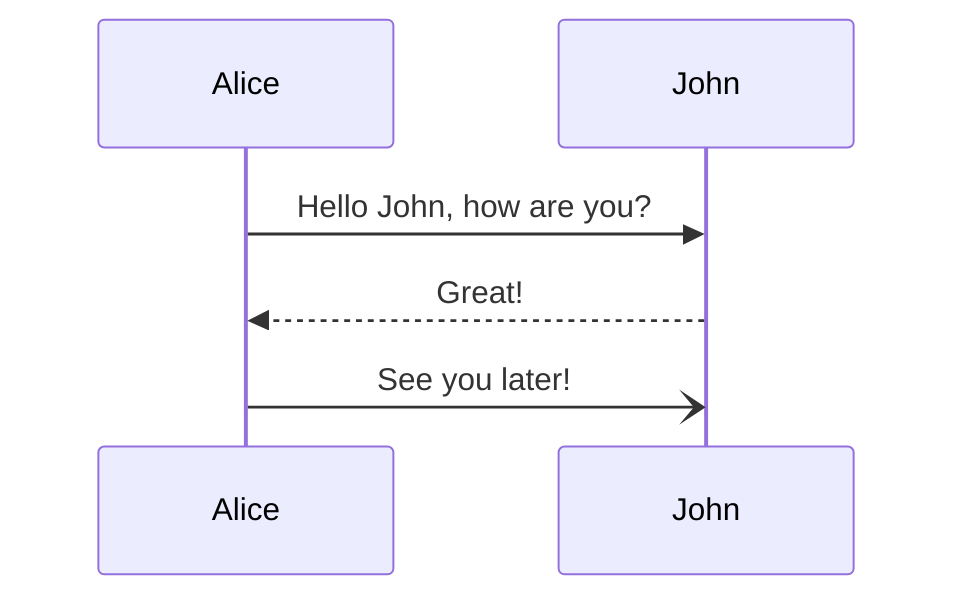
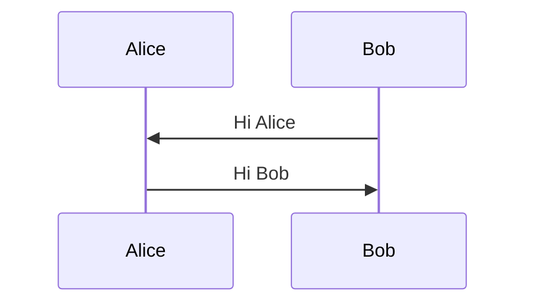
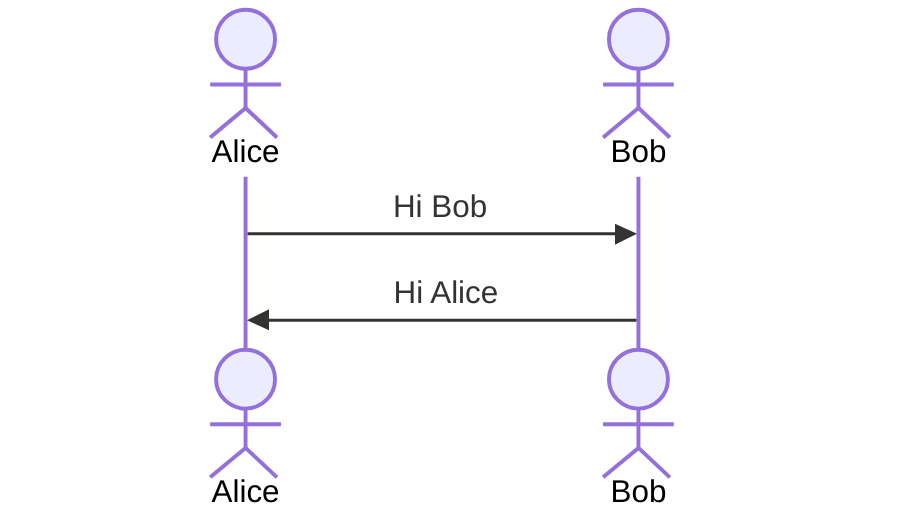
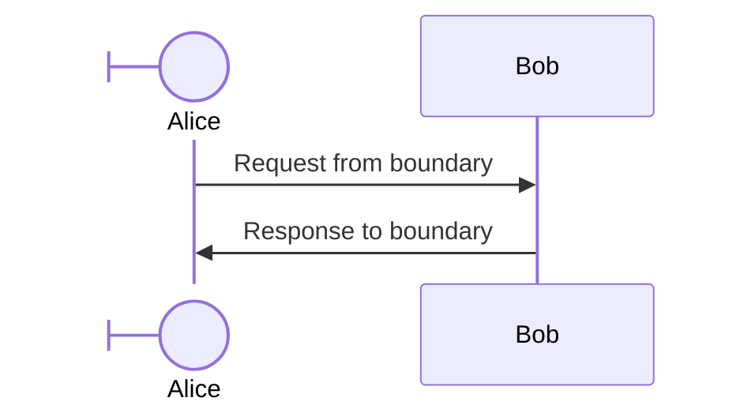
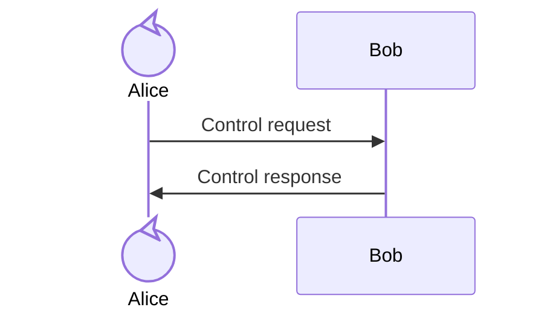
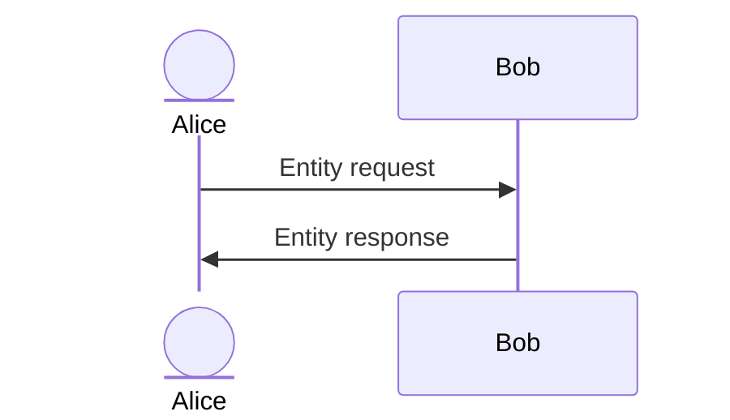
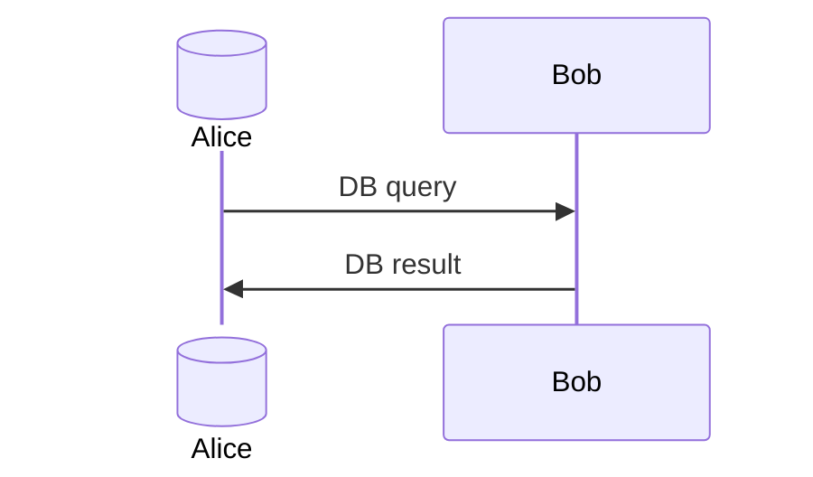
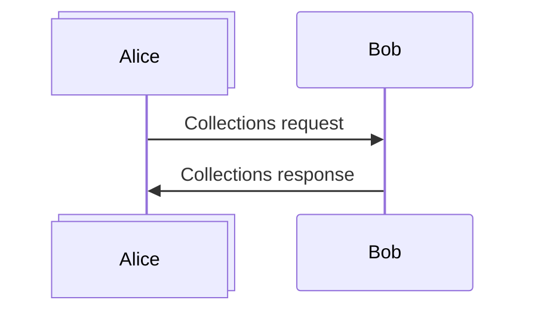
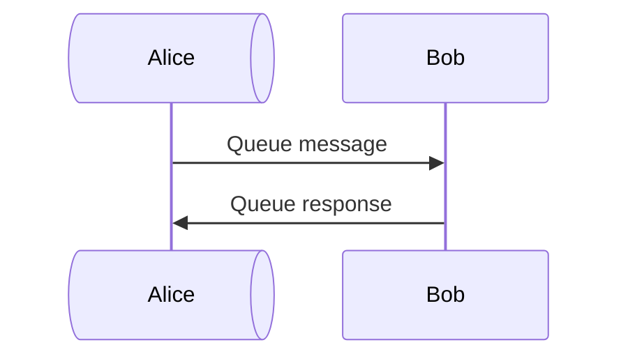
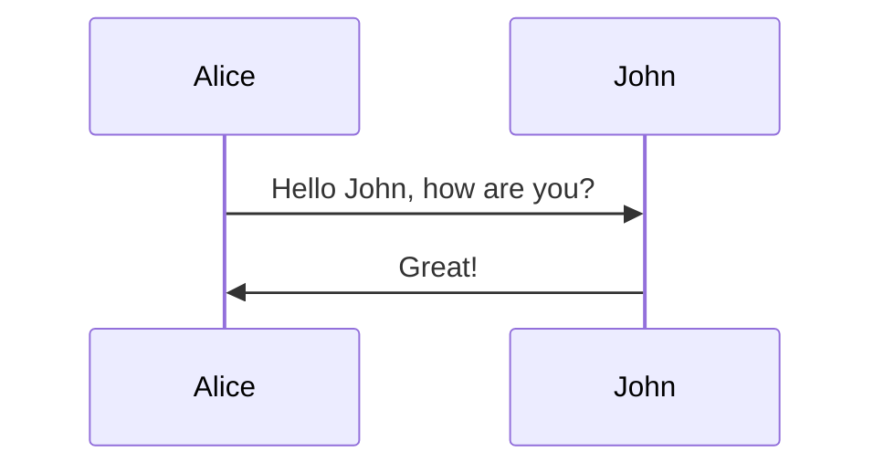

时序图是一种交互图，显示进程之间如何相互操作以及操作顺序。Mermaid 可以渲染时序图。



````markdown

````


> [!WARNING]
> 节点名称中使用 "end" 可能会破坏图表。如果不可避免，请使用括号 `()`、引号 `""` 或方括号 `{}`、`[]` 包裹 "end"，例如 `(end)`、`[end]`、`{end}`。
>

## 语法

### 参与者（Participants）

参与者可以隐式定义。有时需要以不同的顺序显示参与者，可以通过以下方式指定参与者的出现顺序：



````markdown

````

### 角色（Actors）

如果需要使用角色符号而不是带文本的矩形：



````markdown

````

### Boundary



````markdown

````

### Control



````markdown

````

### Entity



````markdown

````

### Database



````markdown

````

### Collections



````markdown

````

### Queue



````markdown

````

### 别名（Aliases）

角色可以有便捷的标识符和描述性标签。别名可以用 `as` 关键字定义，或在内联配置对象中定义。

#### 外部别名语法



````markdown

````

外部别名语法也支持与类型配置组合使用：

```mermaid
sequenceDiagram
    participant API@{ "type": "boundary" } as Public API
    actor DB@{ "type": "database" } as User Database
    participant Svc@{ "type": "control" } as Auth Service
    API->>Svc: Authenticate
    Svc->>DB: Query user
    DB-->>Svc: User data
    Svc-->>API: Token
```

````markdown
```mermaid
sequenceDiagram
    participant API@{ "type": "boundary" } as Public API
    actor DB@{ "type": "database" } as User Database
    participant Svc@{ "type": "control" } as Auth Service
    API->>Svc: Authenticate
    Svc->>DB: Query user
    DB-->>Svc: User data
    Svc-->>API: Token
```
````

#### 内联别名语法

```mermaid
sequenceDiagram
    participant API@{ "type": "boundary", "alias": "Public API" }
    participant Auth@{ "type": "control", "alias": "Auth Service" }
    participant DB@{ "type": "database", "alias": "User Database" }
    API->>Auth: Login request
    Auth->>DB: Query user
    DB-->>Auth: User data
    Auth-->>API: Access token
```

````markdown
```mermaid
sequenceDiagram
    participant API@{ "type": "boundary", "alias": "Public API" }
    participant Auth@{ "type": "control", "alias": "Auth Service" }
    participant DB@{ "type": "database", "alias": "User Database" }
    API->>Auth: Login request
    Auth->>DB: Query user
    DB-->>Auth: User data
    Auth-->>API: Access token
```
````

#### 别名优先级

当同时提供内联别名和外部别名时，**外部别名优先**：

```mermaid
sequenceDiagram
    participant API@{ "type": "boundary", "alias": "Internal Name" } as External Name
    participant DB@{ "type": "database", "alias": "Internal DB" } as External DB
    API->>DB: Query
    DB-->>API: Result
```

````markdown
```mermaid
sequenceDiagram
    participant API@{ "type": "boundary", "alias": "Internal Name" } as External Name
    participant DB@{ "type": "database", "alias": "Internal DB" } as External DB
    API->>DB: Query
    DB-->>API: Result
```
````

### 角色创建和销毁（v10.3.0+）

可以通过消息创建和销毁角色。在消息前添加 create 或 destroy 指令。

```text
create participant B
A --> B: Hello
```

```mermaid
sequenceDiagram
    Alice->>Bob: Hello Bob, how are you ?
    Bob->>Alice: Fine, thank you. And you?
    create participant Carl
    Alice->>Carl: Hi Carl!
    create actor D as Donald
    Carl->>D: Hi!
    destroy Carl
    Alice-xCarl: We are too many
    destroy Bob
    Bob->>Alice: I agree
```

````markdown
```mermaid
sequenceDiagram
    Alice->>Bob: Hello Bob, how are you ?
    Bob->>Alice: Fine, thank you. And you?
    create participant Carl
    Alice->>Carl: Hi Carl!
    create actor D as Donald
    Carl->>D: Hi!
    destroy Carl
    Alice-xCarl: We are too many
    destroy Bob
    Bob->>Alice: I agree
```
````

### 分组 / Box

角色可以在垂直框中分组。可以定义颜色和描述性标签：

```mermaid
    sequenceDiagram
    box Purple Alice & John
    participant A
    participant J
    end
    box Another Group
    participant B
    participant C
    end
    A->>J: Hello John, how are you?
    J->>A: Great!
    A->>B: Hello Bob, how is Charley?
    B->>C: Hello Charley, how are you?
```

````markdown
```mermaid
    sequenceDiagram
    box Purple Alice & John
    participant A
    participant J
    end
    box Another Group
    participant B
    participant C
    end
    A->>J: Hello John, how are you?
    J->>A: Great!
    A->>B: Hello Bob, how is Charley?
    B->>C: Hello Charley, how are you?
```
````

## 消息

消息可以用实线或虚线显示。

```text
[Actor][Arrow][Actor]:Message text
```

### 支持的箭头类型

**标准箭头类型**

| 类型     | 描述                                          |
| -------- | ---------------------------------------------- |
| `->`     | 实线无箭头                                     |
| `-->`    | 虚线无箭头                                     |
| `->>`    | 实线带箭头                                     |
| `-->>`   | 虚线带箭头                                     |
| `<<->>`  | 实线双向箭头 (v11.0.0+)                        |
| `<<-->>` | 虚线双向箭头 (v11.0.0+)                        |
| `-x`     | 实线末端带叉号                                 |
| `--x`    | 虚线末端带叉号                                 |
| `-)`     | 实线末端带开放箭头（异步）                     |
| `--)`    | 虚线末端带开放箭头（异步）                     |

## 中心连接（v11.12.3+）

Mermaid 时序图支持使用 `()` 表示**中心生命线连接**，用于表示连接到中心点的消息或信号。

```mermaid
sequenceDiagram
    participant Alice
    participant John
    Alice->>()John: Hello John
    Alice()->>John: How are you?
    John()->>()Alice: Great!
```

````markdown
```mermaid
sequenceDiagram
    participant Alice
    participant John
    Alice->>()John: Hello John
    Alice()->>John: How are you?
    John()->>()Alice: Great!
```
````

## 激活

可以激活和停用角色：

```mermaid
sequenceDiagram
    Alice->>John: Hello John, how are you?
    activate John
    John-->>Alice: Great!
    deactivate John
```

````markdown
```mermaid
sequenceDiagram
    Alice->>John: Hello John, how are you?
    activate John
    John-->>Alice: Great!
    deactivate John
```
````

快捷方式是在消息箭头后追加 `+`/`-`：

```mermaid
sequenceDiagram
    Alice->>+John: Hello John, how are you?
    John-->>-Alice: Great!
```

````markdown
```mermaid
sequenceDiagram
    Alice->>+John: Hello John, how are you?
    John-->>-Alice: Great!
```
````

激活可以堆叠：

```mermaid
sequenceDiagram
    Alice->>+John: Hello John, how are you?
    Alice->>+John: John, can you hear me?
    John-->>-Alice: Hi Alice, I can hear you!
    John-->>-Alice: I feel great!
```

````markdown
```mermaid
sequenceDiagram
    Alice->>+John: Hello John, how are you?
    Alice->>+John: John, can you hear me?
    John-->>-Alice: Hi Alice, I can hear you!
    John-->>-Alice: I feel great!
```
````

## 注释

可以向时序图添加注释：

```mermaid
sequenceDiagram
    participant John
    Note right of John: Text in note
```

````markdown
```mermaid
sequenceDiagram
    participant John
    Note right of John: Text in note
```
````

也可以创建跨越两个参与者的注释：

```mermaid
sequenceDiagram
    Alice->John: Hello John, how are you?
    Note over Alice,John: A typical interaction
```

````markdown
```mermaid
sequenceDiagram
    Alice->John: Hello John, how are you?
    Note over Alice,John: A typical interaction
```
````

## 换行

可以在注释和消息中添加换行：

```mermaid
sequenceDiagram
    Alice->John: Hello John,<br/>how are you?
    Note over Alice,John: A typical interaction<br/>But now in two lines
```

````markdown
```mermaid
sequenceDiagram
    Alice->John: Hello John,<br/>how are you?
    Note over Alice,John: A typical interaction<br/>But now in two lines
```
````

## 循环（Loops）

```mermaid
sequenceDiagram
    Alice->John: Hello John, how are you?
    loop Every minute
        John-->Alice: Great!
    end
```

````markdown
```mermaid
sequenceDiagram
    Alice->John: Hello John, how are you?
    loop Every minute
        John-->Alice: Great!
    end
```
````

## 条件分支（Alt）

```mermaid
sequenceDiagram
    Alice->>Bob: Hello Bob, how are you?
    alt is sick
        Bob->>Alice: Not so good :(
    else is well
        Bob->>Alice: Feeling fresh like a daisy
    end
    opt Extra response
        Bob->>Alice: Thanks for asking
    end
```

````markdown
```mermaid
sequenceDiagram
    Alice->>Bob: Hello Bob, how are you?
    alt is sick
        Bob->>Alice: Not so good :(
    else is well
        Bob->>Alice: Feeling fresh like a daisy
    end
    opt Extra response
        Bob->>Alice: Thanks for asking
    end
```
````

## 并行（Parallel）

```mermaid
sequenceDiagram
    par Alice to Bob
        Alice->>Bob: Hello guys!
    and Alice to John
        Alice->>John: Hello guys!
    end
    Bob-->>Alice: Hi Alice!
    John-->>Alice: Hi Alice!
```

````markdown
```mermaid
sequenceDiagram
    par Alice to Bob
        Alice->>Bob: Hello guys!
    and Alice to John
        Alice->>John: Hello guys!
    end
    Bob-->>Alice: Hi Alice!
    John-->>Alice: Hi Alice!
```
````

并行块也可以嵌套：

```mermaid
sequenceDiagram
    par Alice to Bob
        Alice->>Bob: Go help John
    and Alice to John
        Alice->>John: I want this done today
        par John to Charlie
            John->>Charlie: Can we do this today?
        and John to Diana
            John->>Diana: Can you help us today?
        end
    end
```

````markdown
```mermaid
sequenceDiagram
    par Alice to Bob
        Alice->>Bob: Go help John
    and Alice to John
        Alice->>John: I want this done today
        par John to Charlie
            John->>Charlie: Can we do this today?
        and John to Diana
            John->>Diana: Can you help us today?
        end
    end
```
````

## 关键区域（Critical Region）

```mermaid
sequenceDiagram
    critical Establish a connection to the DB
        Service-->DB: connect
    option Network timeout
        Service-->Service: Log error
    option Credentials rejected
        Service-->Service: Log different error
    end
```

````markdown
```mermaid
sequenceDiagram
    critical Establish a connection to the DB
        Service-->DB: connect
    option Network timeout
        Service-->Service: Log error
    option Credentials rejected
        Service-->Service: Log different error
    end
```
````

也可以没有选项：

```mermaid
sequenceDiagram
    critical Establish a connection to the DB
        Service-->DB: connect
    end
```

````markdown
```mermaid
sequenceDiagram
    critical Establish a connection to the DB
        Service-->DB: connect
    end
```
````

## 中断（Break）

```mermaid
sequenceDiagram
    Consumer-->API: Book something
    API-->BookingService: Start booking process
    break when the booking process fails
        API-->Consumer: show failure
    end
    API-->BillingService: Start billing process
```

````markdown
```mermaid
sequenceDiagram
    Consumer-->API: Book something
    API-->BookingService: Start booking process
    break when the booking process fails
        API-->Consumer: show failure
    end
    API-->BillingService: Start billing process
```
````

## 背景高亮

可以通过提供彩色背景矩形来高亮流程：

```mermaid
sequenceDiagram
    participant Alice
    participant John

    rect rgb(191, 223, 255)
    note right of Alice: Alice calls John.
    Alice->>+John: Hello John, how are you?
    rect rgb(200, 150, 255)
    Alice->>+John: John, can you hear me?
    John-->>-Alice: Hi Alice, I can hear you!
    end
    John-->>-Alice: I feel great!
    end
    Alice ->>+ John: Did you want to go to the game tonight?
    John -->>- Alice: Yeah! See you there.
```

````markdown
```mermaid
sequenceDiagram
    participant Alice
    participant John

    rect rgb(191, 223, 255)
    note right of Alice: Alice calls John.
    Alice->>+John: Hello John, how are you?
    rect rgb(200, 150, 255)
    Alice->>+John: John, can you hear me?
    John-->>-Alice: Hi Alice, I can hear you!
    end
    John-->>-Alice: I feel great!
    end
    Alice ->>+ John: Did you want to go to the game tonight?
    John -->>- Alice: Yeah! See you there.
```
````

## 注释语法

注释以 `%%` 开头，必须单独占一行。

```mermaid
sequenceDiagram
    Alice->>John: Hello John, how are you?
    %% this is a comment
    John-->>Alice: Great!
```

````markdown
```mermaid
sequenceDiagram
    Alice->>John: Hello John, how are you?
    %% this is a comment
    John-->>Alice: Great!
```
````

## 实体编码转义字符

```mermaid
sequenceDiagram
    A->>B: I #9829; you!
    B->>A: I #9829; you #infin; times more!
```

````markdown
```mermaid
sequenceDiagram
    A->>B: I #9829; you!
    B->>A: I #9829; you #infin; times more!
```
````

因为分号可以代替换行符来定义标记，所以需要在消息文本中使用 `#59;` 来包含分号。

## 序列号

可以为时序图中的每个箭头附加序列号：

```mermaid
sequenceDiagram
    autonumber
    Alice->>John: Hello John, how are you?
    loop HealthCheck
        John->>John: Fight against hypochondria
    end
    Note right of John: Rational thoughts!
    John-->>Alice: Great!
    John->>Bob: How about you?
    Bob-->>John: Jolly good!
```

````markdown
```mermaid
sequenceDiagram
    autonumber
    Alice->>John: Hello John, how are you?
    loop HealthCheck
        John->>John: Fight against hypochondria
    end
    Note right of John: Rational thoughts!
    John-->>Alice: Great!
    John->>Bob: How about you?
    Bob-->>John: Jolly good!
```
````

### 起始值和增量（v11.15.0+）

可以指定自动编号的起始值和增量值：

```text
autonumber <start> <increment>
```

## 角色菜单

角色可以包含链接到外部页面的弹出菜单：

```text
link <actor>: <link-label> @ <link-url>
```

### 高级菜单语法

```text
links <actor>: <json-formatted link-name link-url pairs>
```

```mermaid
sequenceDiagram
    participant Alice
    participant John
    links Alice: {"Dashboard": "https://dashboard.contoso.com/alice", "Wiki": "https://wiki.contoso.com/alice"}
    links John: {"Dashboard": "https://dashboard.contoso.com/john", "Wiki": "https://wiki.contoso.com/john"}
    Alice->>John: Hello John, how are you?
    John-->>Alice: Great!
    Alice-)John: See you later!
```

````markdown
```mermaid
sequenceDiagram
    participant Alice
    participant John
    links Alice: {"Dashboard": "https://dashboard.contoso.com/alice", "Wiki": "https://wiki.contoso.com/alice"}
    links John: {"Dashboard": "https://dashboard.contoso.com/john", "Wiki": "https://wiki.contoso.com/john"}
    Alice->>John: Hello John, how are you?
    John-->>Alice: Great!
    Alice-)John: See you later!
```
````

## 样式

时序图的样式通过 CSS 类定义。

### 使用的类

| 类名          | 描述                                                    |
| -------------- | ------------------------------------------------------- |
| actor          | 角色框的样式                                             |
| actor-top      | 图表顶部角色图形/框的样式                                |
| actor-bottom   | 图表底部角色图形/框的样式                                |
| text.actor     | 所有角色文本的样式                                       |
| text.actor-box | 角色框文本的样式                                         |
| text.actor-man | 角色图形文本的样式                                       |
| actor-line     | 角色的垂直线                                             |
| messageLine0   | 实线消息线的样式                                         |
| messageLine1   | 虚线消息线的样式                                         |
| messageText    | 消息箭头上文本的样式                                     |
| labelBox       | 循环左侧标签的样式                                       |
| labelText      | 循环标签中文本的样式                                     |
| loopText       | 循环框中文本的样式                                       |
| loopLine       | 循环框中线条的样式                                       |
| note           | 注释框的样式                                             |
| noteText       | 注释框中文本的样式                                       |

### 样式表示例

```css
body {
  background: white;
}

.actor {
  stroke: #ccccff;
  fill: #ececff;
}
text.actor {
  fill: black;
  stroke: none;
  font-family: Helvetica;
}

.actor-line {
  stroke: grey;
}

.messageLine0 {
  stroke-width: 1.5;
  stroke-dasharray: '2 2';
  marker-end: 'url(#arrowhead)';
  stroke: black;
}

.messageLine1 {
  stroke-width: 1.5;
  stroke-dasharray: '2 2';
  stroke: black;
}

#arrowhead {
  fill: black;
}

.messageText {
  fill: black;
  stroke: none;
  font-family: 'trebuchet ms', verdana, arial;
  font-size: 14px;
}

.labelBox {
  stroke: #ccccff;
  fill: #ececff;
}

.labelText {
  fill: black;
  stroke: none;
  font-family: 'trebuchet ms', verdana, arial;
}

.loopText {
  fill: black;
  stroke: none;
  font-family: 'trebuchet ms', verdana, arial;
}

.loopLine {
  stroke-width: 2;
  stroke-dasharray: '2 2';
  marker-end: 'url(#arrowhead)';
  stroke: #ccccff;
}

.note {
  stroke: #decc93;
  fill: #fff5ad;
}

.noteText {
  fill: black;
  stroke: none;
  font-family: 'trebuchet ms', verdana, arial;
  font-size: 14px;
}
```

## 配置

可以调整渲染时序图的边距：

```javascript
mermaid.sequenceConfig = {
  diagramMarginX: 50,
  diagramMarginY: 10,
  boxTextMargin: 5,
  noteMargin: 10,
  messageMargin: 35,
  mirrorActors: true,
};
```

### 配置参数

| 参数              | 描述                                           | 默认值                        |
| ----------------- | ----------------------------------------------- | ----------------------------- |
| mirrorActors      | 开启/关闭图表下方也渲染角色                     | false                         |
| bottomMarginAdj   | 调整图表结束位置                                 | 1                             |
| actorFontSize     | 角色描述的字体大小                               | 14                            |
| actorFontFamily   | 角色描述的字体系列                               | "Open Sans", sans-serif       |
| actorFontWeight   | 角色描述的字体粗细                               | "Open Sans", sans-serif       |
| noteFontSize      | 角色附加注释的字体大小                           | 14                            |
| noteFontFamily    | 角色附加注释的字体系列                           | "trebuchet ms", verdana, arial |
| noteFontWeight    | 角色附加注释的字体粗细                           | "trebuchet ms", verdana, arial |
| noteAlign         | 角色附加注释的文本对齐                           | center                        |
| messageFontSize   | 角色间消息的字体大小                             | 16                            |
| messageFontFamily | 角色间消息的字体系列                             | "trebuchet ms", verdana, arial |
| messageFontWeight | 角色间消息的字体粗细                             | "trebuchet ms", verdana, arial |

## 参考

- [Sequence Diagram - Mermaid](https://mermaid.js.org/syntax/sequenceDiagram.html)
