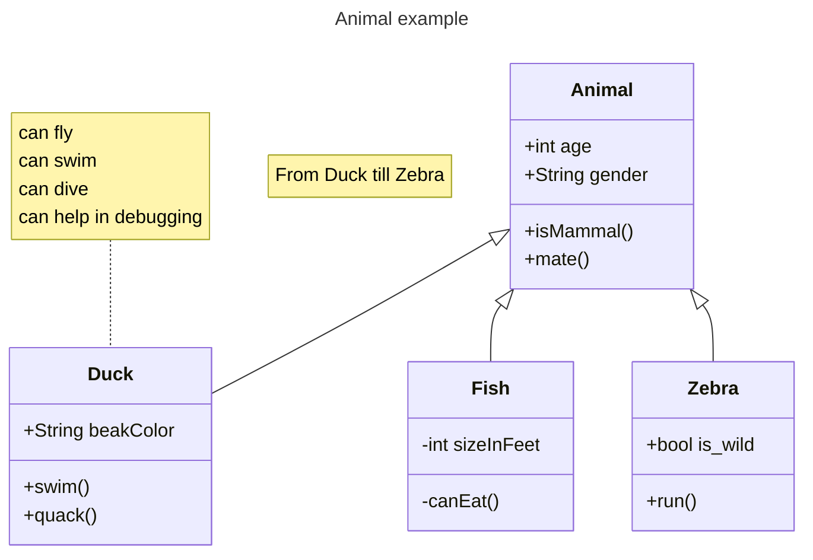
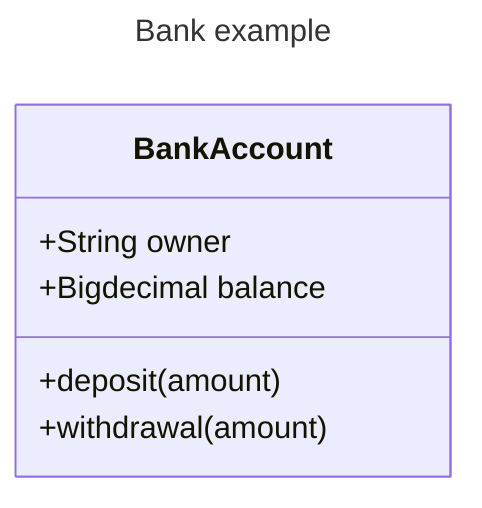
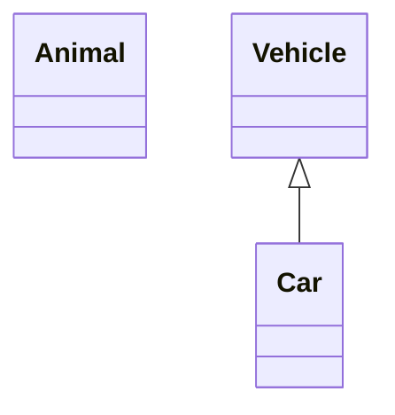
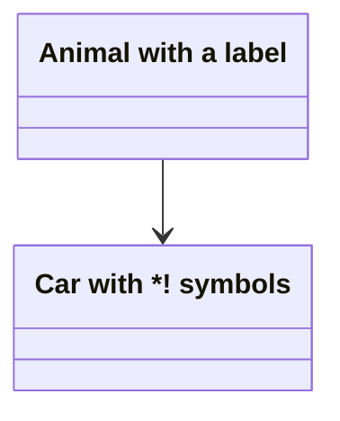
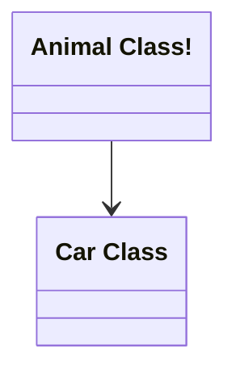
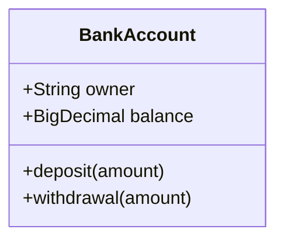
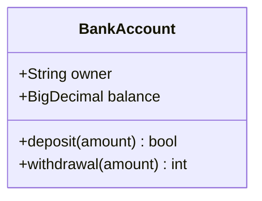
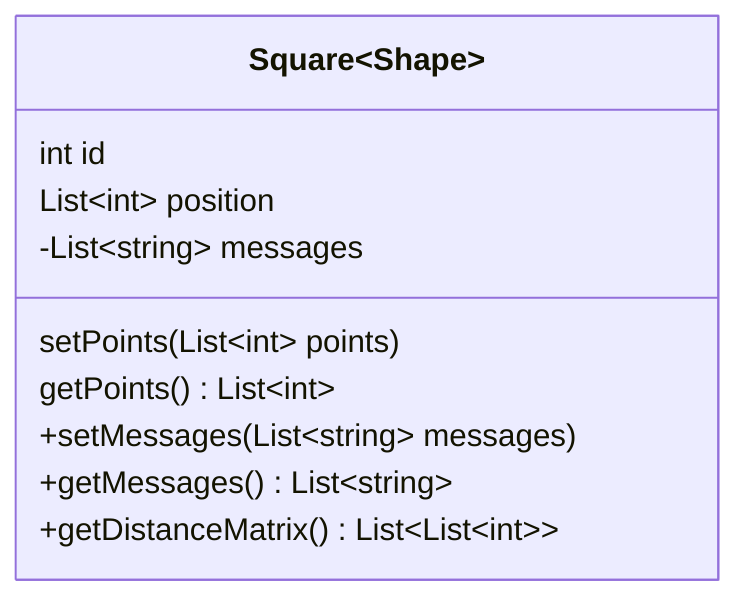
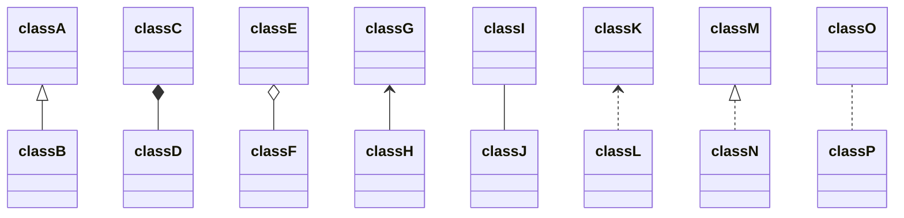

类图是面向对象建模的主要构建块，用于应用程序结构的概念建模，以及将模型转换为编程代码的详细建模。类图也可以用于数据建模。



````markdown

````

## 语法

### 类

UML 提供了表示类成员（属性和方法）的机制。图中的单个类实例包含三个区域：

- 顶部区域包含类名，粗体居中，首字母大写
- 中间区域包含类的属性，左对齐，首字母小写
- 底部区域包含类可执行的操作，左对齐，首字母小写



````markdown

````

## 定义类

有两种方式定义类：

- 使用关键字 **class** 显式定义，如 `class Animal`
- 通过**关系**定义，同时定义两个类及其关系，如 `Vehicle <|-- Car`



````markdown

````

命名约定：类名只能由字母数字字符（包括 unicode）、下划线和连字符（-）组成。

### 类标签

可以为类提供标签：



````markdown

````

也可以使用反引号转义标签中的特殊字符：



````markdown

````

## 定义类的成员

Mermaid 根据是否存在括号 `()` 来区分属性和方法。带 `()` 的被视为方法，其余为属性。

有两种方式定义类的成员：

- 使用 **:**（冒号）关联成员，适合逐个定义：



````markdown

````

- 使用 **{}** 花括号关联成员，适合一次定义多个：


````markdown

````

### 返回类型

可以在方法/函数定义末尾添加返回的数据类型（注意最后一个 `)` 和返回类型之间必须有空格）：



````markdown

````

### 泛型类型

泛型可以作为类定义的一部分表示，也可以用于类成员/返回类型。使用 `~`（波浪号）将类型括起来表示泛型。

> 注意：当泛型用于类定义时，泛型类型不被视为类名的一部分。



````markdown

````

### 可见性

可以在成员名称前添加可选符号来描述可见性：

- `+` Public
- `-` Private
- `#` Protected
- `~` Package/Internal

> 可以在方法定义末尾添加额外的分类符：
> - `*` Abstract，如 `someAbstractMethod()*`
> - `$` Static，如 `someStaticMethod()$`
>
> 可以在字段定义末尾添加：
> - `$` Static，如 `String someField$`

## 定义关系

关系是类和对象图上发现的逻辑连接的通用术语。

```text
[classA][Arrow][ClassB]
```

八种支持的关系类型：

| 类型    | 描述     |
| ------- | -------- |
| `<\|--` | 继承     |
| `*--`   | 组合     |
| `o--`   | 聚合     |
| `-->`   | 关联     |
| `--`    | 链接（实线）|
| `..>`   | 依赖     |
| `..\|>` | 实现     |
| `..`    | 链接（虚线）|



````markdown

````

可以使用标签描述两个类之间的关系：

```mermaid
classDiagram
classA --|> classB : Inheritance
classC --* classD : Composition
classE --o classF : Aggregation
classG --> classH : Association
classI -- classJ : Link(Solid)
classK ..> classL : Dependency
classM ..|> classN : Realization
classO .. classP : Link(Dashed)
```

````markdown
```mermaid
classDiagram
classA --|> classB : Inheritance
classC --* classD : Composition
classE --o classF : Aggregation
classG --> classH : Association
classI -- classJ : Link(Solid)
classK ..> classL : Dependency
classM ..|> classN : Realization
classO .. classP : Link(Dashed)
```
````

### 关系上的标签

```text
[classA][Arrow][ClassB]:LabelText
```

```mermaid
classDiagram
classA <|-- classB : implements
classC *-- classD : composition
classE o-- classF : aggregation
```

````markdown
```mermaid
classDiagram
classA <|-- classB : implements
classC *-- classD : composition
classE o-- classF : aggregation
```
````

### 双向关系

```mermaid
classDiagram
    Animal <|--|> Zebra
```

````markdown
```mermaid
classDiagram
    Animal <|--|> Zebra
```
````

语法：`[Relation Type][Link][Relation Type]`

关系类型：

| 类型  | 描述 |
| ----- | ---- |
| `<\|` | 继承 |
| `\*`  | 组合 |
| `o`   | 聚合 |
| `>`   | 关联 |
| `<`   | 关联 |
| `\|>` | 实现 |

链接类型：

| 类型 | 描述 |
| ---- | ---- |
| --   | 实线 |
| ..   | 虚线 |

### 棒棒糖接口

类可以被赋予一种特殊的关系类型，在类上定义棒棒糖接口：

```mermaid
classDiagram
  bar ()-- foo
```

````markdown
```mermaid
classDiagram
  bar ()-- foo
```
````

```mermaid
classDiagram
  class Class01 {
    int amount
    draw()
  }
  Class01 --() bar
  Class02 --() bar

  foo ()-- Class01
```

````markdown
```mermaid
classDiagram
  class Class01 {
    int amount
    draw()
  }
  Class01 --() bar
  Class02 --() bar

  foo ()-- Class01
```
````

## 定义命名空间

命名空间用于对类进行分组。

```mermaid
classDiagram
namespace BaseShapes {
    class Triangle
    class Rectangle {
      double width
      double height
    }
}
```

````markdown
```mermaid
classDiagram
namespace BaseShapes {
    class Triangle
    class Rectangle {
      double width
      double height
    }
}
```
````

### 命名空间标签（v11.15.0+）

可以使用方括号语法为命名空间指定显示标签：

```mermaid
classDiagram
    namespace Auth["Authentication Service"] {
        class UserService {
            +login()
            +logout()
        }
    }
```

````markdown
```mermaid
classDiagram
    namespace Auth["Authentication Service"] {
        class UserService {
            +login()
            +logout()
        }
    }
```
````

### 嵌套命名空间（v11.15.0+）

**点表示法**自动创建中间命名空间：

```mermaid
classDiagram
    namespace Company.Engineering.Backend {
        class Developer {
            +writeCode()
        }
    }
    namespace Company.Engineering.Frontend {
        class Designer {
            +createMockup()
        }
    }
    namespace Company.Engineering {
        class TechLead {
            +planSprint()
        }
    }
    TechLead --> Developer : leads
    TechLead --> Designer : leads
```

````markdown
```mermaid
classDiagram
    namespace Company.Engineering.Backend {
        class Developer {
            +writeCode()
        }
    }
    namespace Company.Engineering.Frontend {
        class Designer {
            +createMockup()
        }
    }
    namespace Company.Engineering {
        class TechLead {
            +planSprint()
        }
    }
    TechLead --> Developer : leads
    TechLead --> Designer : leads
```
````

**语法嵌套**将命名空间块放在其他命名空间块内部：

```mermaid
classDiagram
    namespace Platform {
        namespace Auth {
            class UserService {
                +login()
                +logout()
            }
        }
        namespace Data {
            class Repository {
                +find()
                +save()
            }
        }
        class Gateway {
            +route()
        }
    }
    Gateway --> UserService : delegates
    Gateway --> Repository : delegates
```

````markdown
```mermaid
classDiagram
    namespace Platform {
        namespace Auth {
            class UserService {
                +login()
                +logout()
            }
        }
        namespace Data {
            class Repository {
                +find()
                +save()
            }
        }
        class Gateway {
            +route()
        }
    }
    Gateway --> UserService : delegates
    Gateway --> Repository : delegates
```
````

#### 紧凑渲染（hierarchicalNamespaces: false）

设置 `hierarchicalNamespaces: false` 切换到紧凑模式：只绘制用户显式声明的命名空间。

```mermaid
---
config:
  class:
    hierarchicalNamespaces: false
---
classDiagram
    namespace Company.Engineering.Backend {
        class Developer {
            +writeCode()
        }
    }
    namespace Company.Engineering.Frontend {
        class Designer {
            +createMockup()
        }
    }
    namespace Company {
        class CEO {
            +makeDecisions()
        }
    }
    CEO --> Developer : oversees
    CEO --> Designer : oversees
```

````markdown
```mermaid
---
config:
  class:
    hierarchicalNamespaces: false
---
classDiagram
    namespace Company.Engineering.Backend {
        class Developer {
            +writeCode()
        }
    }
    namespace Company.Engineering.Frontend {
        class Designer {
            +createMockup()
        }
    }
    namespace Company {
        class CEO {
            +makeDecisions()
        }
    }
    CEO --> Developer : oversees
    CEO --> Designer : oversees
```
````

## 基数/多重性

多重性或基数表示一个类的实例可以与另一个类的实例关联的数量。

基数选项：

- `1` 只有 1
- `0..1` 零或一
- `1..*` 一或多个
- `*` 多个
- `n` n（n>1）
- `0..n` 零到 n
- `1..n` 一到 n

```text
[classA] "cardinality1" [Arrow] "cardinality2" [ClassB]:LabelText
```

```mermaid
classDiagram
    Customer "1" --> "*" Ticket
    Student "1" --> "1..*" Course
    Galaxy --> "many" Star : Contains
```

````markdown
```mermaid
classDiagram
    Customer "1" --> "*" Ticket
    Student "1" --> "1..*" Course
    Galaxy --> "many" Star : Contains
```
````

## 类的注解

可以使用标记为类添加注解，提供额外的元数据。常见的注解包括：

- `<<Interface>>` 接口类
- `<<Abstract>>` 抽象类
- `<<Service>>` 服务类
- `<<Enumeration>>` 枚举

注解在 `<<` 和 `>>` 之间定义。有三种方式添加注解：

- **内联**：

```mermaid
classDiagram
  class Shape <<interface>>
```

````markdown
```mermaid
classDiagram
  class Shape <<interface>>
```
````

- **单独一行**：

```mermaid
classDiagram
class Shape
<<interface>> Shape
Shape : noOfVertices
Shape : draw()
```

````markdown
```mermaid
classDiagram
class Shape
<<interface>> Shape
Shape : noOfVertices
Shape : draw()
```
````

- **嵌套结构**：

```mermaid
classDiagram
class Shape{
    <<interface>>
    noOfVertices
    draw()
}
class Color{
    <<enumeration>>
    RED
    BLUE
    GREEN
    WHITE
    BLACK
}
```

````markdown
```mermaid
classDiagram
class Shape{
    <<interface>>
    noOfVertices
    draw()
}
class Color{
    <<enumeration>>
    RED
    BLUE
    GREEN
    WHITE
    BLACK
}
```
````

## 注释

注释以 `%%` 开头，必须单独占一行。

```mermaid
classDiagram
%% This whole line is a comment classDiagram class Shape <<interface>>
class Shape{
    <<interface>>
    noOfVertices
    draw()
}
```

````markdown
```mermaid
classDiagram
%% This whole line is a comment classDiagram class Shape <<interface>>
class Shape{
    <<interface>>
    noOfVertices
    draw()
}
```
````

## 设置图表方向

```mermaid
classDiagram
  direction RL
  class Student {
    -idCard : IdCard
  }
  class IdCard{
    -id : int
    -name : string
  }
  class Bike{
    -id : int
    -name : string
  }
  Student "1" --o "1" IdCard : carries
  Student "1" --o "1" Bike : rides
```

````markdown
```mermaid
classDiagram
  direction RL
  class Student {
    -idCard : IdCard
  }
  class IdCard{
    -id : int
    -name : string
  }
  class Bike{
    -id : int
    -name : string
  }
  Student "1" --o "1" IdCard : carries
  Student "1" --o "1" Bike : rides
```
````

## 交互

可以将点击事件绑定到节点。点击可以触发 JavaScript 回调或在新浏览器标签中打开链接。**注意**：此功能在 `securityLevel='strict'` 时禁用。

```text
action className "reference" "tooltip"
click className call callback() "tooltip"
click className href "url" "tooltip"
```

## 注释（Notes）

可以使用 `note "line1\nline2"` 在图表上添加注释。可以使用 `note for <CLASS NAME> "line1\nline2"` 为特定类添加注释。

```mermaid
classDiagram
    note "This is a general note"
    note for MyClass "This is a note for a class"
    class MyClass{
    }
```

````markdown
```mermaid
classDiagram
    note "This is a general note"
    note for MyClass "This is a note for a class"
    class MyClass{
    }
```
````

**URL 链接：**

```mermaid
classDiagram
class Shape
link Shape "https://www.github.com" "This is a tooltip for a link"
class Shape2
click Shape2 href "https://www.github.com" "This is a tooltip for a link"
```

````markdown
```mermaid
classDiagram
class Shape
link Shape "https://www.github.com" "This is a tooltip for a link"
class Shape2
click Shape2 href "https://www.github.com" "This is a tooltip for a link"
```
````

**回调：**

```mermaid
classDiagram
class Shape
callback Shape "callbackFunction" "This is a tooltip for a callback"
class Shape2
click Shape2 call callbackFunction() "This is a tooltip for a callback"
```

````markdown
```mermaid
classDiagram
class Shape
callback Shape "callbackFunction" "This is a tooltip for a callback"
class Shape2
click Shape2 call callbackFunction() "This is a tooltip for a callback"
```
````

```html
<script>
  const callbackFunction = function () {
    alert('A callback was triggered');
  };
</script>
```

```mermaid
classDiagram
    class Class01
    class Class02
    callback Class01 "callbackFunction" "Callback tooltip"
    link Class02 "https://www.github.com" "This is a link"
    class Class03
    class Class04
    click Class03 call callbackFunction() "Callback tooltip"
    click Class04 href "https://www.github.com" "This is a link"
```

````markdown
```mermaid
classDiagram
    class Class01
    class Class02
    callback Class01 "callbackFunction" "Callback tooltip"
    link Class02 "https://www.github.com" "This is a link"
    class Class03
    class Class04
    click Class03 call callbackFunction() "Callback tooltip"
    click Class04 href "https://www.github.com" "This is a link"
```
````

## 样式

### 样式节点

可以使用 `style` 关键字为单个节点应用特定样式。注意注释和命名空间不能单独设置样式。

```mermaid
classDiagram
  class Animal
  class Mineral
  style Animal fill:#f9f,stroke:#333,stroke-width:4px
  style Mineral fill:#bbf,stroke:#f66,stroke-width:2px,color:#fff,stroke-dasharray: 5 5
```

````markdown
```mermaid
classDiagram
  class Animal
  class Mineral
  style Animal fill:#f9f,stroke:#333,stroke-width:4px
  style Mineral fill:#bbf,stroke:#f66,stroke-width:2px,color:#fff,stroke-dasharray: 5 5
```
````

#### 类

定义样式类并附加到节点：

```text
classDef className fill:#f9f,stroke:#333,stroke-width:4px;
```

将类附加到节点：

```text
cssClass "nodeId1" className;
```

使用 `:::` 运算符的简写形式：

```mermaid
classDiagram
    class Animal:::someclass
    classDef someclass fill:#f96
```

````markdown
```mermaid
classDiagram
    class Animal:::someclass
    classDef someclass fill:#f96
```
````

或：

```mermaid
classDiagram
    class Animal:::someclass {
        -int sizeInFeet
        -canEat()
    }
    classDef someclass fill:#f96
```

````markdown
```mermaid
classDiagram
    class Animal:::someclass {
        -int sizeInFeet
        -canEat()
    }
    classDef someclass fill:#f96
```
````

### 默认类

如果类名为 default，将应用于所有节点：

```text
classDef default fill:#f9f,stroke:#333,stroke-width:4px;
```

```mermaid
classDiagram
  class Animal:::pink
  class Mineral

  classDef default fill:#f96,color:red
  classDef pink color:#f9f
```

````markdown
```mermaid
classDiagram
  class Animal:::pink
  class Mineral

  classDef default fill:#f96,color:red
  classDef pink color:#f9f
```
````

### CSS 类

也可以在 CSS 样式中预定义类，然后从图表定义中应用：

```html
<style>
  .styleClass > * > g {
    fill: #ff0000;
    stroke: #ffff00;
    stroke-width: 4px;
  }
</style>
```

```mermaid
classDiagram
    class Animal:::styleClass
```

````markdown
```mermaid
classDiagram
    class Animal:::styleClass
```
````

> cssClasses 不能在关系语句的同时使用简写方法添加。

## 配置

### 成员框

可以隐藏类节点的空成员框。通过更改类图配置的 **hideEmptyMembersBox** 值实现。

```mermaid
---
  config:
    class:
      hideEmptyMembersBox: true
---
classDiagram
  class Duck
```

````markdown
```mermaid
---
  config:
    class:
      hideEmptyMembersBox: true
---
classDiagram
  class Duck
```
````

## 参考

- [Class Diagram - Mermaid](https://mermaid.js.org/syntax/classDiagram.html)
