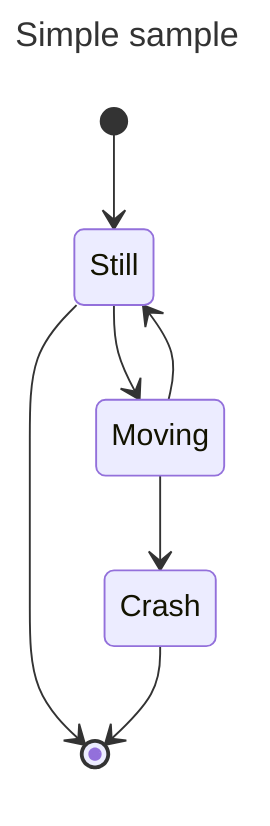
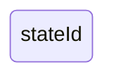
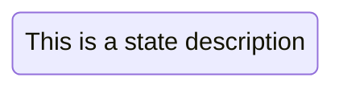
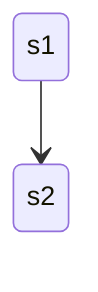
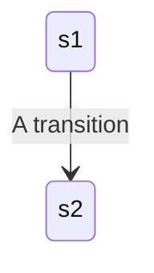
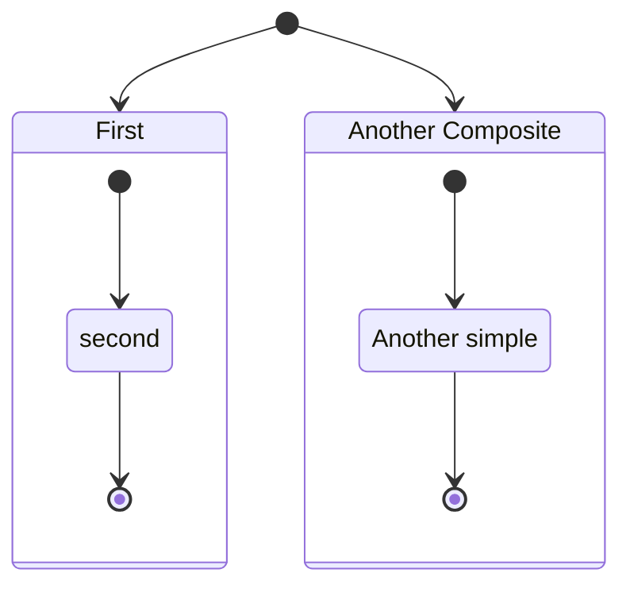
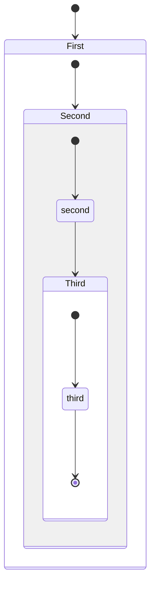
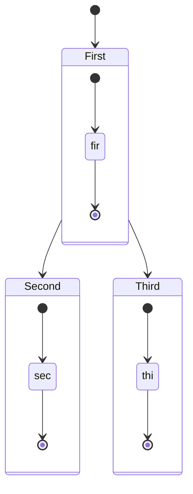

状态图用于描述系统的行为，要求所描述的系统由有限数量的状态组成。Mermaid 可以渲染状态图，语法尽量与 PlantUML 兼容。



````markdown

````

在状态图中，系统用**状态**来描述，以及一个状态如何通过**转换**变为另一个状态。上图显示了三个状态：**Still**、**Moving** 和 **Crash**。从 **Still** 可以转换到 **Moving**，从 **Moving** 可以回到 **Still** 或转换到 **Crash**。

## 状态

最简单的方式是用 id 定义状态：



````markdown

````

使用 state 关键字加描述：



````markdown

````

使用状态 id 后跟冒号和描述：


````markdown

````

## 转换

转换是状态之间变化的路径/边，使用 `"-->"` 表示。



````markdown

````

可以为转换添加文本描述：



````markdown

````

## 起始和结束

有两个特殊状态表示图表的开始和停止，使用 `[*]` 语法：


````markdown

````

## 组合状态

在实际应用中，一个状态可以有多个内部状态，称为组合状态。使用 state 关键字后跟 id 和 `{}` 之间的主体来定义：



````markdown

````

可以多层嵌套：



````markdown

````

也可以在组合状态之间定义转换：



````markdown

````

> 不能在不同组合状态的内部状态之间定义转换。

## 选择（Choice）

使用 `<<choice>>` 模拟两条或多条路径之间的选择：

```mermaid
stateDiagram-v2
    state if_state <<choice>>
    [*] --> IsPositive
    IsPositive --> if_state
    if_state --> False: if n < 0
    if_state --> True : if n >= 0
```

````markdown
```mermaid
stateDiagram-v2
    state if_state <<choice>>
    [*] --> IsPositive
    IsPositive --> if_state
    if_state --> False: if n < 0
    if_state --> True : if n >= 0
```
````

## 分叉（Forks）

使用 `<<fork>>` 和 `<<join>>` 指定分叉：

```mermaid
   stateDiagram-v2
    state fork_state <<fork>>
      [*] --> fork_state
      fork_state --> State2
      fork_state --> State3

      state join_state <<join>>
      State2 --> join_state
      State3 --> join_state
      join_state --> State4
      State4 --> [*]
```

````markdown
```mermaid
   stateDiagram-v2
    state fork_state <<fork>>
      [*] --> fork_state
      fork_state --> State2
      fork_state --> State3

      state join_state <<join>>
      State2 --> join_state
      State3 --> join_state
      join_state --> State4
      State4 --> [*]
```
````

## 注释

可以在状态图中添加注释，选择将注释放在节点的右侧或左侧：

```mermaid
    stateDiagram-v2
        State1: The state with a note
        note right of State1
            Important information! You can write
            notes.
        end note
        State1 --> State2
        note left of State2 : This is the note to the left.
```

````markdown
```mermaid
    stateDiagram-v2
        State1: The state with a note
        note right of State1
            Important information! You can write
            notes.
        end note
        State1 --> State2
        note left of State2 : This is the note to the left.
```
````

## 并发（Concurrency）

与 PlantUML 一样，可以使用 `--` 符号指定并发：

```mermaid
stateDiagram-v2
    [*] --> Active

    state Active {
        [*] --> NumLockOff
        NumLockOff --> NumLockOn : EvNumLockPressed
        NumLockOn --> NumLockOff : EvNumLockPressed
        --
        [*] --> CapsLockOff
        CapsLockOff --> CapsLockOn : EvCapsLockPressed
        CapsLockOn --> CapsLockOff : EvCapsLockPressed
        --
        [*] --> ScrollLockOff
        ScrollLockOff --> ScrollLockOn : EvScrollLockPressed
        ScrollLockOn --> ScrollLockOff : EvScrollLockPressed
    }
```

````markdown
```mermaid
stateDiagram-v2
    [*] --> Active

    state Active {
        [*] --> NumLockOff
        NumLockOff --> NumLockOn : EvNumLockPressed
        NumLockOn --> NumLockOff : EvNumLockPressed
        --
        [*] --> CapsLockOff
        CapsLockOff --> CapsLockOn : EvCapsLockPressed
        CapsLockOn --> CapsLockOff : EvCapsLockPressed
        --
        [*] --> ScrollLockOff
        ScrollLockOff --> ScrollLockOn : EvScrollLockPressed
        ScrollLockOn --> ScrollLockOff : EvScrollLockPressed
    }
```
````

## 设置图表方向

可以使用 direction 语句设置图表的渲染方向：

```mermaid
stateDiagram
    direction LR
    [*] --> A
    A --> B
    B --> C
    state B {
      direction LR
      a --> b
    }
    B --> D
```

````markdown
```mermaid
stateDiagram
    direction LR
    [*] --> A
    A --> B
    B --> C
    state B {
      direction LR
      a --> b
    }
    B --> D
```
````

## 注释语法

注释以 `%%` 开头，可以单独占一行或在语句末尾。

```mermaid
stateDiagram-v2
    [*] --> Still
    Still --> [*]
%% this is a comment
    Still --> Moving
    Moving --> Still %% another comment
    Moving --> Crash
    Crash --> [*]
```

````markdown
```mermaid
stateDiagram-v2
    [*] --> Still
    Still --> [*]
%% this is a comment
    Still --> Moving
    Moving --> Still %% another comment
    Moving --> Crash
    Crash --> [*]
```
````

## 使用 classDef 设置样式

可以像其他图表（如流程图）一样，在图表本身中定义样式并将其应用到状态。

**当前状态图 classDef 的限制：**

1. 不能应用于起始或结束状态
2. 不能应用于组合状态或在组合状态内部

使用 `classDef` 关键字定义样式，后跟样式名称和一个或多个属性-值对：

```txt
classDef movement font-style:italic;
```

多个属性-值对用逗号分隔：

```txt
classDef badBadEvent fill:#f00,color:white,font-weight:bold,stroke-width:2px,stroke:yellow
```

### 将 classDef 样式应用于状态

有两种方式：

#### 1. `class` 语句

```txt
class [一个或多个状态名称，用逗号分隔] [classDef 定义的样式名称]
```

示例：

```txt
class Crash badBadEvent
class Moving, Crash movement
```

```mermaid
   stateDiagram
   direction TB

   classDef notMoving fill:white
   classDef movement font-style:italic
   classDef badBadEvent fill:#f00,color:white,font-weight:bold,stroke-width:2px,stroke:yellow

   [*]--> Still
   Still --> [*]
   Still --> Moving
   Moving --> Still
   Moving --> Crash
   Crash --> [*]

   class Still notMoving
   class Moving, Crash movement
   class Crash badBadEvent
```

````markdown
```mermaid
   stateDiagram
   direction TB

   classDef notMoving fill:white
   classDef movement font-style:italic
   classDef badBadEvent fill:#f00,color:white,font-weight:bold,stroke-width:2px,stroke:yellow

   [*]--> Still
   Still --> [*]
   Still --> Moving
   Moving --> Still
   Moving --> Crash
   Crash --> [*]

   class Still notMoving
   class Moving, Crash movement
   class Crash badBadEvent
```
````

#### 2. `:::` 运算符

可以在转换语句中使用 `:::` 运算符为状态应用 classDef 样式：

```txt
[state]:::[style name]
```

```mermaid
stateDiagram
   direction TB

   classDef notMoving fill:white
   classDef movement font-style:italic;
   classDef badBadEvent fill:#f00,color:white,font-weight:bold,stroke-width:2px,stroke:yellow

   [*] --> Still:::notMoving
   Still --> [*]
   Still --> Moving:::movement
   Moving --> Still
   Moving --> Crash:::movement
   Crash:::badBadEvent --> [*]
```

````markdown
```mermaid
stateDiagram
   direction TB

   classDef notMoving fill:white
   classDef movement font-style:italic;
   classDef badBadEvent fill:#f00,color:white,font-weight:bold,stroke-width:2px,stroke:yellow

   [*] --> Still:::notMoving
   Still --> [*]
   Still --> Moving:::movement
   Moving --> Still
   Moving --> Crash:::movement
   Crash:::badBadEvent --> [*]
```
````

## 状态名称中的空格

可以通过先定义带 id 的状态，然后引用 id 来添加状态名称中的空格：

```mermaid
stateDiagram
    classDef yourState font-style:italic,font-weight:bold,fill:white

    yswsii: Your state with spaces in it
    [*] --> yswsii:::yourState
    [*] --> SomeOtherState
    SomeOtherState --> YetAnotherState
    yswsii --> YetAnotherState
    YetAnotherState --> [*]
```

````markdown
```mermaid
stateDiagram
    classDef yourState font-style:italic,font-weight:bold,fill:white

    yswsii: Your state with spaces in it
    [*] --> yswsii:::yourState
    [*] --> SomeOtherState
    SomeOtherState --> YetAnotherState
    yswsii --> YetAnotherState
    YetAnotherState --> [*]
```
````

## 参考

- [State Diagram - Mermaid](https://mermaid.js.org/syntax/stateDiagram.html)
