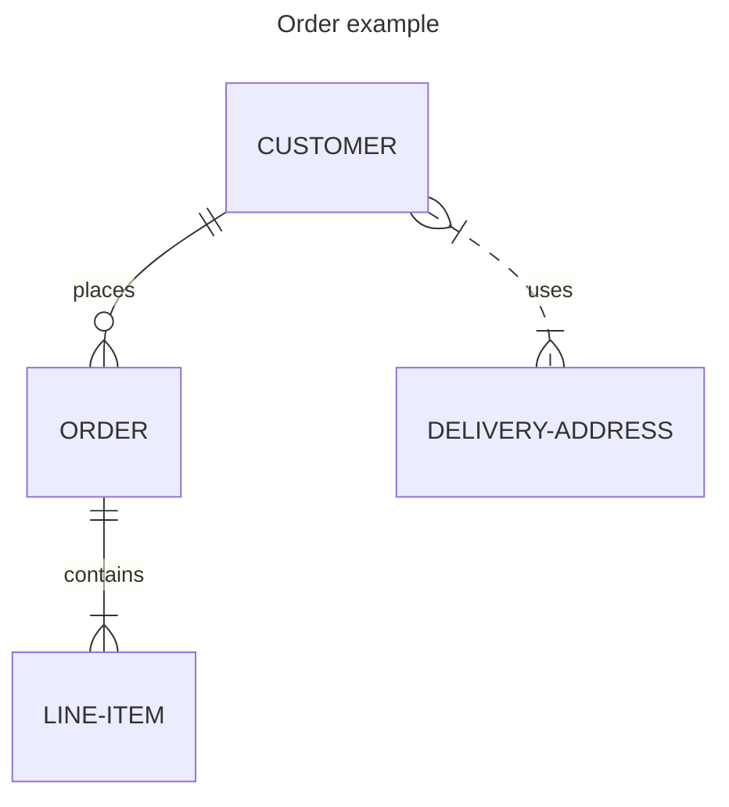
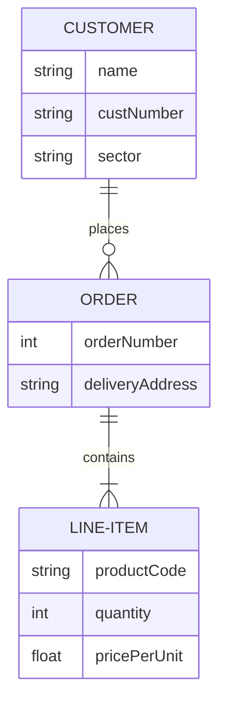
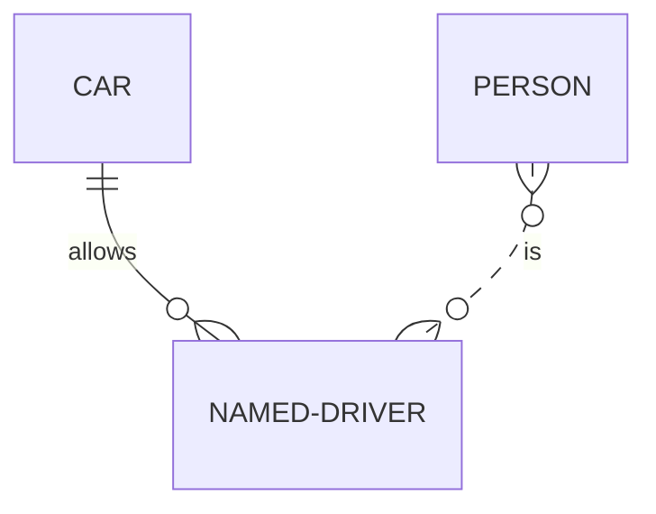
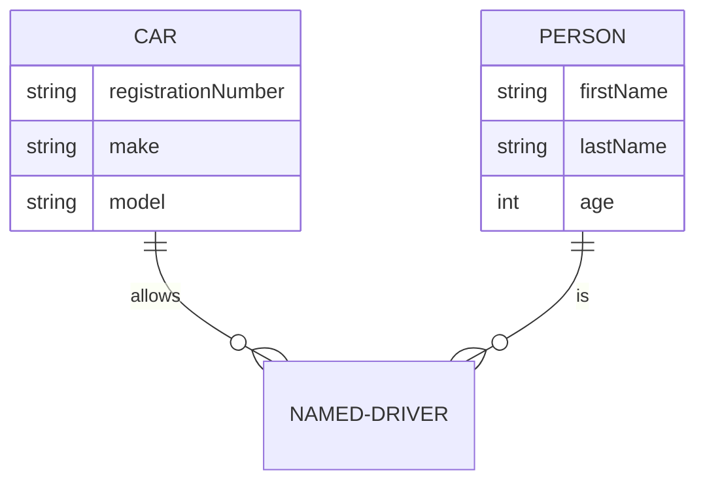
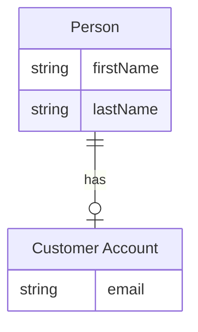
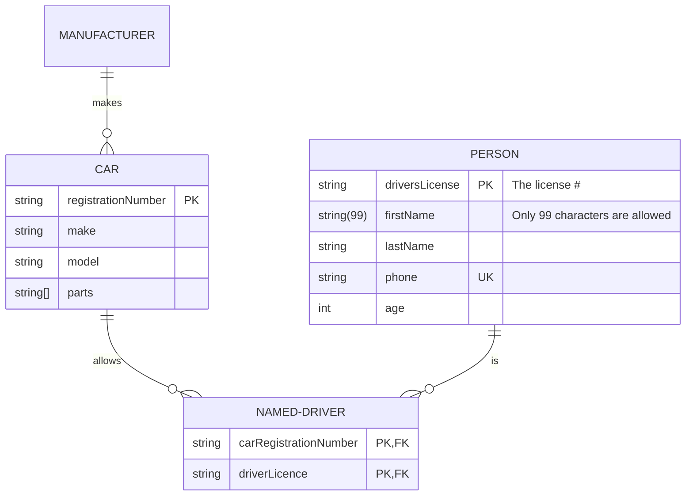

实体关系模型（ER 模型）描述特定知识领域内相互关联的事物。基本 ER 模型由实体类型和对实体之间可以存在的关系的规范组成。Mermaid 可以渲染 ER 图。



````markdown

````

实体名称通常大写，但 Mermaid 不做强制要求。实体之间的关系用带有端标记的线条表示基数。Mermaid 使用最流行的鸦脚记法。

ER 图可用于各种目的，从没有实现细节的抽象逻辑模型到关系数据库表的物理模型。Mermaid 允许通过 _type_ 和 _name_ 定义属性。



````markdown

````

## 语法

### 实体和关系

Mermaid ER 图语法与 PlantUML 兼容，并扩展了关系标签。每条语句由以下部分组成：

```text
    <first-entity> [<relationship> <second-entity> : <relationship-label>]
```

其中：

- `first-entity` 是实体名称，支持 unicode 字符，包含空格时需用双引号包裹
- `relationship` 描述两个实体的关联方式
- `second-entity` 是另一个实体的名称
- `relationship-label` 从第一个实体的角度描述关系

示例：

```text
    PROPERTY ||--|{ ROOM : contains
```

只有 `first-entity` 部分是必需的，这样可以显示没有关系的实体。

#### Unicode 文本

实体名称、关系和属性都支持 unicode 文本。


````markdown

````

#### Markdown 格式


````markdown

````

### 关系语法

关系部分由三个子组件组成：

- 第一个实体相对于第二个实体的基数
- 关系是否赋予"子"实体身份
- 第二个实体相对于第一个实体的基数

基数标记：

| 值（左） | 值（右） | 含义       |
| :-------: | :-------: | ---------- |
| `\|o`     | `o\|`     | 零或一     |
| `\|\|`    | `\|\|`    | 恰好一     |
| `}o`      | `o{`      | 零或多     |
| `}\|`     | `\|{`     | 一或多     |

**别名：**

| 值（左）       | 值（右）       | 别名对应   |
| :-------------: | :-------------: | ---------- |
| one or zero     | one or zero     | 零或一     |
| zero or one     | zero or one     | 零或一     |
| one or more     | one or more     | 一或多     |
| one or many     | one or many     | 一或多     |
| many(1)         | many(1)         | 一或多     |
| 1+              | 1+              | 一或多     |
| zero or more    | zero or more    | 零或多     |
| zero or many    | zero or many    | 零或多     |
| many(0)         | many(0)         | 零或多     |
| 0+              | 0+              | 零或多     |
| only one        | only one        | 恰好一     |
| 1               | 1               | 恰好一     |

### 标识

关系可以分为 _标识_ 或 _非标识_，分别用实线或虚线渲染。当一个实体不能独立于另一个实体存在时，使用标识关系。

| 值  | 别名对应     |
| :-: | :-----------: |
| --  | _标识_       |
| ..  | _非标识_     |

**别名：**

| 值            | 别名对应     |
| :------------: | :-----------: |
| to             | _标识_       |
| optionally to  | _非标识_     |



````markdown

````


````markdown

````

### 属性

可以通过指定实体名称后跟包含多个 `type name` 对的块来定义属性：



````markdown

````

`type` 值必须以字母字符开头，可以包含数字、连字符、下划线、括号和方括号。`name` 值遵循类似格式，但可以以星号开头表示主键。

### 实体名称别名

可以使用方括号为实体添加别名。如果提供了别名，图表中将显示别名而不是实体名称。



````markdown

````

#### 属性键和注释

属性可以有 `key` 或注释。键可以是 `PK`（主键）、`FK`（外键）或 `UK`（唯一键）。要在单个属性上指定多个键约束，用逗号分隔（如 `PK, FK`）。注释由属性末尾的双引号定义。



````markdown

````

### 方向

direction 语句声明图表的方向。

从上到下（`TB`）或从下到上（`BT`）：


````markdown

````

从左到右（`LR`）或从右到左（`RL`）：

```mermaid
erDiagram
    direction LR
    CUSTOMER ||--o{ ORDER : places
    CUSTOMER {
        string name
        string custNumber
        string sector
    }
    ORDER ||--|{ LINE-ITEM : contains
    ORDER {
        int orderNumber
        string deliveryAddress
    }
    LINE-ITEM {
        string productCode
        int quantity
        float pricePerUnit
    }
```

````markdown
```mermaid
erDiagram
    direction LR
    CUSTOMER ||--o{ ORDER : places
    CUSTOMER {
        string name
        string custNumber
        string sector
    }
    ORDER ||--|{ LINE-ITEM : contains
    ORDER {
        int orderNumber
        string deliveryAddress
    }
    LINE-ITEM {
        string productCode
        int quantity
        float pricePerUnit
    }
```
````

可能的图表方向：

- TB - 从上到下
- BT - 从下到上
- RL - 从右到左
- LR - 从左到右

### 样式节点

可以为节点应用特定样式：

```mermaid
erDiagram
    id1||--||id2 : label
    style id1 fill:#f9f,stroke:#333,stroke-width:4px
    style id2 fill:#bbf,stroke:#f66,stroke-width:2px,color:#fff,stroke-dasharray: 5 5
```

````markdown
```mermaid
erDiagram
    id1||--||id2 : label
    style id1 fill:#f9f,stroke:#333,stroke-width:4px
    style id2 fill:#bbf,stroke:#f66,stroke-width:2px,color:#fff,stroke-dasharray: 5 5
```
````

#### 类

定义样式类并附加到节点：

```text
    classDef className fill:#f9f,stroke:#333,stroke-width:4px
```

将类附加到节点：

```text
    class nodeId1 className
```

使用 `:::` 运算符的简写形式：

```mermaid
erDiagram
    direction TB
    CAR:::someclass {
        string registrationNumber
        string make
        string model
    }
    PERSON:::someclass {
        string firstName
        string lastName
        int age
    }
    HOUSE:::someclass

    classDef someclass fill:#f96
```

````markdown
```mermaid
erDiagram
    direction TB
    CAR:::someclass {
        string registrationNumber
        string make
        string model
    }
    PERSON:::someclass {
        string firstName
        string lastName
        int age
    }
    HOUSE:::someclass

    classDef someclass fill:#f96
```
````

在声明实体之间的关系时使用：

```mermaid
erDiagram
    CAR {
        string registrationNumber
        string make
        string model
    }
    PERSON {
        string firstName
        string lastName
        int age
    }
    PERSON:::foo ||--|| CAR : owns
    PERSON o{--|| HOUSE:::bar : has

    classDef foo stroke:#f00
    classDef bar stroke:#0f0
    classDef foobar stroke:#00f
```

````markdown
```mermaid
erDiagram
    CAR {
        string registrationNumber
        string make
        string model
    }
    PERSON {
        string firstName
        string lastName
        int age
    }
    PERSON:::foo ||--|| CAR : owns
    PERSON o{--|| HOUSE:::bar : has

    classDef foo stroke:#f00
    classDef bar stroke:#0f0
    classDef foobar stroke:#00f
```
````

### 默认类

如果类名为 default，将分配给所有没有特定类定义的节点：

```text
    classDef default fill:#f9f,stroke:#333,stroke-width:4px;
````

> **注意：** 来自 style 或其他 class 语句的自定义样式优先，将覆盖默认样式。

```mermaid
erDiagram
    CAR {
        string registrationNumber
        string make
        string model
    }
    PERSON {
        string firstName
        string lastName
        int age
    }
    PERSON:::foo ||--|| CAR : owns
    PERSON o{--|| HOUSE:::bar : has

    classDef default fill:#f9f,stroke-width:4px
    classDef foo stroke:#f00
    classDef bar stroke:#0f0
    classDef foobar stroke:#00f
```

````markdown
```mermaid
erDiagram
    CAR {
        string registrationNumber
        string make
        string model
    }
    PERSON {
        string firstName
        string lastName
        int age
    }
    PERSON:::foo ||--|| CAR : owns
    PERSON o{--|| HOUSE:::bar : has

    classDef default fill:#f9f,stroke-width:4px
    classDef foo stroke:#f00
    classDef bar stroke:#0f0
    classDef foobar stroke:#00f
```
````

## 配置

### 布局

默认布局是 dagre。对于更大或更复杂的图表，可以使用 ELK 布局：

```yaml
---
config:
  layout: elk
---
```

```mermaid
---
title: Order example
config:
    layout: elk
---
erDiagram
    CUSTOMER ||--o{ ORDER : places
    ORDER ||--|{ LINE-ITEM : contains
    CUSTOMER }|..|{ DELIVERY-ADDRESS : uses
```

````markdown
```mermaid
---
title: Order example
config:
    layout: elk
---
erDiagram
    CUSTOMER ||--o{ ORDER : places
    ORDER ||--|{ LINE-ITEM : contains
    CUSTOMER }|..|{ DELIVERY-ADDRESS : uses
```
````

> 注意：站点需要使用 Mermaid 9.4+ 版本才能使用此功能。

## 参考

- [Entity Relationship Diagram - Mermaid](https://mermaid.js.org/syntax/entityRelationshipDiagram.html)
