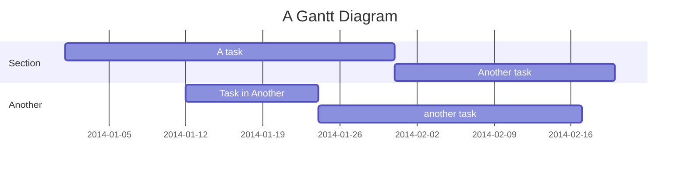
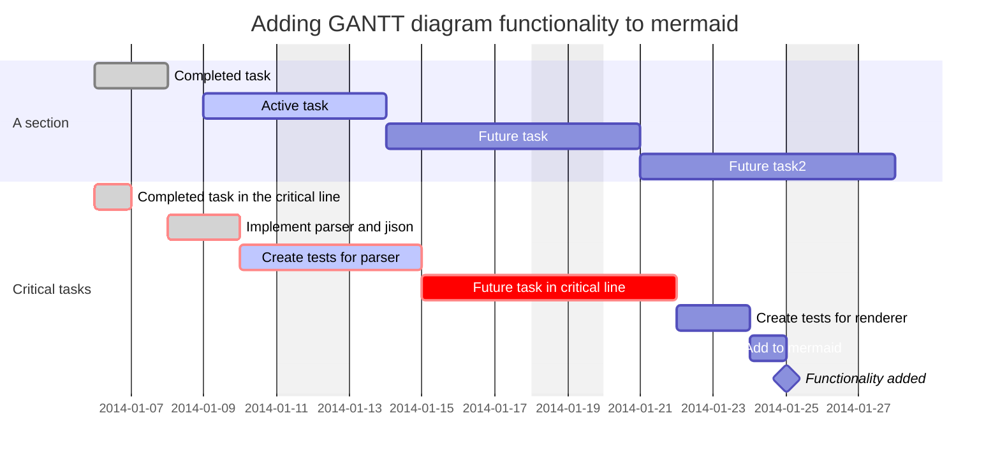

```mermaid
gantt
    dateFormat HH:mm
    axisFormat %H:%M
    Initial milestone : milestone, m1, 17:49, 2m
    Task A : 10m
    Task B : 5m
    Final milestone : milestone, m2, 18:08, 4m
```

甘特图是一种条形图，用于展示项目进度和各任务的起止时间。Mermaid 可将甘特图渲染为 SVG、PNG 或 Markdown 链接。



````markdown

````

## 语法



````markdown

````

任务默认按顺序排列，起始日期默认为前一个任务的结束日期。冒号 `:` 分隔任务标题和元数据，元数据项用逗号 `,` 分隔。有效标签为 `active`、`done`、`crit` 和 `milestone`，标签可选但如果使用必须放在最前面。

### 任务元数据

| 元数据语法 | 起始日期 | 结束日期 | ID |
|---|---|---|---|
| `<taskID>, <startDate>, <endDate>` | 按日期格式解析 | 按日期格式解析 | taskID |
| `<taskID>, <startDate>, <length>` | 按日期格式解析 | 起始日期 + 时长 | taskID |
| `<taskID>, after <otherTaskId>, <endDate>` | 引用任务的结束日期 | 按日期格式解析 | taskID |
| `<taskID>, after <otherTaskId>, <length>` | 引用任务的结束日期 | 起始日期 + 时长 | taskID |
| `<startDate>, <endDate>` | 按日期格式解析 | 按日期格式解析 | n/a |
| `<startDate>, <length>` | 按日期格式解析 | 起始日期 + 时长 | n/a |
| `after <otherTaskID>, <length>` | 引用任务的结束日期 | 起始日期 + 时长 | n/a |
| `<endDate>` | 前一任务结束日期 | 按日期格式解析 | n/a |
| `<length>` | 前一任务结束日期 | 起始日期 + 时长 | n/a |

`until` 关键字（v10.9.0+）可用于定义运行直到另一个任务或里程碑开始的任务。

### 时长格式

| 单位 | 后缀 | 示例 |
|---|---|---|
| 毫秒 | `ms` | `500ms` |
| 秒 | `s` | `30s` |
| 分钟 | `m` | `30m` |
| 小时 | `h` | `4h` |
| 天 | `d` | `3d` |
| 周 | `w` | `2w` |
| 月 | `M` | `1M` |
| 年 | `y` | `1y` |

支持小数值（如 `1.5d`）。

### Title

`title` 是可选字符串，显示在甘特图顶部。

### Excludes

`excludes` 接受特定日期（YYYY-MM-DD）、星期几（如 "sunday"）或 "weekends"。

#### 周末配置（v11.0.0+）

```markdown
excludes weekends
weekend friday
```

### Section

用 `section` 关键字将图表分为不同部分。

### Milestones

里程碑代表时间上的单个瞬间，使用 `milestone` 关键字标识。



````markdown

````

### Vertical Markers

`vert` 关键字添加贯穿图表的垂直线，用于标记重要日期。

## 设置日期

`dateFormat` 定义日期输入格式，`axisFormat` 定义渲染输出的日期格式。

### 输入日期格式

默认为 `YYYY-MM-DD`，支持以下格式：

| 输入 | 示例 | 说明 |
|---|---|---|
| `YYYY` | 2014 | 4 位年份 |
| `YY` | 14 | 2 位年份 |
| `M MM` | 1..12 | 月份数字 |
| `D DD` | 1..31 | 日期 |
| `H HH` | 0..23 | 24 小时制 |
| `m mm` | 0..59 | 分钟 |
| `s ss` | 0..59 | 秒 |

### 输出日期格式

| 格式 | 说明 |
|---|---|
| `%a` | 缩写星期名 |
| `%A` | 完整星期名 |
| `%b` | 缩写月份名 |
| `%B` | 完整月份名 |
| `%d` | 补零日期 |
| `%m` | 补零月份 |
| `%Y` | 4 位年份 |
| `%H` | 24 小时制小时 |
| `%M` | 分钟 |
| `%S` | 秒 |

### 轴刻度（v10.3.0+）

```markdown
tickInterval 1day
```

模式为 `/^([1-9][0-9]*)(millisecond|second|minute|hour|day|week|month)$/`

## 紧凑模式

```markdown
---
displayMode: compact
---
gantt
    title A Gantt Diagram
    dateFormat  YYYY-MM-DD
    section Section
    A task           :a1, 2014-01-01, 30d
    Another task     :a2, 2014-01-20, 25d
    Another one      :a3, 2014-02-10, 20d
```

## 注释

注释必须单独一行，以 `%%` 开头。

## Today marker

样式化或隐藏当前日期标记：

```text
todayMarker stroke-width:5px,stroke:#0f0,opacity:0.5
```

隐藏标记：`todayMarker off`

## 配置

```javascript
mermaid.ganttConfig = {
  titleTopMargin: 25,
  barHeight: 20,
  barGap: 4,
  topPadding: 75,
  rightPadding: 75,
  leftPadding: 75,
  gridLineStartPadding: 10,
  fontSize: 12,
  sectionFontSize: 24,
  numberSectionStyles: 1,
  axisFormat: '%d/%m',
  tickInterval: '1week',
  topAxis: true,
  displayMode: 'compact',
  weekday: 'sunday',
};
```

## 交互

可绑定点击事件到任务：

```text
click taskId call callback(arguments)
click taskId href URL
```


> [!NOTE]
> 使用 `securityLevel='strict'` 时此功能被禁用。
>

## 示例

### 柱状图

```mermaid
gantt
    title Git Issues - days since last update
    dateFormat X
    axisFormat %s
    section Issue19062
    71   : 0, 71
    section Issue19401
    36   : 0, 36
    section Issue193
    34   : 0, 34
    section Issue7441
    9    : 0, 9
    section Issue1300
    5    : 0, 5
```



````markdown

````

## 参考

- [Gantt - Mermaid](https://mermaid.js.org/syntax/gantt.html)
