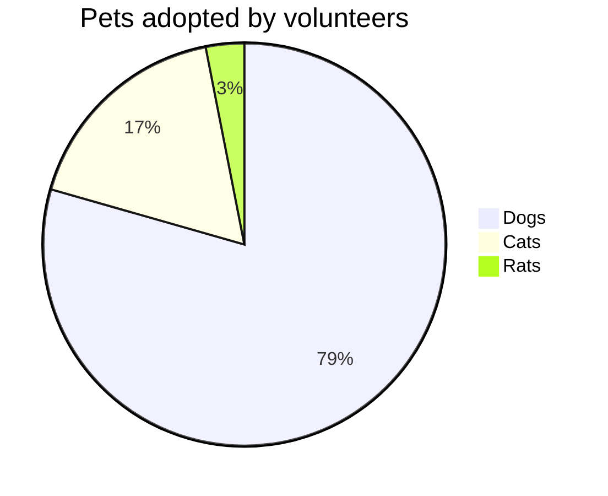
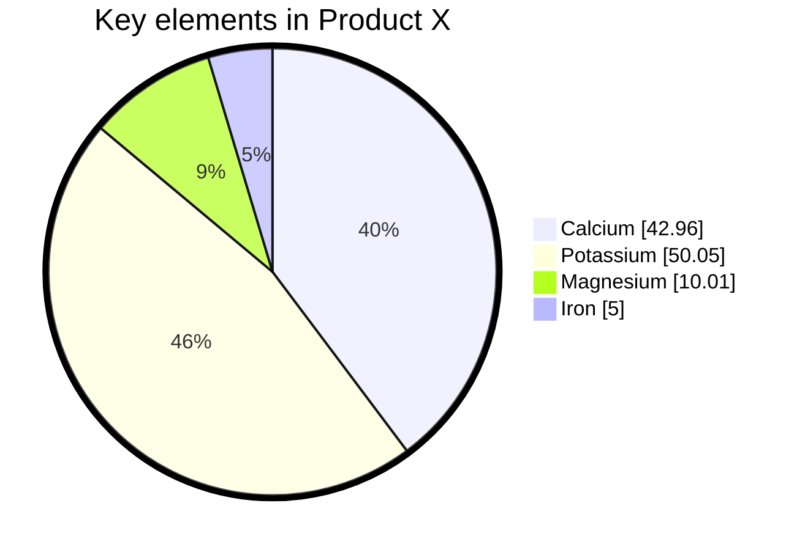

饼图是一种圆形统计图，通过切片展示数值比例。Mermaid 可以渲染饼图。



````markdown

````

## 语法

- 以 `pie` 关键字开始
  - `showData` 可选，在图例文本后渲染实际数据值
- 后跟 `title` 关键字和标题值（可选）
- 后跟数据集，饼图切片按标签顺序顺时针排列
  - `"标签"` — 用引号包裹
  - `:` — 分隔符
  - 正数值 — 支持到小数点后两位


> [!WARNING]
> 饼图值必须是**大于零的正数**，不允许负值。
>

```text
[pie] [showData] (可选)
[title] [标题值] (可选)
"[数据键1]" : [数据值1]
"[数据键2]" : [数据值2]
```

## 示例



````markdown

````

## 配置

| 参数 | 说明 | 默认值 |
|---|---|---|
| `textPosition` | 饼图标签的轴向位置，0.0 为中心，1.0 为外边缘 | `0.75` |

## 参考

- [Pie Chart - Mermaid](https://mermaid.js.org/syntax/pie.html)
