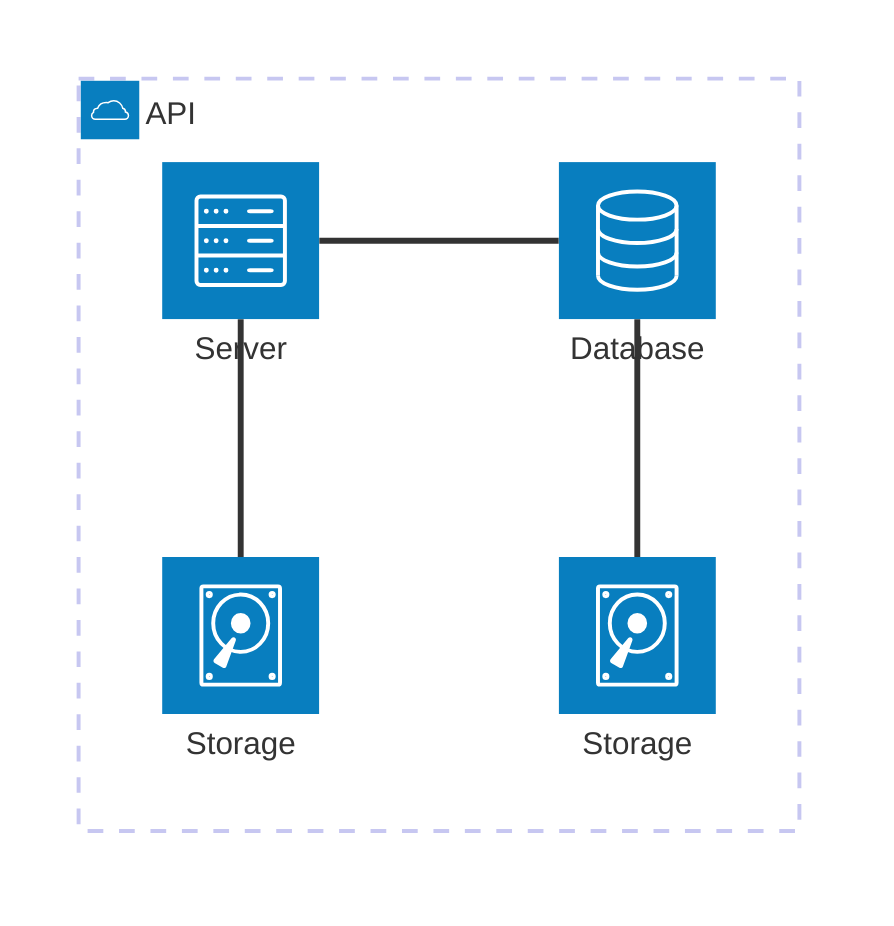

```mermaid
architecture-beta
    group api(logos:aws-lambda)[API]

    service db(logos:aws-aurora)[Database] in api
    service server(logos:aws-ec2)[Server] in api

    db:L -- R:server
```

架构图用于展示云或 CI/CD 部署中服务和资源之间的关系。服务（节点）通过边连接，相关服务可放入分组中。



````markdown

````

## 语法

架构图的构建块为 `groups`、`services`、`edges` 和 `junctions`。图标用 `()` 声明，标签用 `[]` 声明。

以 `architecture-beta` 关键字开始。

### Groups

```text
group {group id}({icon name})[{title}] (in {parent id})?
```

示例：`group public_api(cloud)[Public API]`

分组可嵌套：`group private_api(cloud)[Private API] in public_api`

### Services

```text
service {service id}({icon name})[{title}] (in {parent id})?
```

示例：`service database1(database)[My Database] in private_api`

### Edges

```text
{serviceId}:{T|B|L|R} <--> {T|B|L|R}:{serviceId}
```

方向：`T`（上）、`B`（下）、`L`（左）、`R`（右）

箭头：用 `<` 和 `>` 添加

```text
db:R --> L:server
```

#### 跨组边

用 `{group}` 修饰符让边从组中延伸出去：

```text
server{group}:B --> T:subnet{group}
```

### Junctions

交叉点是一种特殊的四向分叉节点：

```text
junction {junction id} (in {parent id})?
```

## 配置

### randomize（v11.14.0+）

默认 `randomize: false`。设为 `true` 可随机化初始节点位置。

```javascript
mermaid.initialize({
  architecture: { randomize: true },
});
```

### 布局调整（v11.15.0+）

| 选项 | 类型 | 默认值 | 说明 |
|---|---|---|---|
| nodeSeparation | number | 75 | 同组节点最小间距 |
| idealEdgeLengthMultiplier | number | 1.5 | 边的理想长度乘数 |
| edgeElasticity | number | 0.45 | 边的弹簧弹性 |
| numIter | number | 2500 | 最大迭代次数 |
| seed | number | 1 | 确定性种子 |

## 图标

默认支持：`cloud`、`database`、`disk`、`internet`、`server`。

可通过注册 iconify.design 的图标包使用 200,000+ 图标：



````markdown

````

## 参考

- [Architecture - Mermaid](https://mermaid.js.org/syntax/architecture.html)
