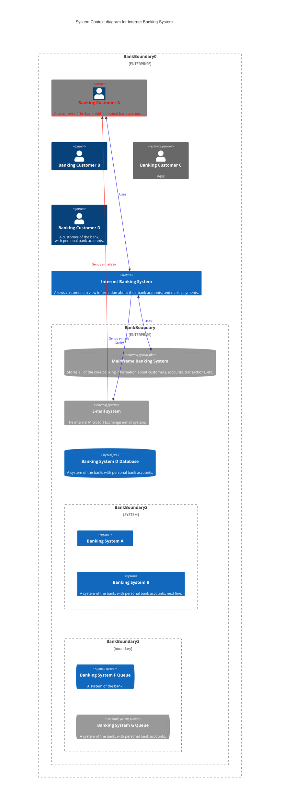
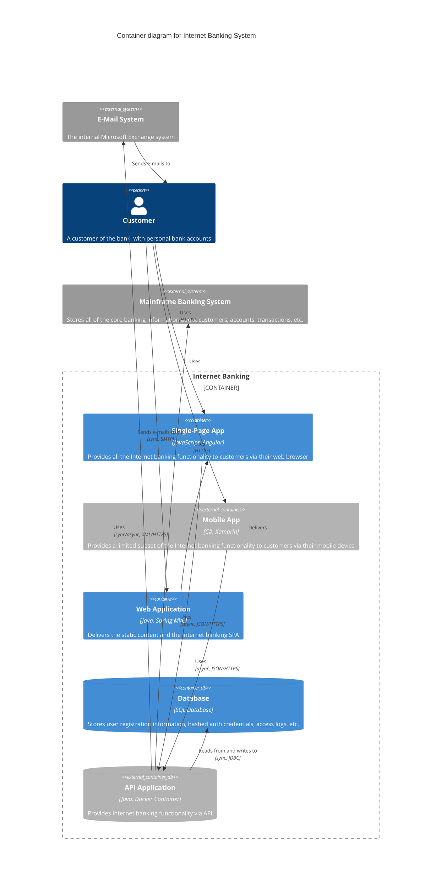
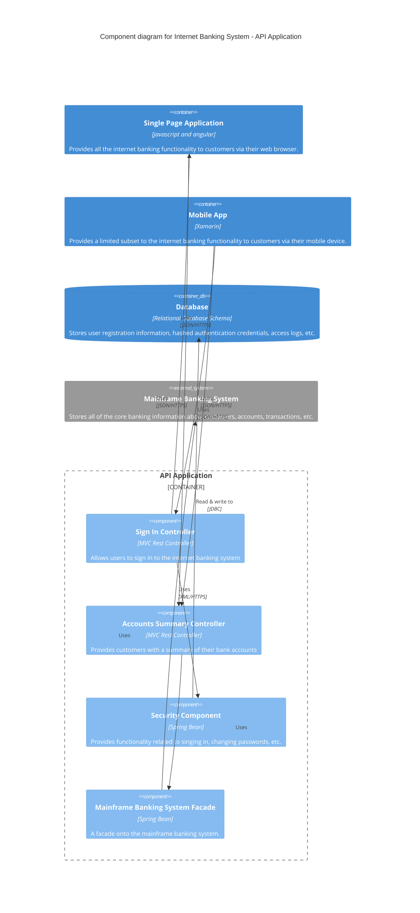
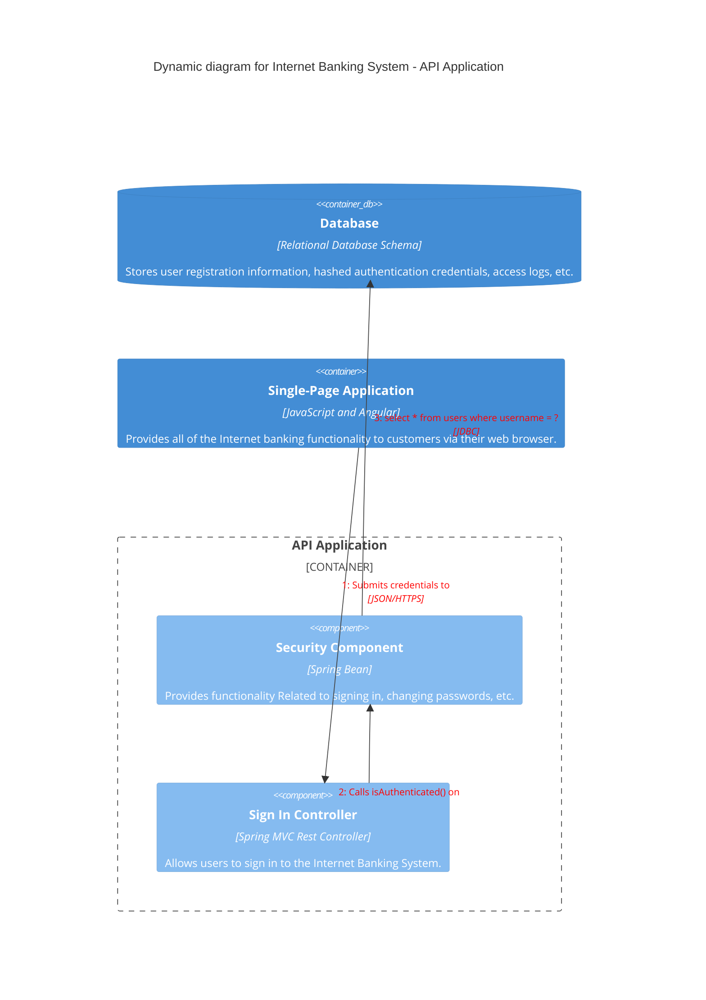
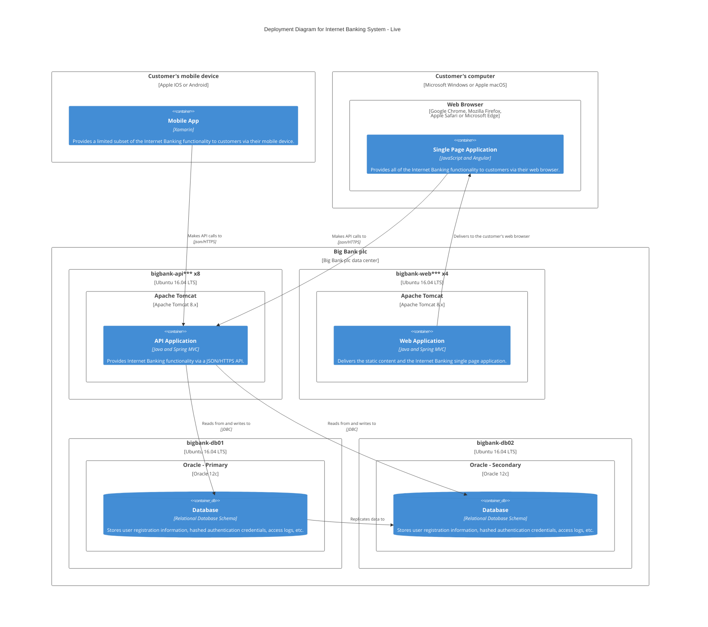

C4 图是一种实验性图表，用于描述软件架构。其语法与 PlantUML 兼容。Mermaid 支持 5 种 C4 图表类型，可以通过主题变量和样式函数自定义元素和关系的外观。



````markdown

````

## 支持的图表类型

5 种 C4 图表类型：

- System Context（C4Context）
- Container diagram（C4Container）
- Component diagram（C4Component）
- Dynamic diagram（C4Dynamic）
- Deployment diagram（C4Deployment）

请参考 [C4-PlantUML 语法](https://github.com/plantuml-stdlib/C4-PlantUML/blob/master/README.md) 了解如何编写 C4 图。

C4 图是固定样式的，不同主题下不提供不同的 CSS 颜色。`updateElementStyle` 和 `UpdateElementStyle` 写在图的最后部分。`updateElementStyle` 与原始定义不一致，它会更新关系的样式，包括文本标签相对于原始位置的偏移。

布局不使用完全自动化的布局算法。形状的位置通过更改语句写入顺序来调整。因此没有计划支持以下布局语句。每行形状数量和边界数量可以通过 `UpdateLayoutConfig` 调整。

不支持的布局语句：

- Layout
  - Lay_U, Lay_Up
  - Lay_D, Lay_Down
  - Lay_L, Lay_Left
  - Lay_R, Lay_Right

## 支持的功能

以下功能已支持：

- System Context
  - Person(alias, label, ?descr, ?sprite, ?tags, $link)
  - Person_Ext
  - System(alias, label, ?descr, ?sprite, ?tags, $link)
  - SystemDb
  - SystemQueue
  - System_Ext
  - SystemDb_Ext
  - SystemQueue_Ext
  - Boundary(alias, label, ?type, ?tags, $link)
  - Enterprise_Boundary(alias, label, ?tags, $link)
  - System_Boundary

- Container diagram
  - Container(alias, label, ?techn, ?descr, ?sprite, ?tags, $link)
  - ContainerDb
  - ContainerQueue
  - Container_Ext
  - ContainerDb_Ext
  - ContainerQueue_Ext
  - Container_Boundary(alias, label, ?tags, $link)

- Component diagram
  - Component(alias, label, ?techn, ?descr, ?sprite, ?tags, $link)
  - ComponentDb
  - ComponentQueue
  - Component_Ext
  - ComponentDb_Ext
  - ComponentQueue_Ext

- Dynamic diagram
  - RelIndex(index, from, to, label, ?tags, $link)

- Deployment diagram
  - Deployment_Node(alias, label, ?type, ?descr, ?sprite, ?tags, $link)
  - Node(alias, label, ?type, ?descr, ?sprite, ?tags, $link)：Deployment_Node() 的简写
  - Node_L(alias, label, ?type, ?descr, ?sprite, ?tags, $link)：左对齐 Node()
  - Node_R(alias, label, ?type, ?descr, ?sprite, ?tags, $link)：右对齐 Node()

- Relationship Types
  - Rel(from, to, label, ?techn, ?descr, ?sprite, ?tags, $link)
  - BiRel（双向关系）
  - Rel_U, Rel_Up
  - Rel_D, Rel_Down
  - Rel_L, Rel_Left
  - Rel_R, Rel_Right
  - Rel_Back
  - RelIndex -- 兼容 C4-PlantUML 语法，但忽略 index 参数。序号由 rel 语句的写入顺序决定。

- 已支持的样式函数：
  - UpdateElementStyle(elementName, ?bgColor, ?fontColor, ?borderColor, ?shadowing, ?shape, ?sprite, ?techn, ?legendText, ?legendSprite)：更新元素的默认样式，不创建额外的图例条目。
  - UpdateRelStyle(from, to, ?textColor, ?lineColor, ?offsetX, ?offsetY)：更新默认关系颜色，不创建额外的图例条目。新增 offsetX 和 offsetY 参数设置文本原始位置的偏移。
  - UpdateLayoutConfig(?c4ShapeInRow, ?c4BoundaryInRow)：更新默认的 c4ShapeInRow(4) 和 c4BoundaryInRow(2)。

暂未支持的功能：sprite、tags、link、Legend、自定义标签/原型、RoundedBoxShape、EightSidedShape、DashedLine、DottedLine、BoldLine。

带问号的参数有两种赋值方式。一种是按参数顺序的非命名参数赋值，另一种是命名参数赋值，名称必须以 $ 符号开头。

示例：`UpdateRelStyle(from, to, ?textColor, ?lineColor, ?offsetX, ?offsetY)`

```text
UpdateRelStyle(customerA, bankA, "red", "blue", "-40", "60")
UpdateRelStyle(customerA, bankA, $offsetX="-40", $offsetY="60", $lineColor="blue", $textColor="red")
UpdateRelStyle(customerA, bankA, $offsetY="60")
````

## C4 System Context Diagram（C4Context）


````markdown

````

## C4 Container Diagram（C4Container）



````markdown

````

## C4 Component Diagram（C4Component）



````markdown

````

## C4 Dynamic Diagram（C4Dynamic）



````markdown

````

## C4 Deployment Diagram（C4Deployment）



````markdown

````

## 参考

- [C4 Diagram - Mermaid](https://mermaid.js.org/syntax/c4.html)
