Git 图（GitGraph）是 Git 提交和 Git 操作（命令）在各分支上的图形化表示。这类图表特别适合开发者和 DevOps 团队分享 Git 分支策略，例如可视化 Git Flow 的工作方式。

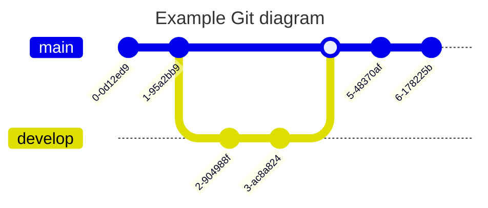

````markdown
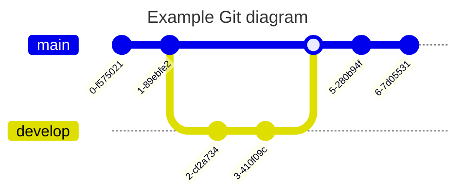
````

Mermaid 支持以下基本 Git 操作：

- **commit**：在当前分支上表示一次新提交。
- **branch**：创建并切换到新分支，将其设为当前分支。
- **checkout**：检出一个已有分支并将其设为当前分支。
- **merge**：将一个已有分支合并到当前分支。

注意：`checkout` 和 `switch` 可以互换使用。

## 语法

Mermaid 的 Git 图语法非常直观。它采用声明式方法，每个提交按代码中出现的顺序绘制在时间线上。基本上，它遵循每个命令的插入顺序。

首先使用 `gitGraph` 关键字声明图表类型。此关键字告诉 Mermaid 你要绘制一个 Git 图，并据此解析图表代码。

每个 Git 图默认使用 **main** 分支初始化。除非你创建不同的分支，否则提交将默认进入 main 分支。默认情况下，`main` 分支被设置为**当前分支**。

使用 `commit` 关键字在当前分支上注册一次提交。

一个简单的 Git 图，在默认（main）分支上显示三个提交：

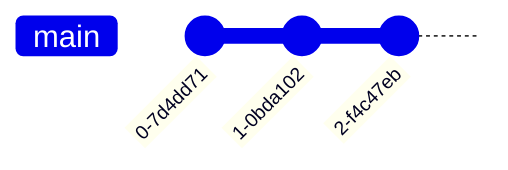

````markdown
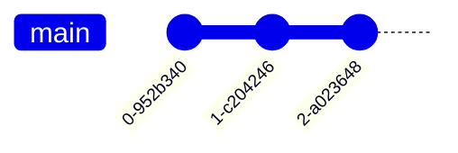
````

### 添加自定义提交 ID

对于给定的提交，你可以在声明时使用 `id` 属性指定自定义 ID，后跟 `:` 和 `""` 引号内的自定义值。例如：`commit id: "your_custom_id"`

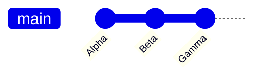

````markdown

````

### 修改提交类型

在 Mermaid 中，提交可以是三种类型，在图表中呈现不同的样式：

- `NORMAL`：默认提交类型。在图表中用实心圆表示。
- `REVERSE`：强调为反向提交。在图表中用交叉实心圆表示。
- `HIGHLIGHT`：在图表中高亮显示特定提交。用填充矩形表示。

对于给定的提交，你可以在声明时使用 `type` 属性指定其类型。例如：`commit type: HIGHLIGHT`

注意：如果未指定提交类型，默认选择 `NORMAL`。

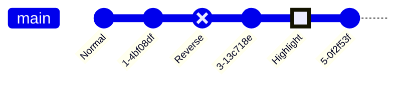

````markdown
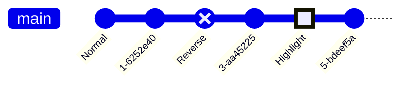
````

### 添加标签

对于给定的提交，你可以为其添加标签（tag），类似于 Git 世界中标签或发布版本的概念。你可以使用 `tag` 属性附加自定义标签。例如：`commit tag: "your_custom_tag"`

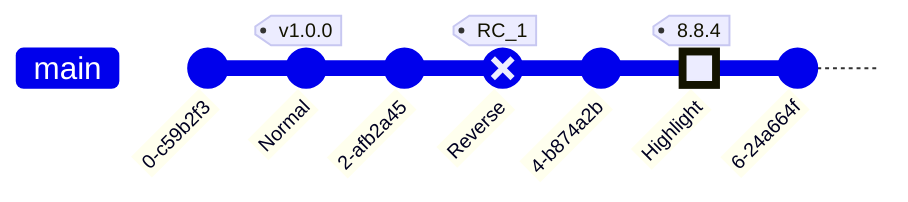

````markdown
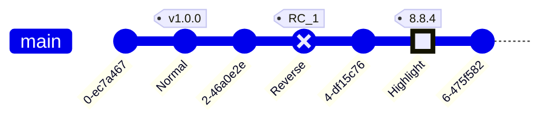
````

### 创建新分支

要创建新分支，使用 `branch` 关键字，并需要提供新分支的名称。名称必须唯一，不能与现有分支重名。可能与关键字混淆的分支名必须用 `""` 引号括起来。用法示例：`branch develop`、`branch "cherry-pick"`

当 Mermaid 读取 `branch` 关键字时，它会创建新分支并将其设为当前分支。相当于在 Git 中创建新分支并检出到该分支。

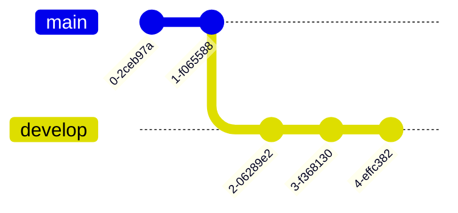

````markdown
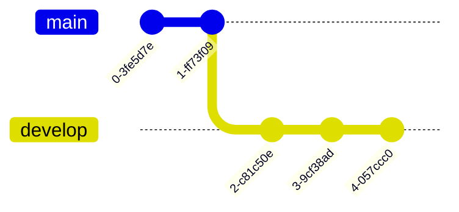
````

### 检出已有分支

要切换到已有分支，使用 `checkout` 关键字，并需要提供已有分支的名称。如果找不到给定名称的分支，将导致控制台错误。用法示例：`checkout develop`


````markdown
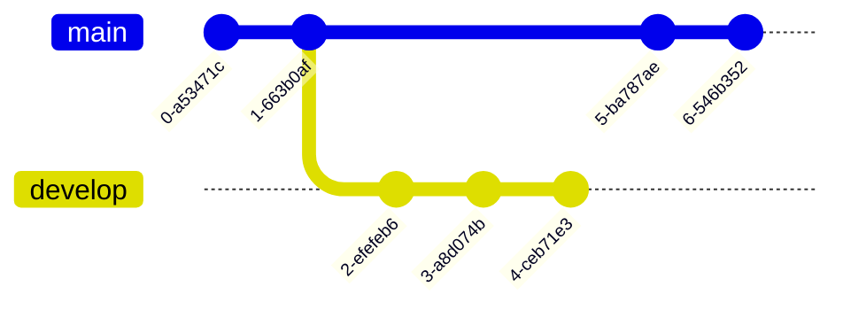
````

### 合并两个分支

要合并到已有分支，使用 `merge` 关键字，并需要提供要合并的源分支名称。只能合并两个不同的分支，不能将分支与自身合并。

用法示例：`merge develop`

当 Mermaid 读取 `merge` 关键字时，它会找到给定分支及其头提交（该分支的最后一次提交），并将其与**当前分支**的头提交合并。每次合并会产生一个**合并提交**，在图表中用**填充双圆**表示。

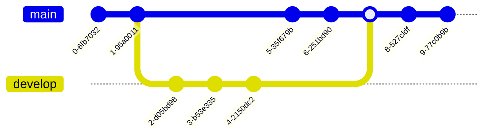

````markdown
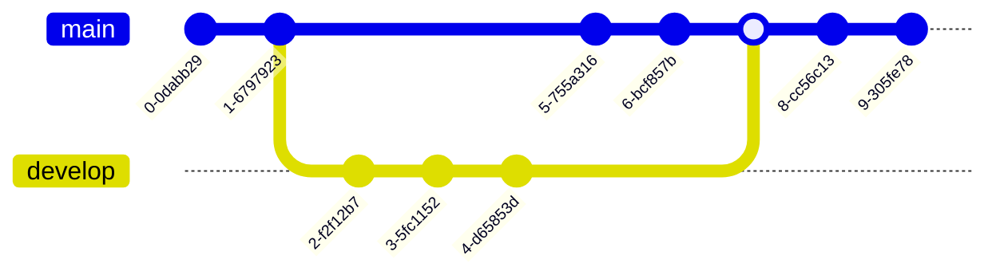
````

你也可以为合并添加类似提交的属性：

- `id` -- 覆盖默认 ID 为自定义 ID
- `tag` -- 为合并提交添加自定义标签
- `type` -- 覆盖合并提交的默认形状

例如：`merge develop id: "my_custom_id" tag: "my_custom_tag" type: REVERSE`

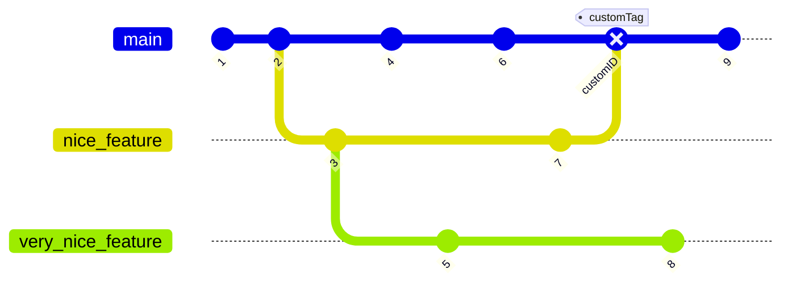

````markdown

````

### 从其他分支 Cherry Pick 提交

类似于 Git 中的 cherry-pick 功能，Mermaid 也支持从**另一个分支**挑选提交到**当前**分支。使用 `cherry-pick` 关键字。

使用 `cherry-pick` 关键字时，必须使用 `id` 属性指定要挑选的提交 ID。例如：`cherry-pick id: "your_custom_id"`

新的 cherry-pick 提交将在当前分支上创建，并在图表中用**樱桃**和标签（显示被挑选的源提交 ID）可视化地突出显示。

重要规则：

1. 你必须提供要 cherry-pick 的已有提交的 `id`。如果给定的提交 ID 不存在，将导致错误。
2. 给定的提交不能存在于当前分支上。cherry-pick 的提交必须始终来自不同于当前分支的分支。
3. 当前分支必须至少有一个提交，然后才能 cherry-pick，否则会抛出错误。
4. cherry-pick 合并提交时，必须提供父提交 ID。如果省略 parent 属性或提供了无效的父提交 ID，将抛出错误。
5. 指定的父提交必须是被 cherry-pick 的合并提交的直接父提交。

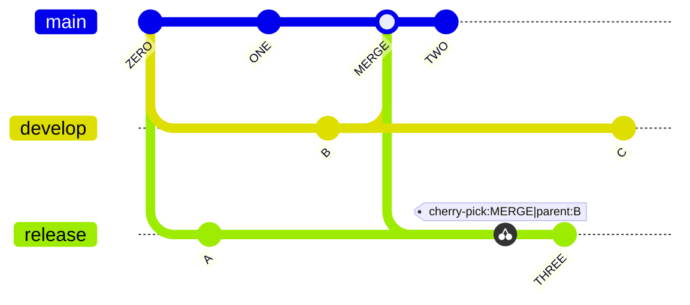

````markdown

````

## 配置选项

在 Mermaid 中，你可以配置 Git 图的以下选项：

- `showBranches`：布尔值，默认为 `true`。如果设为 `false`，图表中不显示分支。
- `showCommitLabel`：布尔值，默认为 `true`。如果设为 `false`，图表中不显示提交标签。
- `mainBranchName`：字符串，默认为 `main`。默认/根分支的名称。
- `mainBranchOrder`：主分支在分支列表中的位置。默认为 `0`，即默认 main 分支排在第一位。
- `parallelCommits`：布尔值，默认为 `false`。如果设为 `true`，距离父提交 x 距离的提交将在图表中同一层级显示。

### 隐藏分支名称和线

有时你可能想隐藏图表中的分支名称和线。可以通过 `showBranches` 关键字实现。默认值为 `true`。可以通过指令设为 `false`。

```mermaid
---
config:
  logLevel: 'debug'
  theme: 'base'
  gitGraph:
    showBranches: false
---
      gitGraph
        commit
        branch hotfix
        checkout hotfix
        commit
        branch develop
        checkout develop
        commit id:"ash" tag:"abc"
        branch featureB
        checkout featureB
        commit type:HIGHLIGHT
        checkout main
        checkout hotfix
        commit type:NORMAL
        checkout develop
        commit type:REVERSE
        checkout featureB
        commit
        checkout main
        merge hotfix
        checkout featureB
        commit
        checkout develop
        branch featureA
        commit
        checkout develop
        merge hotfix
        checkout featureA
        commit
        checkout featureB
        commit
        checkout develop
        merge featureA
        branch release
        checkout release
        commit
        checkout main
        commit
        checkout release
        merge main
        checkout develop
        merge release
```

````markdown
```mermaid
---
config:
  logLevel: 'debug'
  theme: 'base'
  gitGraph:
    showBranches: false
---
      gitGraph
        commit
        branch hotfix
        checkout hotfix
        commit
        branch develop
        checkout develop
        commit id:"ash" tag:"abc"
        branch featureB
        checkout featureB
        commit type:HIGHLIGHT
        checkout main
        checkout hotfix
        commit type:NORMAL
        checkout develop
        commit type:REVERSE
        checkout featureB
        commit
        checkout main
        merge hotfix
        checkout featureB
        commit
        checkout develop
        branch featureA
        commit
        checkout develop
        merge hotfix
        checkout featureA
        commit
        checkout featureB
        commit
        checkout develop
        merge featureA
        branch release
        checkout release
        commit
        checkout main
        commit
        checkout release
        merge main
        checkout develop
        merge release
```
````

### 提交标签布局：旋转或水平

Mermaid 支持两种提交标签布局。默认布局是**旋转**的，即标签放在提交圆圈下方，旋转 45 度以提高可读性。这对长标签的提交特别有用。

另一个选项是**水平**布局，即标签在提交圆圈下方水平居中放置，不旋转。这对短标签的提交特别有用。

可以通过指令中的 `rotateCommitLabel` 关键字更改布局。默认为 `true`，即提交标签是旋转的。

旋转提交标签示例：

```mermaid
---
config:
  logLevel: 'debug'
  theme: 'base'
  gitGraph:
    rotateCommitLabel: true
---
gitGraph
  commit id: "feat(api): ..."
  commit id: "a"
  commit id: "b"
  commit id: "fix(client): .extra long label.."
  branch c2
  commit id: "feat(modules): ..."
  commit id: "test(client): ..."
  checkout main
  commit id: "fix(api): ..."
  commit id: "ci: ..."
  branch b1
  commit
  branch b2
  commit
```

````markdown
```mermaid
---
config:
  logLevel: 'debug'
  theme: 'base'
  gitGraph:
    rotateCommitLabel: true
---
gitGraph
  commit id: "feat(api): ..."
  commit id: "a"
  commit id: "b"
  commit id: "fix(client): .extra long label.."
  branch c2
  commit id: "feat(modules): ..."
  commit id: "test(client): ..."
  checkout main
  commit id: "fix(api): ..."
  commit id: "ci: ..."
  branch b1
  commit
  branch b2
  commit
```
````

水平提交标签示例：

```mermaid
---
config:
  logLevel: 'debug'
  theme: 'base'
  gitGraph:
    rotateCommitLabel: false
---
gitGraph
  commit id: "feat(api): ..."
  commit id: "a"
  commit id: "b"
  commit id: "fix(client): .extra long label.."
  branch c2
  commit id: "feat(modules): ..."
  commit id: "test(client): ..."
  checkout main
  commit id: "fix(api): ..."
  commit id: "ci: ..."
  branch b1
  commit
  branch b2
  commit
```

````markdown
```mermaid
---
config:
  logLevel: 'debug'
  theme: 'base'
  gitGraph:
    rotateCommitLabel: false
---
gitGraph
  commit id: "feat(api): ..."
  commit id: "a"
  commit id: "b"
  commit id: "fix(client): .extra long label.."
  branch c2
  commit id: "feat(modules): ..."
  commit id: "test(client): ..."
  checkout main
  commit id: "fix(api): ..."
  commit id: "ci: ..."
  branch b1
  commit
  branch b2
  commit
```
````

### 隐藏提交标签

可以通过 `showCommitLabel` 关键字隐藏提交标签。默认值为 `true`。可以通过指令设为 `false`。

```mermaid
---
config:
  logLevel: 'debug'
  theme: 'base'
  gitGraph:
    showBranches: false
    showCommitLabel: false
---
      gitGraph
        commit
        branch hotfix
        checkout hotfix
        commit
        branch develop
        checkout develop
        commit id:"ash"
        branch featureB
        checkout featureB
        commit type:HIGHLIGHT
        checkout main
        checkout hotfix
        commit type:NORMAL
        checkout develop
        commit type:REVERSE
        checkout featureB
        commit
        checkout main
        merge hotfix
        checkout featureB
        commit
        checkout develop
        branch featureA
        commit
        checkout develop
        merge hotfix
        checkout featureA
        commit
        checkout featureB
        commit
        checkout develop
        merge featureA
        branch release
        checkout release
        commit
        checkout main
        commit
        checkout release
        merge main
        checkout develop
        merge release
```

````markdown
```mermaid
---
config:
  logLevel: 'debug'
  theme: 'base'
  gitGraph:
    showBranches: false
    showCommitLabel: false
---
      gitGraph
        commit
        branch hotfix
        checkout hotfix
        commit
        branch develop
        checkout develop
        commit id:"ash"
        branch featureB
        checkout featureB
        commit type:HIGHLIGHT
        checkout main
        checkout hotfix
        commit type:NORMAL
        checkout develop
        commit type:REVERSE
        checkout featureB
        commit
        checkout main
        merge hotfix
        checkout featureB
        commit
        checkout develop
        branch featureA
        commit
        checkout develop
        merge hotfix
        checkout featureA
        commit
        checkout featureB
        commit
        checkout develop
        merge featureA
        branch release
        checkout release
        commit
        checkout main
        commit
        checkout release
        merge main
        checkout develop
        merge release
```
````

### 自定义主分支名称

可以通过 `mainBranchName` 关键字自定义主/默认分支的名称。默认值为 `main`。

```mermaid
---
config:
  logLevel: 'debug'
  theme: 'base'
  gitGraph:
    showBranches: true
    showCommitLabel: true
    mainBranchName: 'MetroLine1'
---
      gitGraph
        commit id:"NewYork"
        commit id:"Dallas"
        branch MetroLine2
        commit id:"LosAngeles"
        commit id:"Chicago"
        commit id:"Houston"
        branch MetroLine3
        commit id:"Phoenix"
        commit type: HIGHLIGHT id:"Denver"
        commit id:"Boston"
        checkout MetroLine1
        commit id:"Atlanta"
        merge MetroLine3
        commit id:"Miami"
        commit id:"Washington"
        merge MetroLine2 tag:"MY JUNCTION"
        commit id:"Boston"
        commit id:"Detroit"
        commit type:REVERSE id:"SanFrancisco"
```

````markdown
```mermaid
---
config:
  logLevel: 'debug'
  theme: 'base'
  gitGraph:
    showBranches: true
    showCommitLabel: true
    mainBranchName: 'MetroLine1'
---
      gitGraph
        commit id:"NewYork"
        commit id:"Dallas"
        branch MetroLine2
        commit id:"LosAngeles"
        commit id:"Chicago"
        commit id:"Houston"
        branch MetroLine3
        commit id:"Phoenix"
        commit type: HIGHLIGHT id:"Denver"
        commit id:"Boston"
        checkout MetroLine1
        commit id:"Atlanta"
        merge MetroLine3
        commit id:"Miami"
        commit id:"Washington"
        merge MetroLine2 tag:"MY JUNCTION"
        commit id:"Boston"
        commit id:"Detroit"
        commit type:REVERSE id:"SanFrancisco"
```
````

### 自定义分支排序

默认情况下，分支按其定义或出现在图表代码中的顺序显示。

可以使用 `order` 关键字自定义分支的顺序。将其设为一个正数。

Mermaid 遵循以下优先顺序：

- Main 分支始终首先显示，默认 order 值为 `0`（除非通过 `mainBranchOrder` 关键字修改）。
- 接下来，没有 `order` 的分支按其在图表代码中出现的顺序显示。
- 最后，有 `order` 的分支按其 `order` 值的顺序显示。

要完全控制所有分支的顺序，必须为所有分支定义 `order`。

```mermaid
---
config:
  logLevel: 'debug'
  theme: 'base'
  gitGraph:
    showBranches: true
    showCommitLabel: true
---
      gitGraph
      commit
      branch test1 order: 3
      branch test2 order: 2
      branch test3 order: 1
```

````markdown
```mermaid
---
config:
  logLevel: 'debug'
  theme: 'base'
  gitGraph:
    showBranches: true
    showCommitLabel: true
---
      gitGraph
      commit
      branch test1 order: 3
      branch test2 order: 2
      branch test3 order: 1
```
````

```mermaid
---
config:
  logLevel: 'debug'
  theme: 'base'
  gitGraph:
    showBranches: true
    showCommitLabel: true
    mainBranchOrder: 2
---
      gitGraph
      commit
      branch test1 order: 3
      branch test2
      branch test3
      branch test4 order: 1
```

````markdown
```mermaid
---
config:
  logLevel: 'debug'
  theme: 'base'
  gitGraph:
    showBranches: true
    showCommitLabel: true
    mainBranchOrder: 2
---
      gitGraph
      commit
      branch test1 order: 3
      branch test2
      branch test3
      branch test4 order: 1
```
````

## 方向（v10.3.0+）

Mermaid 支持三种图表方向：**从左到右**（默认）、**从上到下**和**从下到上**。

可以在 `gitGraph` 后使用 `LR:`（从左到右）、`TB:`（从上到下）或 `BT:`（从下到上）来设置。

### 从左到右（默认，LR:）

默认方向是提交从左到右排列，分支从上到下堆叠。

```mermaid
    gitGraph LR:
       commit
       commit
       branch develop
       commit
       commit
       checkout main
       commit
       commit
       merge develop
       commit
       commit
```

````markdown
```mermaid
    gitGraph LR:
       commit
       commit
       branch develop
       commit
       commit
       checkout main
       commit
       commit
       merge develop
       commit
       commit
```
````

### 从上到下（TB:）

在 TB（从上到下）方向中，提交从图的顶部到底部排列，分支并排放置。

```mermaid
    gitGraph TB:
       commit
       commit
       branch develop
       commit
       commit
       checkout main
       commit
       commit
       merge develop
       commit
       commit
```

````markdown
```mermaid
    gitGraph TB:
       commit
       commit
       branch develop
       commit
       commit
       checkout main
       commit
       commit
       merge develop
       commit
       commit
```
````

### 从下到上（BT:）（v11.0.0+）

在 BT（从下到上）方向中，提交从图的底部到顶部排列，分支并排放置。

```mermaid
    gitGraph BT:
       commit
       commit
       branch develop
       commit
       commit
       checkout main
       commit
       commit
       merge develop
       commit
       commit
```

````markdown
```mermaid
    gitGraph BT:
       commit
       commit
       branch develop
       commit
       commit
       checkout main
       commit
       commit
       merge develop
       commit
       commit
```
````

## 并行提交（v10.8.0+）

默认情况下，Mermaid 中的 Git 图通过提交位置显示时间信息。例如，如果两个提交距离其父提交一个提交的距离，较早提交的提交会渲染得更靠近其父提交。可以通过启用 `parallelCommits` 标志来关闭此行为。

### 时间提交（默认，parallelCommits: false）

```mermaid
---
config:
  gitGraph:
    parallelCommits: false
---
gitGraph:
  commit
  branch develop
  commit
  commit
  checkout main
  commit
  commit
```

````markdown
```mermaid
---
config:
  gitGraph:
    parallelCommits: false
---
gitGraph:
  commit
  branch develop
  commit
  commit
  checkout main
  commit
  commit
```
````

### 并行提交（parallelCommits: true）

```mermaid
---
config:
  gitGraph:
    parallelCommits: true
---
gitGraph:
  commit
  branch develop
  commit
  commit
  checkout main
  commit
  commit
```

````markdown
```mermaid
---
config:
  gitGraph:
    parallelCommits: true
---
gitGraph:
  commit
  branch develop
  commit
  commit
  checkout main
  commit
  commit
```
````

## 主题

Mermaid 支持多种预定义主题。你也可以覆盖现有主题的变量来创建自定义主题。

预定义主题选项：

- `base`
- `forest`
- `dark`
- `default`
- `neutral`

注意：可以通过 `initialize` 调用或指令来更改主题。

### Base 主题

```mermaid
---
config:
  logLevel: 'debug'
  theme: 'base'
---
      gitGraph
        commit
        branch hotfix
        checkout hotfix
        commit
        branch develop
        checkout develop
        commit id:"ash" tag:"abc"
        branch featureB
        checkout featureB
        commit type:HIGHLIGHT
        checkout main
        checkout hotfix
        commit type:NORMAL
        checkout develop
        commit type:REVERSE
        checkout featureB
        commit
        checkout main
        merge hotfix
        checkout featureB
        commit
        checkout develop
        branch featureA
        commit
        checkout develop
        merge hotfix
        checkout featureA
        commit
        checkout featureB
        commit
        checkout develop
        merge featureA
        branch release
        checkout release
        commit
        checkout main
        commit
        checkout release
        merge main
        checkout develop
        merge release
```

````markdown
```mermaid
---
config:
  logLevel: 'debug'
  theme: 'base'
---
      gitGraph
        commit
        branch hotfix
        checkout hotfix
        commit
        branch develop
        checkout develop
        commit id:"ash" tag:"abc"
        branch featureB
        checkout featureB
        commit type:HIGHLIGHT
        checkout main
        checkout hotfix
        commit type:NORMAL
        checkout develop
        commit type:REVERSE
        checkout featureB
        commit
        checkout main
        merge hotfix
        checkout featureB
        commit
        checkout develop
        branch featureA
        commit
        checkout develop
        merge hotfix
        checkout featureA
        commit
        checkout featureB
        commit
        checkout develop
        merge featureA
        branch release
        checkout release
        commit
        checkout main
        commit
        checkout release
        merge main
        checkout develop
        merge release
```
````

### Forest 主题

```mermaid
---
config:
  logLevel: 'debug'
  theme: 'forest'
---
      gitGraph
        commit
        branch hotfix
        checkout hotfix
        commit
        branch develop
        checkout develop
        commit id:"ash" tag:"abc"
        branch featureB
        checkout featureB
        commit type:HIGHLIGHT
        checkout main
        checkout hotfix
        commit type:NORMAL
        checkout develop
        commit type:REVERSE
        checkout featureB
        commit
        checkout main
        merge hotfix
        checkout featureB
        commit
        checkout develop
        branch featureA
        commit
        checkout develop
        merge hotfix
        checkout featureA
        commit
        checkout featureB
        commit
        checkout develop
        merge featureA
        branch release
        checkout release
        commit
        checkout main
        commit
        checkout release
        merge main
        checkout develop
        merge release
```

````markdown
```mermaid
---
config:
  logLevel: 'debug'
  theme: 'forest'
---
      gitGraph
        commit
        branch hotfix
        checkout hotfix
        commit
        branch develop
        checkout develop
        commit id:"ash" tag:"abc"
        branch featureB
        checkout featureB
        commit type:HIGHLIGHT
        checkout main
        checkout hotfix
        commit type:NORMAL
        checkout develop
        commit type:REVERSE
        checkout featureB
        commit
        checkout main
        merge hotfix
        checkout featureB
        commit
        checkout develop
        branch featureA
        commit
        checkout develop
        merge hotfix
        checkout featureA
        commit
        checkout featureB
        commit
        checkout develop
        merge featureA
        branch release
        checkout release
        commit
        checkout main
        commit
        checkout release
        merge main
        checkout develop
        merge release
```
````

### Default 主题

```mermaid
---
config:
  logLevel: 'debug'
  theme: 'default'
---
      gitGraph
        commit type:HIGHLIGHT
        branch hotfix
        checkout hotfix
        commit
        branch develop
        checkout develop
        commit id:"ash" tag:"abc"
        branch featureB
        checkout featureB
        commit type:HIGHLIGHT
        checkout main
        checkout hotfix
        commit type:NORMAL
        checkout develop
        commit type:REVERSE
        checkout featureB
        commit
        checkout main
        merge hotfix
        checkout featureB
        commit
        checkout develop
        branch featureA
        commit
        checkout develop
        merge hotfix
        checkout featureA
        commit
        checkout featureB
        commit
        checkout develop
        merge featureA
        branch release
        checkout release
        commit
        checkout main
        commit
        checkout release
        merge main
        checkout develop
        merge release
```

````markdown
```mermaid
---
config:
  logLevel: 'debug'
  theme: 'default'
---
      gitGraph
        commit type:HIGHLIGHT
        branch hotfix
        checkout hotfix
        commit
        branch develop
        checkout develop
        commit id:"ash" tag:"abc"
        branch featureB
        checkout featureB
        commit type:HIGHLIGHT
        checkout main
        checkout hotfix
        commit type:NORMAL
        checkout develop
        commit type:REVERSE
        checkout featureB
        commit
        checkout main
        merge hotfix
        checkout featureB
        commit
        checkout develop
        branch featureA
        commit
        checkout develop
        merge hotfix
        checkout featureA
        commit
        checkout featureB
        commit
        checkout develop
        merge featureA
        branch release
        checkout release
        commit
        checkout main
        commit
        checkout release
        merge main
        checkout develop
        merge release
```
````

### Dark 主题

```mermaid
---
config:
  logLevel: 'debug'
  theme: 'dark'
---
      gitGraph
        commit
        branch hotfix
        checkout hotfix
        commit
        branch develop
        checkout develop
        commit id:"ash" tag:"abc"
        branch featureB
        checkout featureB
        commit type:HIGHLIGHT
        checkout main
        checkout hotfix
        commit type:NORMAL
        checkout develop
        commit type:REVERSE
        checkout featureB
        commit
        checkout main
        merge hotfix
        checkout featureB
        commit
        checkout develop
        branch featureA
        commit
        checkout develop
        merge hotfix
        checkout featureA
        commit
        checkout featureB
        commit
        checkout develop
        merge featureA
        branch release
        checkout release
        commit
        checkout main
        commit
        checkout release
        merge main
        checkout develop
        merge release
```

````markdown
```mermaid
---
config:
  logLevel: 'debug'
  theme: 'dark'
---
      gitGraph
        commit
        branch hotfix
        checkout hotfix
        commit
        branch develop
        checkout develop
        commit id:"ash" tag:"abc"
        branch featureB
        checkout featureB
        commit type:HIGHLIGHT
        checkout main
        checkout hotfix
        commit type:NORMAL
        checkout develop
        commit type:REVERSE
        checkout featureB
        commit
        checkout main
        merge hotfix
        checkout featureB
        commit
        checkout develop
        branch featureA
        commit
        checkout develop
        merge hotfix
        checkout featureA
        commit
        checkout featureB
        commit
        checkout develop
        merge featureA
        branch release
        checkout release
        commit
        checkout main
        commit
        checkout release
        merge main
        checkout develop
        merge release
```
````

### Neutral 主题

```mermaid
---
config:
  logLevel: 'debug'
  theme: 'neutral'
---
      gitGraph
        commit
        branch hotfix
        checkout hotfix
        commit
        branch develop
        checkout develop
        commit id:"ash" tag:"abc"
        branch featureB
        checkout featureB
        commit type:HIGHLIGHT
        checkout main
        checkout hotfix
        commit type:NORMAL
        checkout develop
        commit type:REVERSE
        checkout featureB
        commit
        checkout main
        merge hotfix
        checkout featureB
        commit
        checkout develop
        branch featureA
        commit
        checkout develop
        merge hotfix
        checkout featureA
        commit
        checkout featureB
        commit
        checkout develop
        merge featureA
        branch release
        checkout release
        commit
        checkout main
        commit
        checkout release
        merge main
        checkout develop
        merge release
```

````markdown
```mermaid
---
config:
  logLevel: 'debug'
  theme: 'neutral'
---
      gitGraph
        commit
        branch hotfix
        checkout hotfix
        commit
        branch develop
        checkout develop
        commit id:"ash" tag:"abc"
        branch featureB
        checkout featureB
        commit type:HIGHLIGHT
        checkout main
        checkout hotfix
        commit type:NORMAL
        checkout develop
        commit type:REVERSE
        checkout featureB
        commit
        checkout main
        merge hotfix
        checkout featureB
        commit
        checkout develop
        branch featureA
        commit
        checkout develop
        merge hotfix
        checkout featureA
        commit
        checkout featureB
        commit
        checkout develop
        merge featureA
        branch release
        checkout release
        commit
        checkout main
        commit
        checkout release
        merge main
        checkout develop
        merge release
```
````

## 使用主题变量自定义

Mermaid 允许你使用主题变量来自定义图表的外观和感觉。

> **重要**：Mermaid 支持通过主题变量覆盖**最多 8 个分支**的默认值。超过 8 个分支的阈值后，主题变量将以循环方式重复使用，即第 9 个分支将使用第 1 个分支的颜色/样式。

### 自定义分支颜色

你可以使用 `git0` 到 `git7` 主题变量自定义分支颜色。`git0` 变量驱动第一个分支的值，`git1` 驱动第二个分支，依此类推。

```mermaid
---
config:
  logLevel: 'debug'
  theme: 'default'
  themeVariables:
      'git0': '#ff0000'
      'git1': '#00ff00'
      'git2': '#0000ff'
      'git3': '#ff00ff'
      'git4': '#00ffff'
      'git5': '#ffff00'
      'git6': '#ff00ff'
      'git7': '#00ffff'
---
       gitGraph
       commit
       branch develop
       commit tag:"v1.0.0"
       commit
       checkout main
       commit type: HIGHLIGHT
       commit
       merge develop
       commit
       branch featureA
       commit
```

````markdown
```mermaid
---
config:
  logLevel: 'debug'
  theme: 'default'
  themeVariables:
      'git0': '#ff0000'
      'git1': '#00ff00'
      'git2': '#0000ff'
      'git3': '#ff00ff'
      'git4': '#00ffff'
      'git5': '#ffff00'
      'git6': '#ff00ff'
      'git7': '#00ffff'
---
       gitGraph
       commit
       branch develop
       commit tag:"v1.0.0"
       commit
       checkout main
       commit type: HIGHLIGHT
       commit
       merge develop
       commit
       branch featureA
       commit
```
````

### 自定义分支标签颜色

你可以使用 `gitBranchLabel0` 到 `gitBranchLabel7` 主题变量自定义分支标签颜色。

```mermaid
---
config:
  logLevel: 'debug'
  theme: 'default'
  themeVariables:
    'gitBranchLabel0': '#ffffff'
    'gitBranchLabel1': '#ffffff'
    'gitBranchLabel2': '#ffffff'
    'gitBranchLabel3': '#ffffff'
    'gitBranchLabel4': '#ffffff'
    'gitBranchLabel5': '#ffffff'
    'gitBranchLabel6': '#ffffff'
    'gitBranchLabel7': '#ffffff'
    'gitBranchLabel8': '#ffffff'
    'gitBranchLabel9': '#ffffff'
---
  gitGraph
    checkout main
    branch branch1
    branch branch2
    branch branch3
    branch branch4
    branch branch5
    branch branch6
    branch branch7
    branch branch8
    branch branch9
    checkout branch1
    commit
```

````markdown
```mermaid
---
config:
  logLevel: 'debug'
  theme: 'default'
  themeVariables:
    'gitBranchLabel0': '#ffffff'
    'gitBranchLabel1': '#ffffff'
    'gitBranchLabel2': '#ffffff'
    'gitBranchLabel3': '#ffffff'
    'gitBranchLabel4': '#ffffff'
    'gitBranchLabel5': '#ffffff'
    'gitBranchLabel6': '#ffffff'
    'gitBranchLabel7': '#ffffff'
    'gitBranchLabel8': '#ffffff'
    'gitBranchLabel9': '#ffffff'
---
  gitGraph
    checkout main
    branch branch1
    branch branch2
    branch branch3
    branch branch4
    branch branch5
    branch branch6
    branch branch7
    branch branch8
    branch branch9
    checkout branch1
    commit
```
````

可以看到 `branch8` 和 `branch9` 的颜色和样式分别取自索引位置 `0`（`main`）和 `1`（`branch1`）的分支，即**分支主题变量循环重复**。

### 自定义提交颜色

你可以使用 `commitLabelColor` 和 `commitLabelBackground` 主题变量自定义提交标签的颜色和背景色。

```mermaid
---
config:
  logLevel: 'debug'
  theme: 'default'
  themeVariables:
    commitLabelColor: '#ff0000'
    commitLabelBackground: '#00ff00'
---
       gitGraph
       commit
       branch develop
       commit tag:"v1.0.0"
       commit
       checkout main
       commit type: HIGHLIGHT
       commit
       merge develop
       commit
       branch featureA
       commit
```

````markdown
```mermaid
---
config:
  logLevel: 'debug'
  theme: 'default'
  themeVariables:
    commitLabelColor: '#ff0000'
    commitLabelBackground: '#00ff00'
---
       gitGraph
       commit
       branch develop
       commit tag:"v1.0.0"
       commit
       checkout main
       commit type: HIGHLIGHT
       commit
       merge develop
       commit
       branch featureA
       commit
```
````

### 自定义提交标签字体大小

你可以使用 `commitLabelFontSize` 主题变量更改提交标签的字体大小。

```mermaid
---
config:
  logLevel: 'debug'
  theme: 'default'
  themeVariables:
    commitLabelColor: '#ff0000'
    commitLabelBackground: '#00ff00'
    commitLabelFontSize: '16px'
---
       gitGraph
       commit
       branch develop
       commit tag:"v1.0.0"
       commit
       checkout main
       commit type: HIGHLIGHT
       commit
       merge develop
       commit
       branch featureA
       commit
```

````markdown
```mermaid
---
config:
  logLevel: 'debug'
  theme: 'default'
  themeVariables:
    commitLabelColor: '#ff0000'
    commitLabelBackground: '#00ff00'
    commitLabelFontSize: '16px'
---
       gitGraph
       commit
       branch develop
       commit tag:"v1.0.0"
       commit
       checkout main
       commit type: HIGHLIGHT
       commit
       merge develop
       commit
       branch featureA
       commit
```
````

### 自定义标签字体大小

你可以使用 `tagLabelFontSize` 主题变量更改标签的字体大小。

```mermaid
---
config:
  logLevel: 'debug'
  theme: 'default'
  themeVariables:
    commitLabelColor: '#ff0000'
    commitLabelBackground: '#00ff00'
    tagLabelFontSize: '16px'
---
       gitGraph
       commit
       branch develop
       commit tag:"v1.0.0"
       commit
       checkout main
       commit type: HIGHLIGHT
       commit
       merge develop
       commit
       branch featureA
       commit
```

````markdown
```mermaid
---
config:
  logLevel: 'debug'
  theme: 'default'
  themeVariables:
    commitLabelColor: '#ff0000'
    commitLabelBackground: '#00ff00'
    tagLabelFontSize: '16px'
---
       gitGraph
       commit
       branch develop
       commit tag:"v1.0.0"
       commit
       checkout main
       commit type: HIGHLIGHT
       commit
       merge develop
       commit
       branch featureA
       commit
```
````

### 自定义标签颜色

你可以使用 `tagLabelColor`、`tagLabelBackground` 和 `tagLabelBorder` 主题变量自定义标签的颜色、背景色和边框。

```mermaid
---
config:
  logLevel: 'debug'
  theme: 'default'
  themeVariables:
    tagLabelColor: '#ff0000'
    tagLabelBackground: '#00ff00'
    tagLabelBorder: '#0000ff'
---
       gitGraph
       commit
       branch develop
       commit tag:"v1.0.0"
       commit
       checkout main
       commit type: HIGHLIGHT
       commit
       merge develop
       commit
       branch featureA
       commit
```

````markdown
```mermaid
---
config:
  logLevel: 'debug'
  theme: 'default'
  themeVariables:
    tagLabelColor: '#ff0000'
    tagLabelBackground: '#00ff00'
    tagLabelBorder: '#0000ff'
---
       gitGraph
       commit
       branch develop
       commit tag:"v1.0.0"
       commit
       checkout main
       commit type: HIGHLIGHT
       commit
       merge develop
       commit
       branch featureA
       commit
```
````

### 自定义高亮提交颜色

你可以使用 `gitInv0` 到 `gitInv7` 主题变量自定义高亮提交的颜色（相对于其所在分支）。`gitInv0` 变量驱动第一个分支的高亮提交颜色，`gitInv1` 驱动第二个分支，依此类推。

```mermaid
---
config:
  logLevel: 'debug'
  theme: 'default'
  themeVariables:
    'gitInv0': '#ff0000'
---
       gitGraph
       commit
       branch develop
       commit tag:"v1.0.0"
       commit
       checkout main
       commit type: HIGHLIGHT
       commit
       merge develop
       commit
       branch featureA
       commit
```

````markdown
```mermaid
---
config:
  logLevel: 'debug'
  theme: 'default'
  themeVariables:
    'gitInv0': '#ff0000'
---
       gitGraph
       commit
       branch develop
       commit tag:"v1.0.0"
       commit
       checkout main
       commit type: HIGHLIGHT
       commit
       merge develop
       commit
       branch featureA
       commit
```
````

## 参考

- [GitGraph - Mermaid](https://mermaid.js.org/syntax/gitgraph.html)
