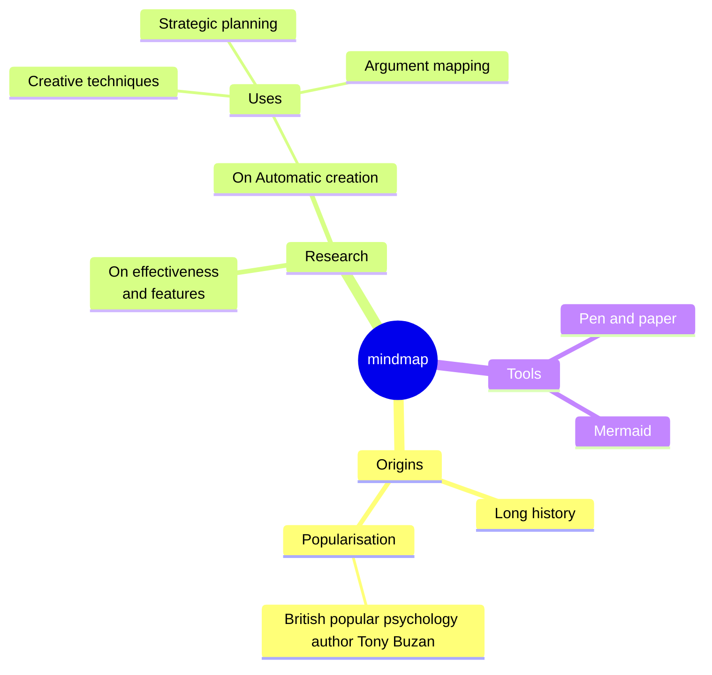
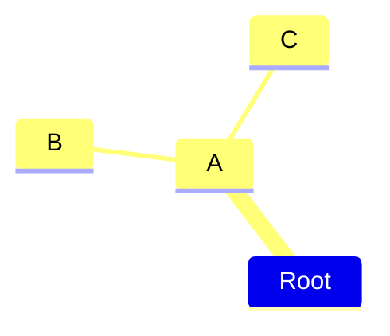
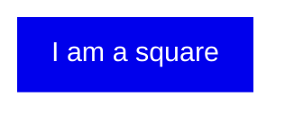
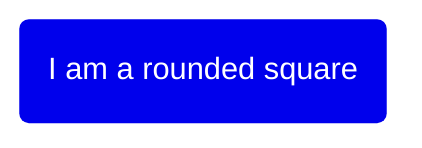
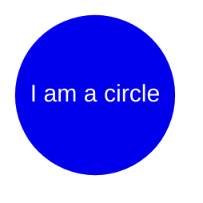
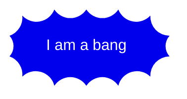
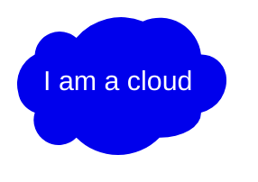
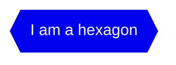
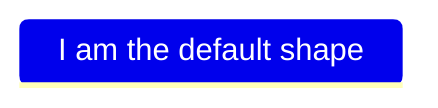
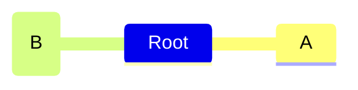

思维导图是一种用于将信息可视化地组织成层次结构的图表，显示各部分之间的关系。它通常围绕一个中心概念创建，将相关的想法（如图像、词语和词语的部分）添加到周围。主要想法直接连接到中心概念，其他想法从这些主要想法分支出来。



````markdown

````

## 语法

创建思维导图的语法很简单，依靠缩进来设置层次中的级别。

在下面的示例中，可以看到 3 个不同的级别。一个从文本左侧开始，另一个级别有两行从同一列开始，定义了节点 A。最后还有一个级别，文本比前面的行缩进更多，定义了节点 B 和 C。

```text
mindmap
    Root
        A
            B
            C
```

简而言之，这是一个简单的文本大纲，根级别有一个名为 `Root` 的节点，它有一个子节点 `A`。`A` 又有两个子节点 `B` 和 `C`。



````markdown

````

通过这种方式，我们可以使用文本大纲来生成层次化的思维导图。

## 不同形状

Mermaid 思维导图可以使用不同形状显示节点。指定节点形状时的语法类似于流程图节点，先有 id，然后是形状定义，文本在形状分隔符内。

### Square



````markdown

````

### Rounded square



````markdown

````

### Circle



````markdown

````

### Bang



````markdown

````

### Cloud



````markdown

````

### Hexagon



````markdown

````

### Default



````markdown

````

更多形状将会添加，从流程图中可用的形状开始。

## 图标和类

### 图标

与流程图一样，你可以使用更新后的语法为节点添加图标。基于字体的图标的样式是在集成期间添加的，以便网页可以使用。这不是图表作者可以做的，需要由站点管理员或集成者完成。一旦图标字体就位，你可以使用 `::icon()` 语法将它们添加到思维导图节点中。



````markdown

````

### 类

添加类的语法也类似于流程图。你可以使用三个冒号后跟多个以空格分隔的 CSS 类。

```mermaid
mindmap
    Root
        A[A]
        :::urgent large
        B(B)
        C
```

````markdown
```mermaid
mindmap
    Root
        A[A]
        :::urgent large
        B(B)
        C
```
````

这些类需要由站点管理员提供。

## 不明确的缩进

实际的缩进并不真正重要，只与前面的行比较。以之前示例为例，稍微打乱一下，可以看到计算是如何执行的。让我们把 C 放在比 `B` 更小的缩进位置，但比 `A` 更大。

```text
mindmap
    Root
        A
            B
          C
```

这个大纲不明确，因为 `B` 显然是 `A` 的子节点，但当我们继续到 `C` 时，清晰性就丧失了。`C` 既不是 `B` 的子节点（缩进更高），也没有与 `B` 相同的缩进。唯一清楚的是具有更小缩进的第一个节点（表示父节点）是 A。然后 Mermaid 依赖这个已知事实并补偿不明确的缩进，选择 `A` 作为 `C` 的父节点，导致 `B` 和 `C` 成为兄弟节点的相同图。

```mermaid
mindmap
Root
    A
        B
      C
```

````markdown
```mermaid
mindmap
Root
    A
        B
      C
```
````

## Markdown 字符串

"Markdown 字符串" 功能通过提供更通用的字符串类型来增强思维导图，支持粗体和斜体等文本格式选项，并自动在标签内换行文本。

```mermaid
mindmap
    id1["`**Root** with
a second line
Unicode works too: 🤓`"]
      id2["`The dog in **the** hog... a *very long text* that wraps to a new line`"]
      id3[Regular labels still works]
```

````markdown
```mermaid
mindmap
    id1["`**Root** with
a second line
Unicode works too: 🤓`"]
      id2["`The dog in **the** hog... a *very long text* that wraps to a new line`"]
      id3[Regular labels still works]
```
````

格式说明：

- 粗体文本，在文本前后使用双星号 \*\*。
- 斜体文本，在文本前后使用单星号 \*。
- 使用传统字符串时，需要在节点中添加 `<br>` 标签才能换行。但 Markdown 字符串会在文本过长时自动换行，并允许通过简单地使用换行符来开始新行。

## 布局

Mermaid 还支持思维导图的 Tidy Tree 布局。

```text
---
config:
  layout: tidy-tree
---
mindmap
root((mindmap is a long thing))
  A
  B
  C
  D
```

添加和注册 tidy-tree 布局的说明请参阅 Tidy Tree 配置文档。

## 与你的库/网站集成

思维导图使用实验性的延迟加载和异步渲染功能，这些功能在未来可能会更改。从 9.4.0 版本开始，此图表已包含在 mermaid 中，但使用延迟加载以保持 mermaid 的大小。

你可以使用以下方法将包含思维导图的 mermaid 添加到网页：

```html
<script type="module">
  import mermaid from '<CDN_URL>/mermaid@<MERMAID_VERSION>/dist/mermaid.esm.min.mjs';
</script>
```

## 参考

- [Mindmap - Mermaid](https://mermaid.js.org/syntax/mindmap.html)
