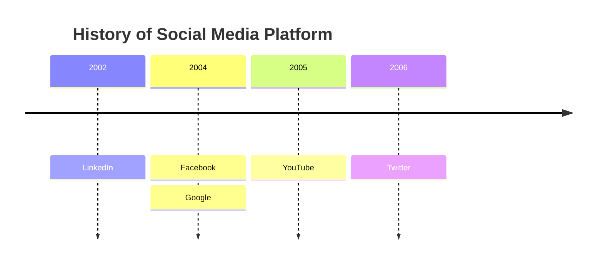
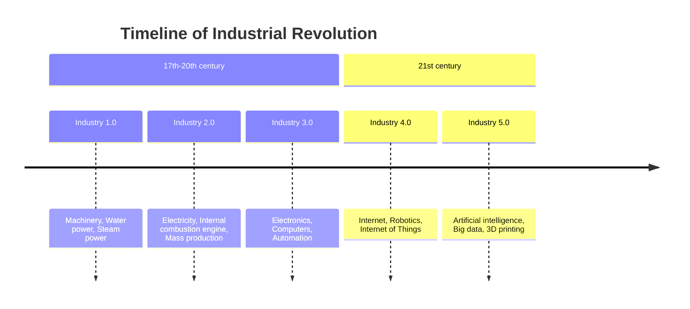
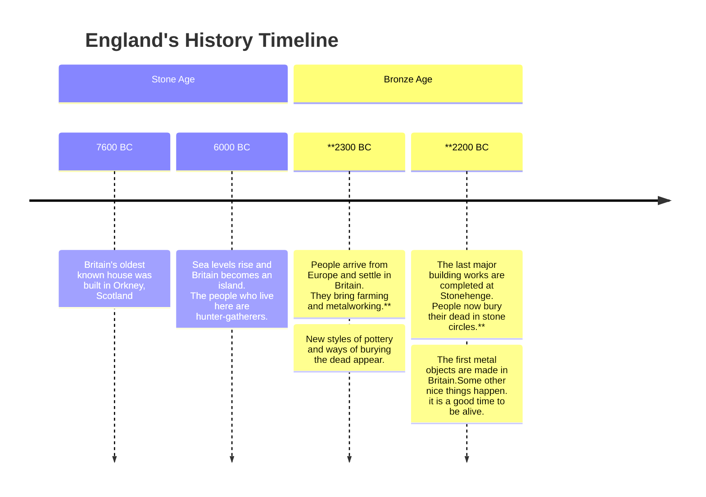
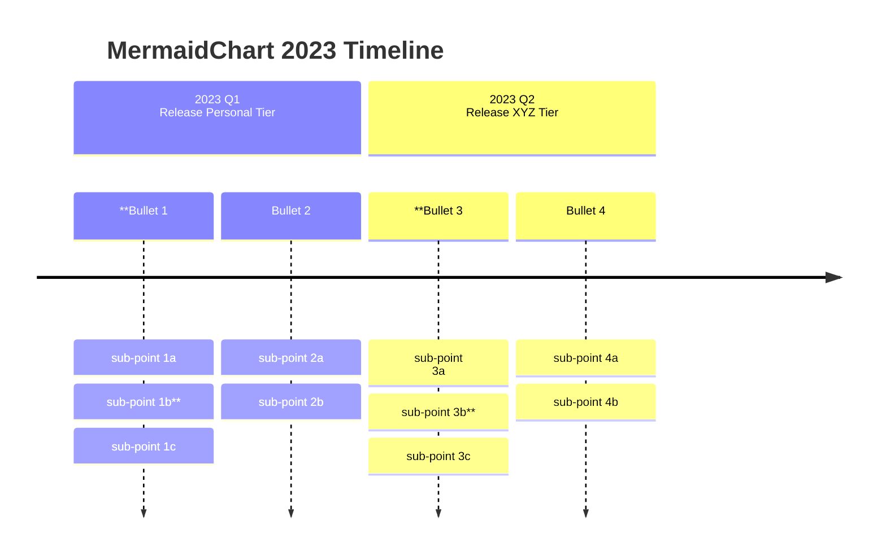
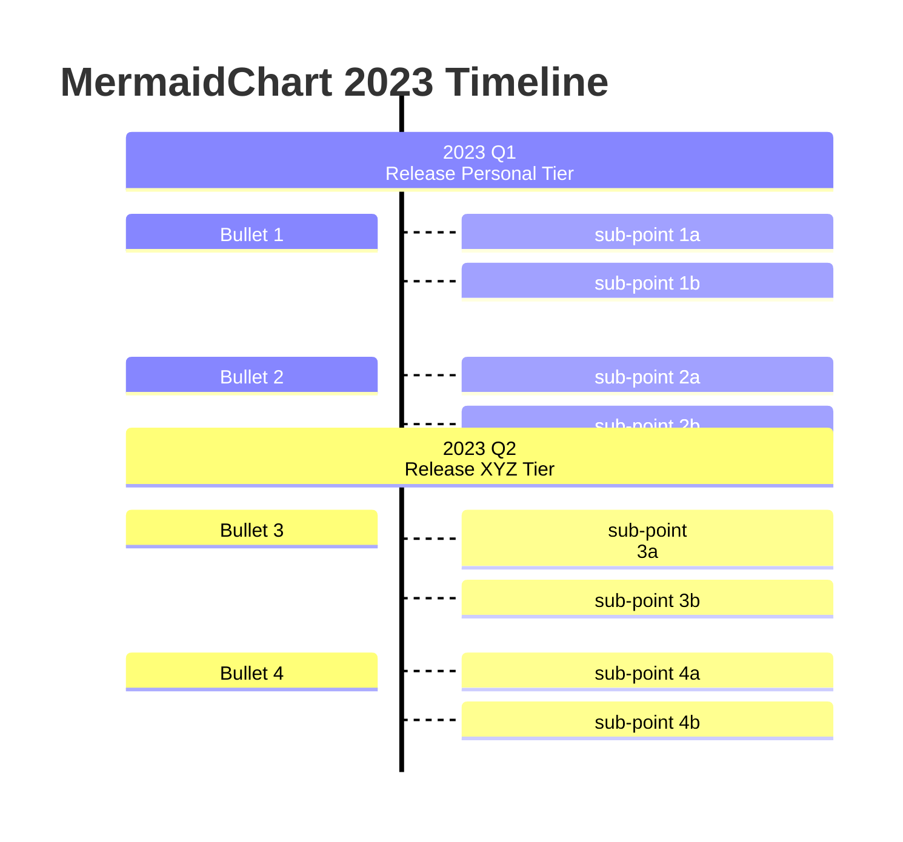
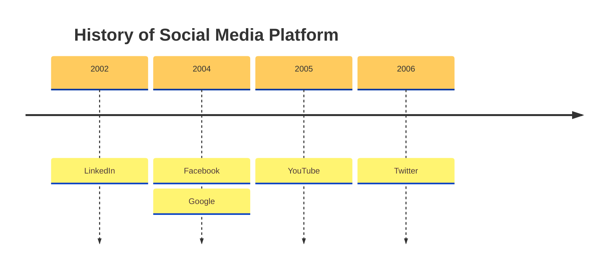
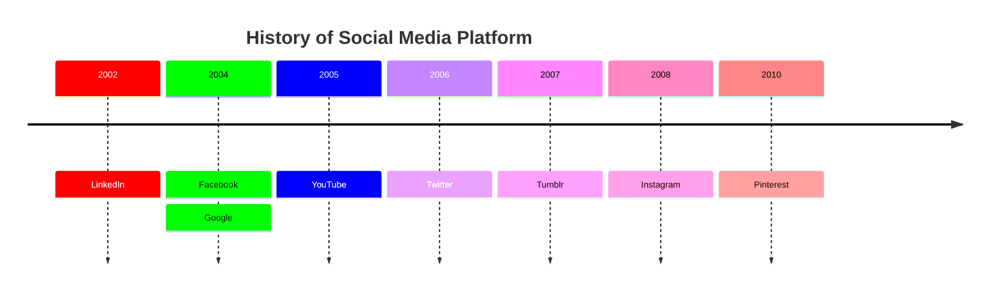
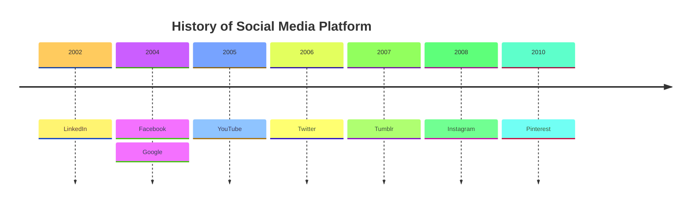

时间线（Timeline）是一种用于按时间顺序说明事件、日期或时间段的图表。它通常以图形方式呈现以指示时间的流逝，并通常按时间顺序组织。基本时间线按时间顺序呈现事件列表，通常使用日期作为标记。


````markdown

````

## 语法

创建时间线图的语法很简单。始终以 `timeline` 关键字开头，让 Mermaid 知道你要创建时间线图。

之后可以添加标题。方法是添加一行以 `title` 关键字开头，后跟标题文本。

然后添加时间线数据，始终以时间段开头，后跟冒号，然后是事件的文本。可以选择添加第二个冒号和另一个事件。因此，每个时间段可以有一个或多个事件。

```text
{time period} : {event}
```

或

```text
{time period} : {event} : {event}
```

或

```text
****{time period} : {event}**: {event}**: {event}


```

注意：时间段和事件都是简单文本，不限于数字。



````markdown

````

时间段和事件的顺序很重要，因为它们将用于绘制时间线。第一个时间段放在时间线的左侧，最后一个时间段放在右侧。同样，第一个事件放在该特定时间段的顶部，最后一个事件放在底部。

## 在分段/时代中分组时间段

你可以在分段/时代中分组时间段。方法是添加一行以 `section` 关键字开头，后跟分段名称。

所有后续的时间段将放在此分段中，直到定义新的分段。如果未定义分段，所有时间段将放在默认分段中。



````markdown

````

如你所见，时间段放在分段中，分段按定义的顺序放置。给定分段下的所有时间段和事件遵循类似的颜色方案。这样做是为了更容易看到时间段和事件之间的关系。

## 长时间段或事件的文本换行

默认情况下，如果时间段和事件的文本过长，将自动换行。你也可以使用 `<br>` 强制换行。



````markdown

````



````markdown

````

### 方向（v11.14.0+）

时间线可以通过 `timeline` 后的关键字更改方向。



````markdown

````

可选方向：

- `LR`：从左到右（默认）
- `TD`：从上到下

## 时间段和事件的样式

如前所述，每个分段都有一个颜色方案，分段下的每个时间段和事件遵循类似的颜色方案。

但是，如果未定义分段，则有两种可能：

1. 单独为时间段设置样式，即每个时间段（及其对应事件）有自己的颜色方案。这是**默认行为**。


````markdown

````

注意：未定义分段，每个时间段及其对应事件有自己的颜色方案。

2. 使用 `disableMultiColor` 选项禁用多色选项。这将使所有时间段和事件遵循相同的颜色方案。

你需要通过 `mermaid.initialize` 函数或指令添加此选项。

```javascript
mermaid.initialize({
        theme: 'base',
        startOnLoad: true,
        logLevel: 0,
        timeline: {
          disableMulticolor: false,
        },
        ...
```



````markdown

````

### 自定义颜色方案

你可以使用 `cScale0` 到 `cScale11` 主题变量自定义颜色方案，这将更改背景颜色。Mermaid 允许你为最多 12 个分段设置唯一颜色，`cScale0` 变量驱动第一个分段或时间段的值，`cScale1` 驱动第二个分段的值，依此类推。如果超过 12 个分段，颜色方案将开始重复。

如果你想更改分段的前景色，可以使用对应的 `cScaleLabel0` 到 `cScaleLabel11` 变量。

注意：这些主题变量的默认值从选定的主题中选取。如果要覆盖默认值，可以使用 `initialize` 调用添加自定义主题变量值。



````markdown

````

## 主题

Mermaid 支持多种预定义主题。你也可以覆盖现有主题的变量来创建自定义主题。

预定义主题选项：

- `base`
- `forest`
- `dark`
- `default`
- `neutral`

注意：可以通过 `initialize` 调用或指令来更改主题。

### Base 主题



````markdown

````

### Forest 主题

```mermaid
---
config:
  logLevel: 'debug'
  theme: 'forest'
---
    timeline
        title History of Social Media Platform
          2002 : LinkedIn
          2004 : Facebook : Google
          2005 : YouTube
          2006 : Twitter
          2007 : Tumblr
          2008 : Instagram
          2010 : Pinterest
```

````markdown
```mermaid
---
config:
  logLevel: 'debug'
  theme: 'forest'
---
    timeline
        title History of Social Media Platform
          2002 : LinkedIn
          2004 : Facebook : Google
          2005 : YouTube
          2006 : Twitter
          2007 : Tumblr
          2008 : Instagram
          2010 : Pinterest
```
````

### Dark 主题

```mermaid
---
config:
  logLevel: 'debug'
  theme: 'dark'
---
    timeline
        title History of Social Media Platform
          2002 : LinkedIn
          2004 : Facebook : Google
          2005 : YouTube
          2006 : Twitter
          2007 : Tumblr
          2008 : Instagram
          2010 : Pinterest
```

````markdown
```mermaid
---
config:
  logLevel: 'debug'
  theme: 'dark'
---
    timeline
        title History of Social Media Platform
          2002 : LinkedIn
          2004 : Facebook : Google
          2005 : YouTube
          2006 : Twitter
          2007 : Tumblr
          2008 : Instagram
          2010 : Pinterest
```
````

### Default 主题

```mermaid
---
config:
  logLevel: 'debug'
  theme: 'default'
---
    timeline
        title History of Social Media Platform
          2002 : LinkedIn
          2004 : Facebook : Google
          2005 : YouTube
          2006 : Twitter
          2007 : Tumblr
          2008 : Instagram
          2010 : Pinterest
```

````markdown
```mermaid
---
config:
  logLevel: 'debug'
  theme: 'default'
---
    timeline
        title History of Social Media Platform
          2002 : LinkedIn
          2004 : Facebook : Google
          2005 : YouTube
          2006 : Twitter
          2007 : Tumblr
          2008 : Instagram
          2010 : Pinterest
```
````

### Neutral 主题

```mermaid
---
config:
  logLevel: 'debug'
  theme: 'neutral'
---
    timeline
        title History of Social Media Platform
          2002 : LinkedIn
          2004 : Facebook : Google
          2005 : YouTube
          2006 : Twitter
          2007 : Tumblr
          2008 : Instagram
          2010 : Pinterest
```

````markdown
```mermaid
---
config:
  logLevel: 'debug'
  theme: 'neutral'
---
    timeline
        title History of Social Media Platform
          2002 : LinkedIn
          2004 : Facebook : Google
          2005 : YouTube
          2006 : Twitter
          2007 : Tumblr
          2008 : Instagram
          2010 : Pinterest
```
````

## 与你的库/网站集成

时间线使用实验性的延迟加载和异步渲染功能，这些功能在未来可能会更改。延迟加载对于能够添加额外图表非常重要。

你可以使用此方法将包含时间线图的 mermaid 添加到网页：

```html
<script type="module">
  import mermaid from '<CDN_URL>/mermaid@<MERMAID_VERSION>/dist/mermaid.esm.min.mjs';
</script>
```

## 参考

- [Timeline - Mermaid](https://mermaid.js.org/syntax/timeline.html)
