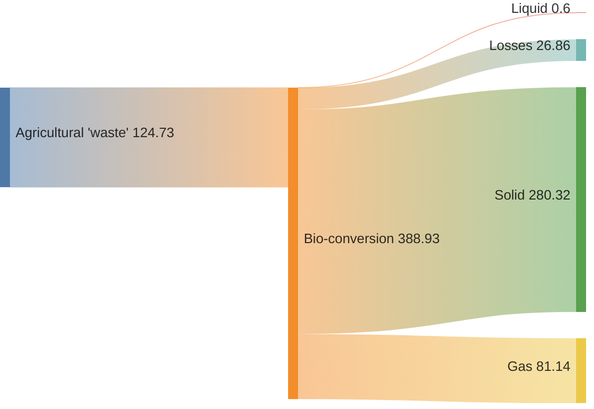
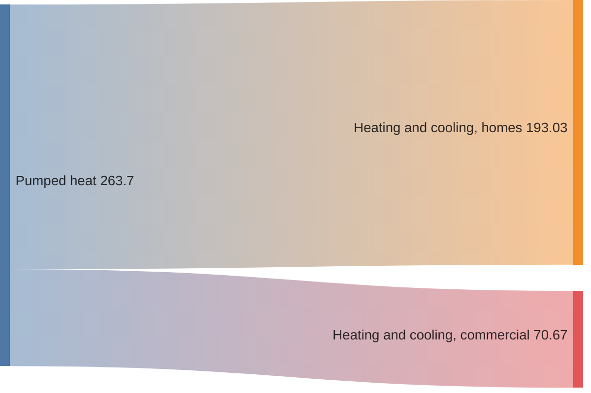
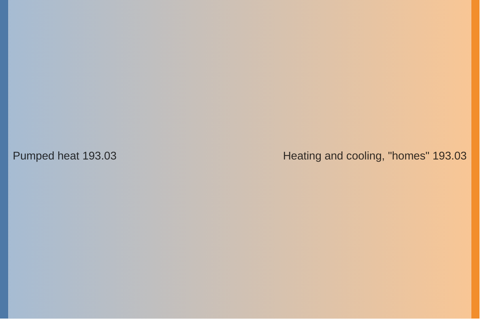

桑基图用于展示一组值到另一组值的流量。被连接的事物称为节点，连接称为链接。


> [!WARNING]
> 这是一个实验性图表，语法接近纯 CSV。
>

## 示例



````markdown

````

## 语法

先输入 `sankey` 关键字，然后粘贴 CSV 数据。CSV 必须包含 **3 列**，分别表示 `source`、`target` 和 `value`。允许有空行。

### 逗号

如需包含逗号，用双引号包裹：



````markdown

````

### 双引号

如需包含双引号，在引号内使用两个双引号：



````markdown

````

## 配置

```javascript
mermaid.initialize({
  sankey: {
    width: 800,
    height: 400,
    linkColor: 'source',
    nodeAlignment: 'left',
  },
});
```

### 链接着色

`linkColor` 可设为：

- `source` — 链接使用源节点颜色
- `target` — 链接使用目标节点颜色
- `gradient` — 链接颜色在源和目标之间渐变
- 十六进制颜色值，如 `#a1a1a1`

### 节点对齐

`nodeAlignment` 可设为：`justify`、`center`、`left`、`right`

### 标签样式（v11.15.0+）

`labelStyle` 可设为：

- `legacy`（默认）— 纯文本标签
- `outlined` — 带背景描边的标签

### 节点宽度和间距（v11.15.0+）

- `nodeWidth` — 节点矩形宽度（默认 10）
- `nodePadding` — 节点之间的垂直间距（默认 12）

### 自定义节点颜色（v11.15.0+）

通过 `nodeColors` 映射为节点指定颜色：

```yaml
nodeColors:
  Electricity grid: "#4e79a7"
  Industry: "#e15759"
```

## 参考

- [Sankey - Mermaid](https://mermaid.js.org/syntax/sankey.html)
