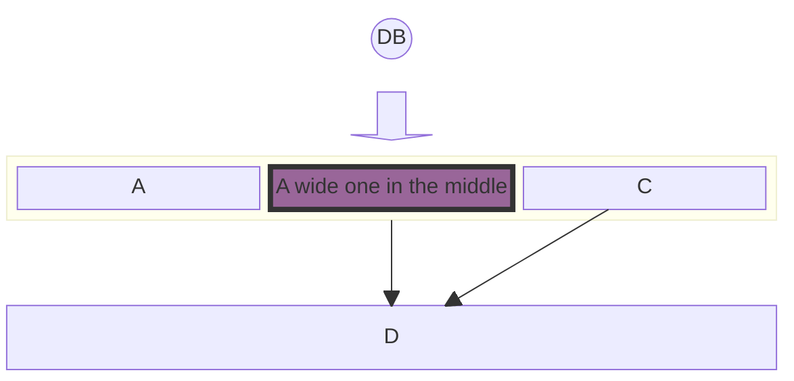
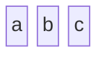
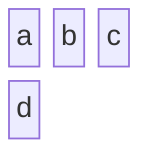
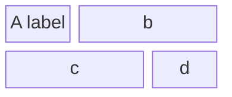
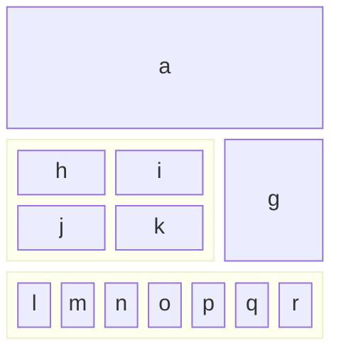
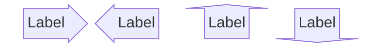
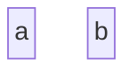
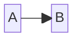
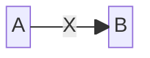

块图用块和连接器直观地表示复杂系统。与流程图不同，块图让作者完全控制形状的定位。



````markdown

````

## 基本结构



````markdown

````

### 设置列数



````markdown

````

## 高级配置

### 设置块宽度

用 `:N` 让块跨越 N 列：



````markdown

````

### 组合块（嵌套）


````markdown

````

### 动态列宽

列宽由该列中最宽的块自动决定。



````markdown

````

## 块形状

| 形状 | 语法 |
|---|---|
| 圆角 | `id1("text")` |
| 体育场形 | `id1(["text"])` |
| 子程序 | `id1([["text"]])` |
| 圆柱（数据库） | `id1[("Database")]` |
| 圆形 | `id1(("text"))` |
| 菱形 | `id1{"text"}` |
| 六边形 | `id1{{"text"}}` |
| 平行四边形 | `id1[/"text"/]` |
| 双圆 | `id1((("text")))` |

### 块箭头



````markdown

````

### 空间块

用 `space` 创建空白区域，可用 `space:N` 指定占据 N 列：



````markdown

````

## 连接块



````markdown

````

### 带文本的链接



````markdown

````

## 样式

### 直接样式

```text
style id1 fill:#636,stroke:#333,stroke-width:4px
```

### 类样式

```mermaid
block
  A space B
  A-->B
  classDef blue fill:#6e6ce6,stroke:#333,stroke-width:4px
  class A blue
```

````markdown
```mermaid
block
  A space B
  A-->B
  classDef blue fill:#6e6ce6,stroke:#333,stroke-width:4px
  class A blue
```
````

## 实用示例

### 系统架构

```mermaid
block
  columns 3
  Frontend blockArrowId6<[" "]>(right) Backend
  space:2 down<[" "]>(down)
  Disk left<[" "]>(left) Database[("Database")]

  classDef front fill:#696,stroke:#333
  classDef back fill:#969,stroke:#333
  class Frontend front
  class Backend,Database back
```

````markdown
```mermaid
block
  columns 3
  Frontend blockArrowId6<[" "]>(right) Backend
  space:2 down<[" "]>(down)
  Disk left<[" "]>(left) Database[("Database")]

  classDef front fill:#696,stroke:#333
  classDef back fill:#969,stroke:#333
  class Frontend front
  class Backend,Database back
```
````

## 参考

- [Block Diagram - Mermaid](https://mermaid.js.org/syntax/block.html)
