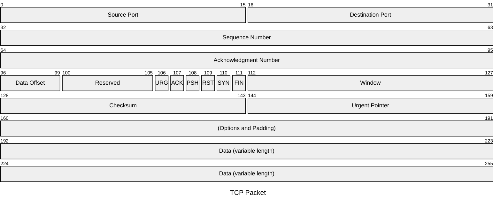
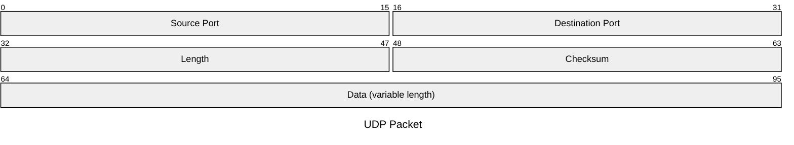

数据包图用于可视化网络数据包的结构和内容，适用于开发者、网络工程师和教育场景。

## 语法

```text
packet
start: "Block name" %% 单比特块
start-end: "Block name" %% 多比特块
```

### Bits 语法（v11.7.0+）

使用 `+<count>` 自动从上一个字段结束位置计算：

```text
packet
+1: "Block name" %% 单比特块
+8: "Block name" %% 8 比特块
9-15: "手动设置起止位，可混合使用"
```

## 示例

### TCP 数据包



````markdown

````

### UDP 数据包



````markdown

````

## 语法细节

- **范围**：每行表示数据包中的一个字段，范围（如 `0-15`）指示比特位置
- **字段描述**：用引号包裹的字段说明

## 参考

- [Packet - Mermaid](https://mermaid.js.org/syntax/packet.html)
