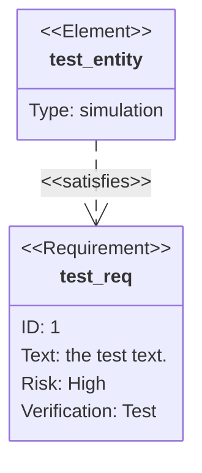

需求图提供需求和它们之间连接的可视化表示，遵循 SysML v1.6 规范。



````markdown

````

## 语法

需求图包含三种组件：需求（requirement）、元素（element）和关系（relationship）。

所有输入可以用引号包裹或不用。但不用引号时需注意，解析器检测到关键字会失败。

### Requirement

```text
<type> user_defined_name {
    id: user_defined_id
    text: user_defined text
    risk: <risk>
    verifymethod: <method>
}
```

| 关键字 | 选项 |
|---|---|
| Type | requirement, functionalRequirement, interfaceRequirement, performanceRequirement, physicalRequirement, designConstraint |
| Risk | Low, Medium, High |
| VerificationMethod | Analysis, Inspection, Test, Demonstration |

### Element

```text
element user_defined_name {
    type: user_defined_type
    docref: user_defined_ref
}
```

### Markdown 格式

用引号包裹文本时可使用 Markdown 格式：`"**bold text** and *italics*"`

### Relationship

```text
{name of source} - <type> -> {name of destination}
```

或反向：

```text
{name of destination} <- <type> - {name of source}
```

关系类型：contains、copies、derives、satisfies、verifies、refines、traces。

## 方向

使用 `direction` 语句设置渲染方向：

- `TB` — 从上到下（默认）
- `BT` — 从下到上
- `LR` — 从左到右
- `RL` — 从右到左

## 样式

### 直接样式

```text
style test_req fill:#ffa,stroke:#000, color: green
```

### 类定义

```text
classDef important fill:#f96,stroke:#333,stroke-width:4px
class test_req,test_entity important
```

### 简写语法

```text
requirement test_req:::important {
    id: 1
    text: class styling example
    risk: low
    verifymethod: test
}
```

## 参考

- [Requirement Diagram - Mermaid](https://mermaid.js.org/syntax/requirementDiagram.html)
