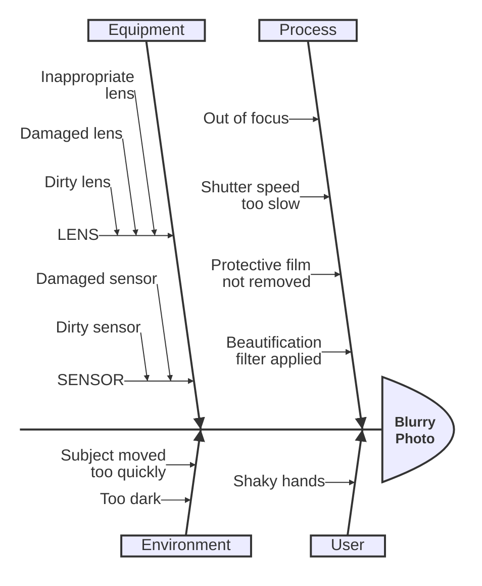

石川图（鱼骨图）用于表示特定事件或问题的原因。图表类似鱼骨架，主要问题在鱼头，原因从脊椎分出。


> [!WARNING]
> 这是 Mermaid 的新图表类型，语法可能在后续版本中演进。
>

## 语法



````markdown

````

- 第一行是事件（问题）
- 后续行是事件的原因
- 缩进表示"鱼骨"层级结构

## 参考

- [Ishikawa - Mermaid](https://mermaid.js.org/syntax/ishikawa.html)
