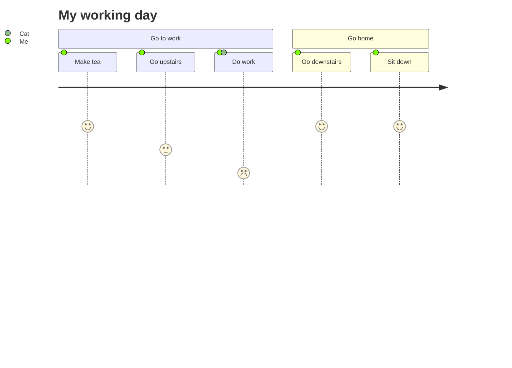

用户旅程图描述不同用户在系统中完成特定任务时所采取的步骤，展示当前工作流并揭示改进空间。



````markdown

````

每个用户旅程分为多个**章节（section）**，描述用户尝试完成的任务部分。

任务语法为 `Task name: <score>: <comma separated list of actors>`，其中分数为 1 到 5 之间的整数。

## 参考

- [User Journey - Mermaid](https://mermaid.js.org/syntax/userJourney.html)
