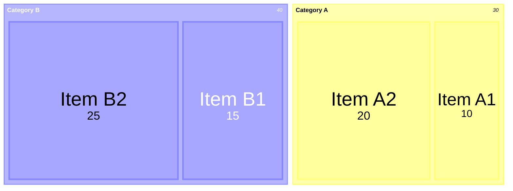
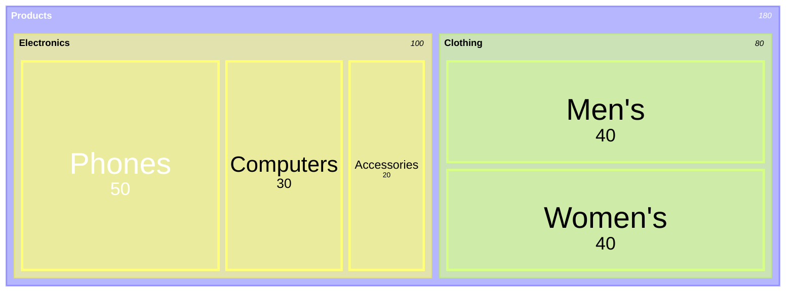
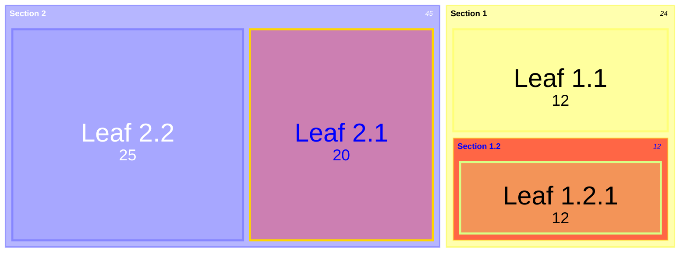
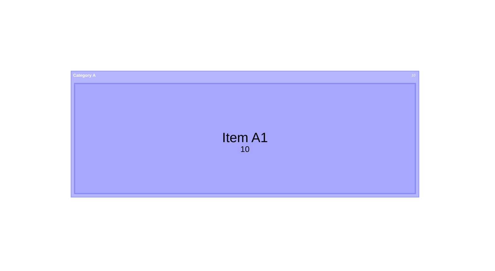
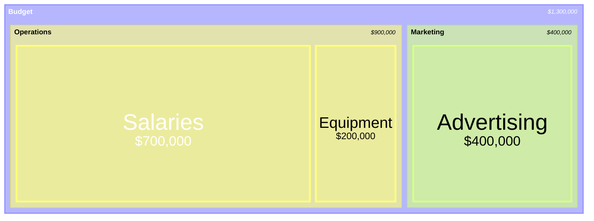

矩形树图将分层数据显示为一组嵌套矩形，每个矩形的大小与其代表的值成比例。


> [!WARNING]
> 这是 Mermaid 的新图表类型，语法可能在后续版本中演进。
>



````markdown

````

## 语法

```text
treemap-beta
"Section 1"
    "Leaf 1.1": 12
    "Section 1.2"
      "Leaf 1.2.1": 12
"Section 2"
    "Leaf 2.1": 20
    "Leaf 2.2": 25
```

- **父节点**：用引号包裹的文本 `"Section Name"`
- **叶子节点**：引号文本后加冒号和值 `"Leaf Name": value`
- **层级**：通过缩进创建
- **样式**：使用 `:::class` 语法

## 示例

### 层级矩形树图



````markdown

````

### 带样式的矩形树图



````markdown

````

## 样式和配置

### classDef 样式

```markdown
classDef important fill:#f96,stroke:#333,stroke-width:2px
```

### 图表内边距



````markdown

````

## 配置选项

| 选项 | 说明 | 默认值 |
|---|---|---|
| useMaxWidth | 图表宽度设为 100% | true |
| padding | 节点间内边距 | 10 |
| diagramPadding | 图表整体内边距 | 8 |
| showValues | 是否显示值 | true |
| borderWidth | 边框宽度 | 1 |
| valueFontSize | 值字号 | 12 |
| labelFontSize | 标签字号 | 14 |
| valueFormat | 值格式 | ',' |

### 值格式化

使用 D3 格式说明符：

- `,` — 千分位分隔符（默认）
- `$` — 美元符号
- `.1f` — 一位小数
- `.1%` — 百分比
- `$0,0` — 美元加千分位



````markdown

````

## 局限性

- 最适合有自然层级的数据
- 过小的值可能难以看到
- 过深的层级不易清晰表示
- 不适合负值数据

## 参考

- [Treemap - Mermaid](https://mermaid.js.org/syntax/treemap.html)
