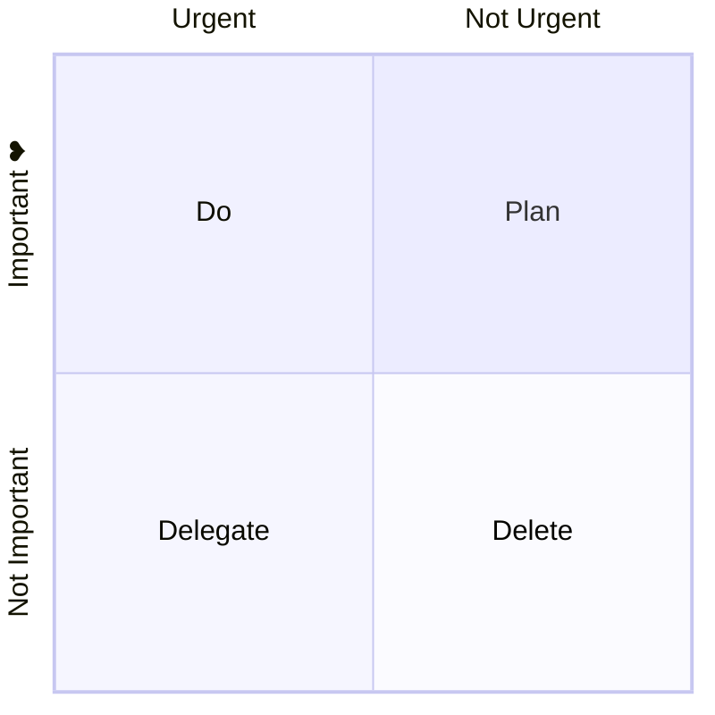

象限图将数据分为四个象限，在二维网格上绘制数据点。常用于业务分析、营销和风险管理中识别模式和趋势。


````markdown

````

## 语法

数据点的 x 和 y 值范围为 0 到 1。

### Title

标题显示在图表顶部。

### x-axis

x 轴有左右两部分，用 `-->` 分隔：

- `x-axis <text> --> <text>` — 显示左右轴文本
- `x-axis <text>` — 只显示左轴文本

### y-axis

y 轴有上下两部分，用 `-->` 分隔：

- `y-axis <text> --> <text>` — 显示上下轴文本
- `y-axis <text>` — 只显示下轴文本

### Quadrants

- `quadrant-1` — 右上象限
- `quadrant-2` — 左上象限
- `quadrant-3` — 左下象限
- `quadrant-4` — 右下象限

### Points

语法：`<text>: [x, y]`，x 和 y 值范围为 0-1。

## 图表配置

| 参数 | 说明 | 默认值 |
|---|---|---|
| chartWidth | 图表宽度 | 500 |
| chartHeight | 图表高度 | 500 |
| titlePadding | 标题上下内边距 | 10 |
| titleFontSize | 标题字号 | 20 |
| quadrantPadding | 象限外边距 | 5 |
| quadrantLabelFontSize | 象限文本字号 | 16 |
| xAxisLabelFontSize | x 轴文本字号 | 16 |
| xAxisPosition | x 轴位置（top/bottom） | 'top' |
| yAxisLabelFontSize | y 轴文本字号 | 16 |
| yAxisPosition | y 轴位置（left/right） | 'left' |
| pointLabelFontSize | 数据点文本字号 | 12 |
| pointRadius | 数据点半径 | 5 |

## 主题变量

| 参数 | 说明 |
|---|---|
| quadrant1Fill | 右上象限填充色 |
| quadrant2Fill | 左上象限填充色 |
| quadrant3Fill | 左下象限填充色 |
| quadrant4Fill | 右下象限填充色 |
| quadrantPointFill | 数据点填充色 |
| quadrantXAxisTextFill | x 轴文本色 |
| quadrantYAxisTextFill | y 轴文本色 |

## 配置和主题示例



````markdown

````

## 数据点样式

支持直接样式和类样式：

```text
Point A: [0.9, 0.0] radius: 12
Point B: [0.8, 0.1] color: #ff3300, radius: 10
Point C:::class1: [0.7, 0.2]
classDef class1 color: #109060
```

可用样式参数：`color`、`radius`、`stroke-width`、`stroke-color`。优先级：直接样式 > 类样式 > 主题样式。

## 参考

- [Quadrant Chart - Mermaid](https://mermaid.js.org/syntax/quadrantChart.html)
