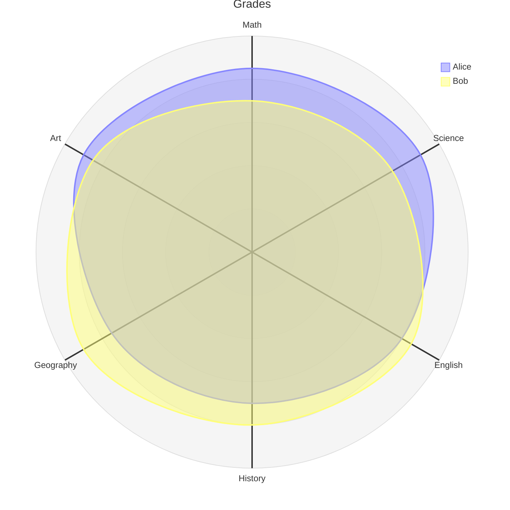
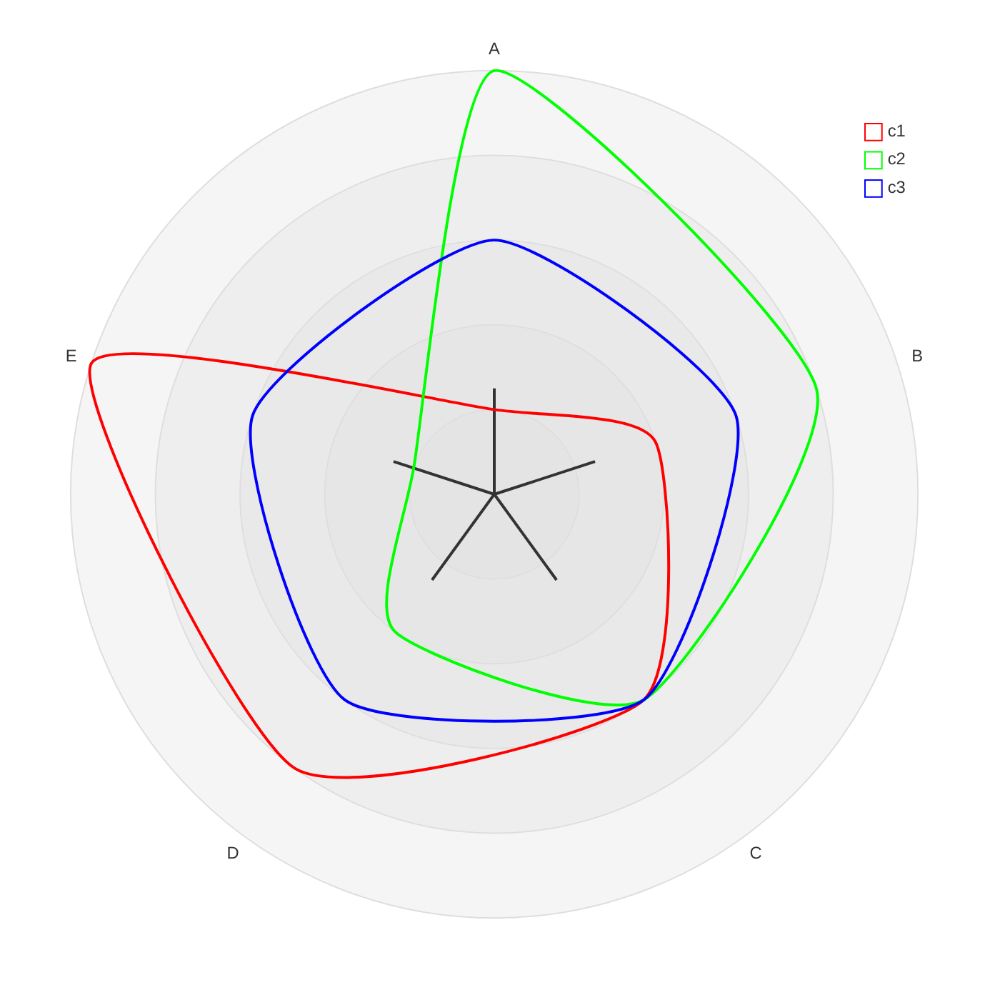

雷达图用于以圆形格式绘制低维数据，也称蛛网图、星形图或极坐标图。常用于比较多个实体在多个维度上的表现。



````markdown

````

## 语法

```markdown
radar-beta
axis A, B, C, D, E
curve c1{1,2,3,4,5}
curve c2{5,4,3,2,1}
```

### Title

可选，显示在雷达图顶部。

```markdown
radar-beta
  title Title of the Radar Diagram
```

### Axis

定义雷达图的轴，每个轴有 ID 和可选标签：

```markdown
axis id1["Label1"]
axis id2["Label2"], id3["Label3"]
```

### Curve

定义数据曲线，支持数字列表或键值对：

```markdown
curve id1["Label1"]{1, 2, 3}
curve id4{ axis3: 30, axis1: 20, axis2: 10 }
```

### 选项

- `showLegend` — 显示或隐藏图例（默认显示）
- `max` — 最大值（默认从数据计算）
- `min` — 最小值（默认 0）
- `graticule` — 网格类型：`circle` 或 `polygon`（默认 circle）
- `ticks` — 网格刻度数（默认 5）

## 配置

| 参数 | 说明 | 默认值 |
|---|---|---|
| width | 图表宽度 | 600 |
| height | 图表高度 | 600 |
| marginTop | 上边距 | 50 |
| axisScaleFactor | 轴缩放因子 | 1 |
| axisLabelFactor | 轴标签位置因子 | 1.05 |
| curveTension | 曲线张力 | 0.17 |

## 主题变量

全局颜色用 `cScale${i}`（i 从 0 到 12）：

```yaml
---
config:
  themeVariables:
    cScale0: "#FF0000"
    cScale1: "#00FF00"
---
```

雷达专用变量在 `radar` 键下：

| 属性 | 说明 | 默认值 |
|---|---|---|
| axisColor | 轴线颜色 | black |
| axisStrokeWidth | 轴线宽度 | 1 |
| curveOpacity | 曲线透明度 | 0.7 |
| curveStrokeWidth | 曲线宽度 | 2 |
| graticuleColor | 网格颜色 | black |
| legendFontSize | 图例字号 | 14px |

## 配置和主题示例



````markdown

````

## 参考

- [Radar - Mermaid](https://mermaid.js.org/syntax/radar.html)
