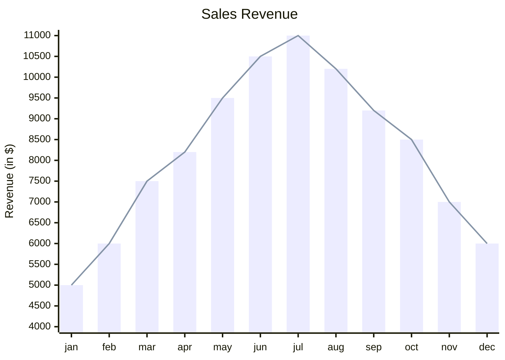
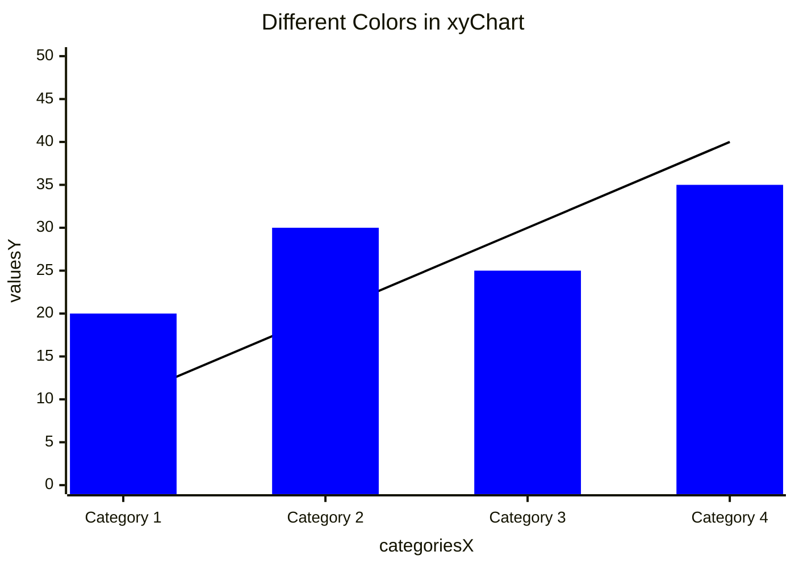

XY 图表模块涵盖柱状图和折线图等使用 x 轴和 y 轴的数据图表类型。



````markdown

````

## 语法

单字文本可不用引号，多字文本需用 `"` 包裹。

### 方向

默认垂直，可设为水平：`xychart horizontal`

### Title

```text
xychart
    title "This is a simple example"
```

### x-axis

x 轴可作为分类值或数值范围：

- `x-axis title min --> max` — 数值范围
- `x-axis "title" [cat1, cat2, cat3]` — 分类值

### y-axis

y 轴用于数值范围：

- `y-axis title min --> max`
- `y-axis title` — 只有标题，范围从数据自动生成

x 轴和 y 轴都是可选的。

### 折线图

`line [2.3, 45, .98, -3.4]`

### 柱状图

`bar [2.3, 45, .98, -3.4]`

最简示例：

```text
xychart
    line [+1.3, .6, 2.4, -.34]
```

## 图表配置

| 参数 | 说明 | 默认值 |
|---|---|---|
| width | 图表宽度 | 700 |
| height | 图表高度 | 500 |
| titlePadding | 标题上下内边距 | 10 |
| titleFontSize | 标签字号 | 20 |
| showTitle | 是否显示标题 | true |
| chartOrientation | vertical 或 horizontal | vertical |
| showDataLabel | 是否在柱内显示值 | false |
| showDataLabelOutsideBar | 数据标签显示在柱外 | false |

### AxisConfig

| 参数 | 说明 | 默认值 |
|---|---|---|
| showLabel | 显示轴标签 | true |
| labelFontSize | 标签字号 | 14 |
| showTitle | 显示轴标题 | true |
| titleFontSize | 轴标题字号 | 16 |
| showTick | 显示刻度 | true |
| showAxisLine | 显示轴线 | true |

## 主题变量

```yaml
---
config:
  themeVariables:
    xyChart:
      titleColor: '#ff0000'
---
```

| 参数 | 说明 |
|---|---|
| backgroundColor | 图表背景色 |
| titleColor | 标题颜色 |
| xAxisLabelColor | x 轴标签色 |
| yAxisLabelColor | y 轴标签色 |
| plotColorPalette | 颜色字符串，逗号分隔 |

### 设置线条和柱的颜色

使用 `plotColorPalette` 按顺序为图表元素指定颜色：



````markdown

````

## 显示柱状图数值（v11.14.0+）

设置 `showDataLabel: true` 在柱内显示数值，设置 `showDataLabelOutsideBar: true` 显示在柱外。

## 参考

- [XY Chart - Mermaid](https://mermaid.js.org/syntax/xyChart.html)
