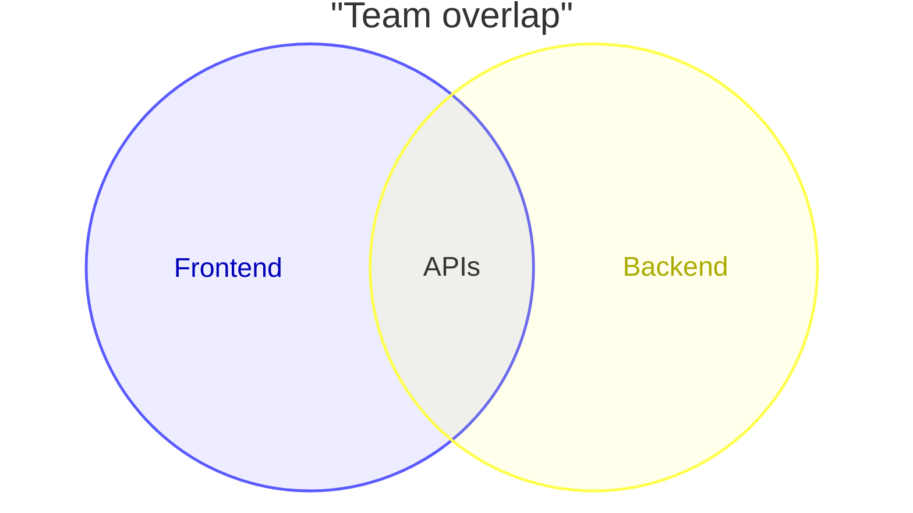
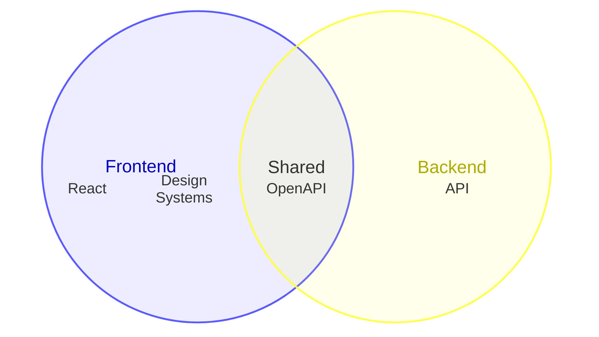
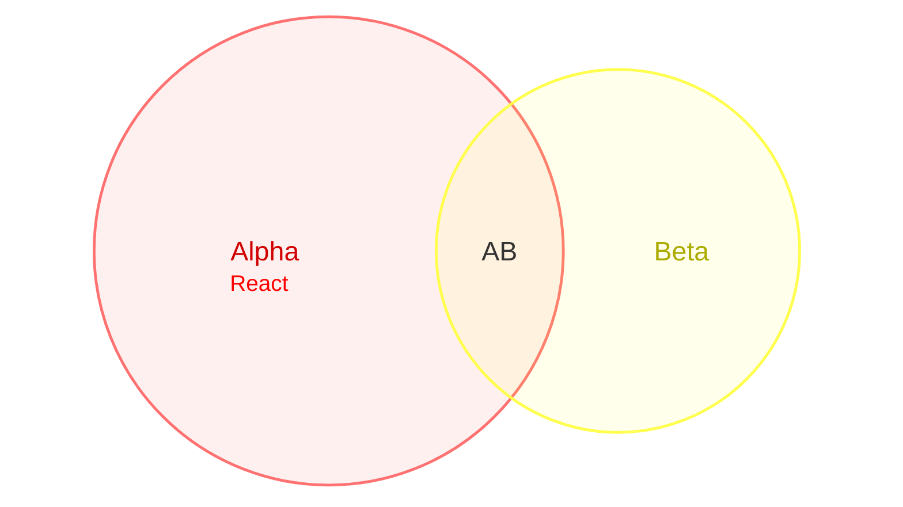

韦恩图使用重叠圆形展示集合之间的关系。


> [!WARNING]
> 这是 Mermaid 的新图表类型，语法可能在后续版本中演进。
>



````markdown

````

## 语法

- 以 `venn-beta` 开始
- `set` 定义集合
- `union` 定义两个或多个集合的重叠
- `union` 中的标识符必须由之前的 `set` 定义
- 标识符可以是裸词或引号字符串

### 标签

用 `["..."]` 设置显示标签：

```markdown
set A["Alpha"]
set B["Beta"]
union A,B["AB"]
```

### 大小

用 `:N` 后缀设置大小：

```markdown
set A["Alpha"]:20
set B["Beta"]:12
union A,B["AB"]:3
```

### 文本节点

- `text` 在集合或联合内放置标签
- 缩进的 `text` 附加到最近的 `set` 或 `union`



````markdown

````

### 样式

使用 `style` 语句设置视觉效果：

- `fill` — 填充色
- `color` — 文本色
- `stroke` — 描边色
- `stroke-width` — 描边宽度
- `fill-opacity` — 填充透明度



````markdown

````

## 参考

- [Venn - Mermaid](https://mermaid.js.org/syntax/venn.html)
