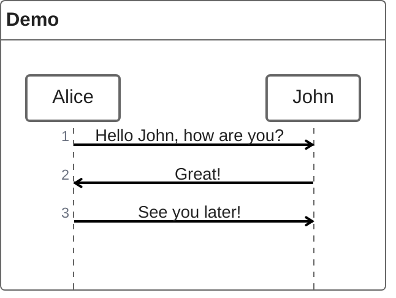
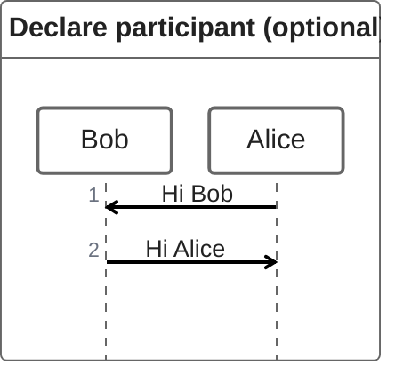
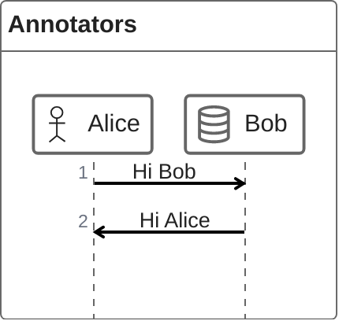
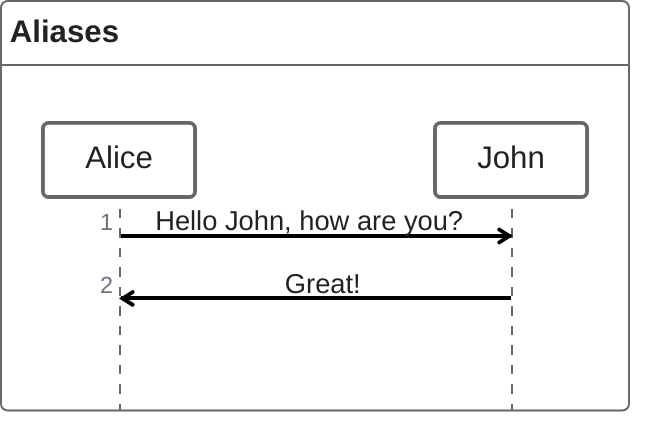
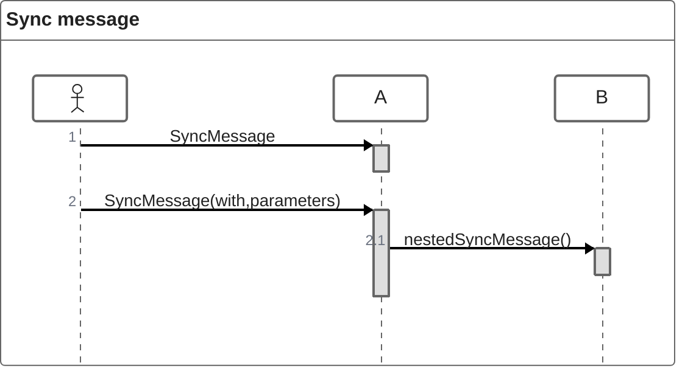
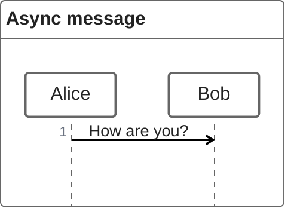
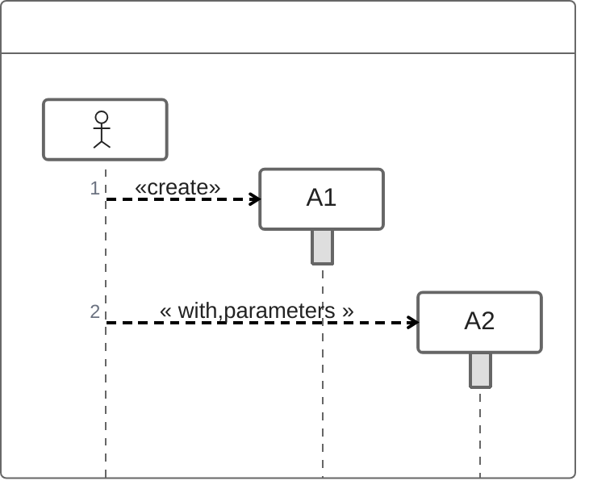
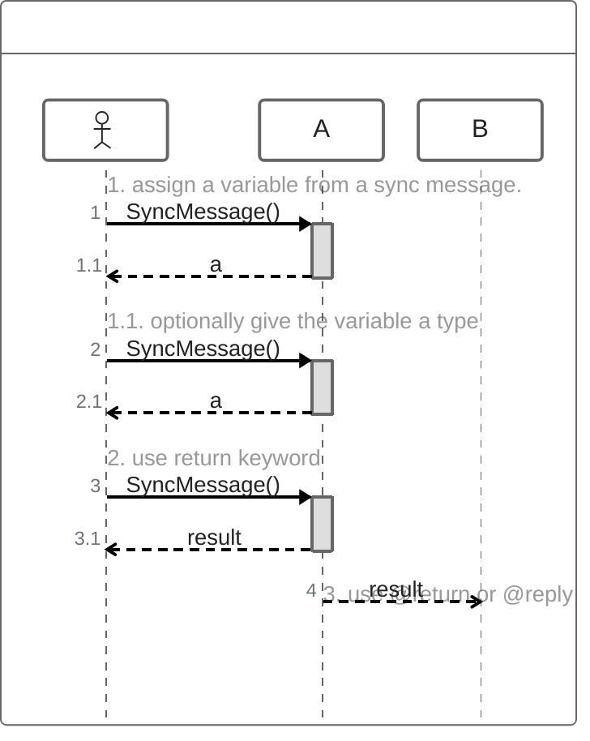
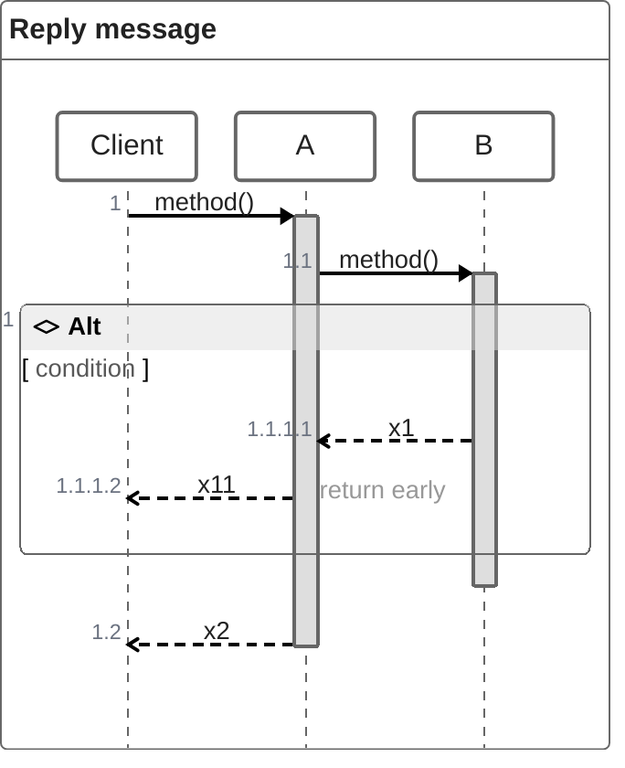
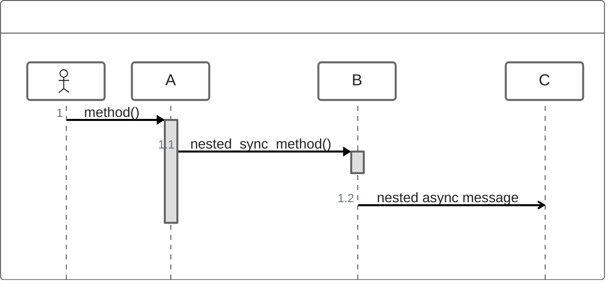

ZenUML 是一种序列图（Sequence Diagram）语法，用于展示进程之间如何交互以及交互的顺序。Mermaid 可以通过 [ZenUML](https://zenuml.com) 渲染序列图。注意 ZenUML 使用与 Mermaid 原生序列图不同的语法。



````markdown

````

## 语法

### 参与者

参与者可以隐式定义，如本页第一个示例所示。参与者或角色按其在图表源文本中出现的顺序渲染。有时你可能想以不同于第一条消息中出现的顺序来显示参与者。



````markdown

````

### 注解器

如果你想使用符号而不是仅使用带文本的矩形，可以使用注解器语法将参与者声明为以下类型。



````markdown

````

可用的注解器：


### 别名

参与者可以有一个方便的标识符和一个描述性标签。



````markdown

````

## 消息

消息可以是以下之一：

1. 同步消息（Sync message）
2. 异步消息（Async message）
3. 创建消息（Creation message）
4. 回复消息（Reply message）

### 同步消息

你可以将其想象为编程语言中的同步（阻塞）方法。



````markdown

````

### 异步消息

你可以将其想象为编程语言中的异步（非阻塞）方法。触发事件后即忘记。



````markdown

````

### 创建消息

使用 `new` 关键字创建对象。



````markdown

````

### 回复消息

有三种方式表达回复消息：



````markdown

````

第三种方式 `@return` 很少使用，但在你想返回到上一层时很有用。



````markdown

````

## 嵌套

同步消息和创建消息自然可以通过 `{}` 嵌套。



````markdown

````

## 注释

可以使用 `// comment` 语法在序列图中添加注释。注释将渲染在消息或片段上方。其他位置的注释将被忽略。支持 Markdown。

```mermaid
zenuml
    // a comment on a participant will not be rendered
    BookService
    // a comment on a message.
    // **Markdown** is supported.
    BookService.getBook()
```

````markdown
```mermaid
zenuml
    // a comment on a participant will not be rendered
    BookService
    // a comment on a message.
    // **Markdown** is supported.
    BookService.getBook()
```
````

## 循环

可以在 ZenUML 图中表达循环。使用以下任何一种表示法：

1. while
2. for
3. forEach, foreach
4. loop

```text
while(condition) {
    ...statements...
}
```

```mermaid
zenuml
    Alice->John: Hello John, how are you?
    while(true) {
      John->Alice: Great!
    }
```

````markdown
```mermaid
zenuml
    Alice->John: Hello John, how are you?
    while(true) {
      John->Alice: Great!
    }
```
````

## Alt

可以在序列图中表达替代路径。

```text
if(condition1) {
    ...statements...
} else if(condition2) {
    ...statements...
} else {
    ...statements...
}
```

```mermaid
zenuml
    Alice->Bob: Hello Bob, how are you?
    if(is_sick) {
      Bob->Alice: Not so good :(
    } else {
      Bob->Alice: Feeling fresh like a daisy
    }
```

````markdown
```mermaid
zenuml
    Alice->Bob: Hello Bob, how are you?
    if(is_sick) {
      Bob->Alice: Not so good :(
    } else {
      Bob->Alice: Feeling fresh like a daisy
    }
```
````

## Opt

可以渲染一个 `opt` 片段。

```text
opt {
  ...statements...
}
```

```mermaid
zenuml
    Alice->Bob: Hello Bob, how are you?
    Bob->Alice: Not so good :(
    opt {
      Bob->Alice: Thanks for asking
    }
```

````markdown
```mermaid
zenuml
    Alice->Bob: Hello Bob, how are you?
    Bob->Alice: Not so good :(
    opt {
      Bob->Alice: Thanks for asking
    }
```
````

## Parallel

可以显示并行发生的操作。

```text
par {
  statement1
  statement2
  statement3
}
```

```mermaid
zenuml
    par {
        Alice->Bob: Hello guys!
        Alice->John: Hello guys!
    }
```

````markdown
```mermaid
zenuml
    par {
        Alice->Bob: Hello guys!
        Alice->John: Hello guys!
    }
```
````

## Try/Catch/Finally（Break）

可以在流程中指示序列的停止（通常用于建模异常）。

```text
try {
  ...statements...
} catch {
  ...statements...
} finally {
  ...statements...
}
```

```mermaid
zenuml
    try {
      Consumer->API: Book something
      API->BookingService: Start booking process
    } catch {
      API->Consumer: show failure
    } finally {
      API->BookingService: rollback status
    }
```

````markdown
```mermaid
zenuml
    try {
      Consumer->API: Book something
      API->BookingService: Start booking process
    } catch {
      API->Consumer: show failure
    } finally {
      API->BookingService: rollback status
    }
```
````

## 与你的库/网站集成

ZenUML 使用实验性的延迟加载和异步渲染功能，这些功能在未来可能会更改。

你可以使用此方法将包含 ZenUML 图的 mermaid 添加到网页：

```html
<script type="module">
  import mermaid from 'https://cdn.jsdelivr.net/npm/mermaid@10/dist/mermaid.esm.min.mjs';
  import zenuml from 'https://cdn.jsdelivr.net/npm/@mermaid-js/mermaid-zenuml@0.1.0/dist/mermaid-zenuml.esm.min.mjs';
  await mermaid.registerExternalDiagrams([zenuml]);
</script>
```

## 参考

- [ZenUML - Mermaid](https://mermaid.js.org/syntax/zenuml.html)
