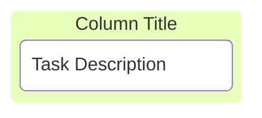
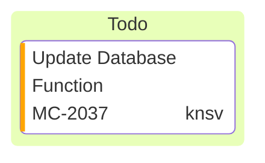
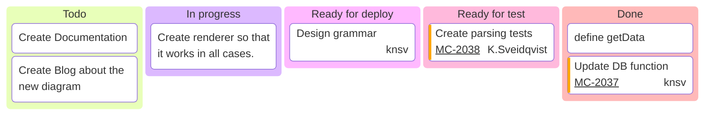

看板图用于可视化任务在不同工作流阶段中的移动。

## 基本语法

以 `kanban` 关键字开始，后跟列（阶段）和列内任务的定义。



````markdown

````

## 定义列

列代表工作流的不同阶段：

```text
columnId[Column Title]
```

## 添加任务

任务缩进在对应列下方：

```text
taskId[Task Description]
```

## 任务元数据

使用 `@{ ... }` 语法添加元数据：

- `assigned` — 负责人
- `ticket` — 关联的工单号
- `priority` — 优先级（'Very High'、'High'、'Low'、'Very Low'）



````markdown

````

## 配置

```yaml
---
config:
  kanban:
    ticketBaseUrl: 'https://yourproject.atlassian.net/browse/#TICKET#'
---
```

`ticketBaseUrl` 设置外部系统的工单链接，`#TICKET#` 会被替换为实际的工单号。

## 完整示例



````markdown

````

## 参考

- [Kanban - Mermaid](https://mermaid.js.org/syntax/kanban.html)
