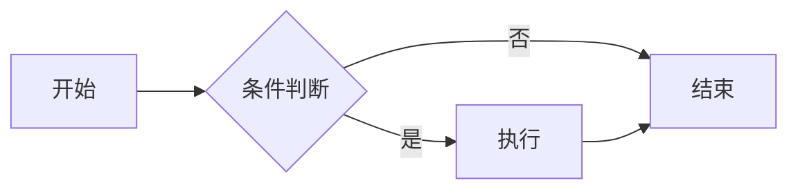

# Markdown 语法高亮示例

以下 `markdown.md` 示例使用 ` ```markdown ` 围栏代码块渲染：

`````markdown
<!-- 文件: markdown.md —— Markdown 轻量级标记语言基础语法全集演示 -->
<!-- 一句话简介：用纯文本写出带格式（标题、列表、表格、代码、图、公式）的文档。 -->

# Markdown 语法示例

> Markdown 是一种轻量级标记语言，通过简单的纯文本符号即可生成结构化文档。
> 本文件演示 CommonMark 核心语法及 GitHub Flavored Markdown (GFM) 等常见扩展。

<!-- HTML 注释：Markdown 没有原生注释语法，通常用 HTML 注释 <!-- --> -->

## 标题 Headings

```text
# 一级标题
## 二级标题
### 三级标题
#### 四级标题
##### 五级标题
###### 六级标题
```

也可以用底线形式（仅一、二级）：

```text
一级标题
=======

二级标题
-------
```

## 段落与换行 Paragraphs

段落之间用一个空行分隔。
直接回车换行不会产生新段落，需在行尾加两个空格或反斜杠 `\` 才能强制换行。\
就像这一行（行尾用了反斜杠）。

## 强调 Emphasis

```text
*斜体* 或 _斜体_
**粗体** 或 __粗体__
***粗斜体*** 或 ___粗斜体___
~~删除线~~（GFM 扩展）
```

效果：*斜体*、**粗体**、***粗斜体***、~~删除线~~。

## 行内代码与代码块 Code

行内代码用反引号包裹：`console.log("hi")`。
代码内含反引号时用双反引号：``这里有个 ` 反引号``。

代码块可用缩进 4 个空格，或用围栏式（推荐）：

````text
```javascript
function add(a, b) {
	return a + b;  // 围栏代码块可指定语言高亮
}
```
````

> 围栏代码块支持语言标识，如 ```python 、```go 、```bash 等。

## 引用 Blockquote

> 这是一段引用。
>
> 引用内可以包含 **格式**、`代码`，甚至嵌套引用：
>
> > 这是嵌套引用。

## 列表 Lists

无序列表（`-`、`*`、`+` 等效）：

- 第一项
- 第二项
  - 嵌套项（缩进 2 空格或 1 制表符）
  - 另一个嵌套项
- 第三项

有序列表（数字 + 点，数字不必连续）：

1. 第一项
1. 第二项（写成 1. 也会自动递增）
1. 第三项

任务列表（GFM 扩展）：

- [x] 已完成项
- [ ] 未完成项
- [ ] 另一个待办

## 链接 Links

行内链接：[GitHub](https://github.com "鼠标悬停标题")。
带标题属性：[示例](https://example.com "示例站点")。

引用式链接：[CommonMark 规范][cm] 与 [GFM][gfm]。

[cm]: https://commonmark.org "CommonMark"
[gfm]: https://github.github.com/gfm/ "GitHub Flavored Markdown"

自动链接：<https://example.com> 或邮箱 <user@example.com>。

## 图片 Images

行内图片：


引用式图片：

![图标][logo]

[logo]: https://commonmark.org/markdown.png "Markdown logo"

## 表格 Tables（GFM 扩展）

| 语言     | 类型   | 出现年份 | 备注       |
| -------- | :----- | :------: | ---------- |
| Python   | 动态   |  1991    | 易学       |
| Go       | 静态   |  2009    | 并发友好   |
| Rust     | 静态   |  2010    | 内存安全   |

对齐方式：`:---` 左对齐、`---:` 右对齐、`:---:` 居中。

## 水平线 Horizontal Rule

三种写法等价：

```text
---
***
___
```

## 转义字符 Backslash Escapes

反斜杠可转义 Markdown 特殊字符：\* \_ \# \[ \] \( \) \` \| \! \\。

例如显示星号：\*不是斜体\*。

## 脚注 Footnotes（扩展）

这里有一个脚注引用[^1]，还有一个长脚注[^longnote]。

[^1]: 这是第一个脚注的内容。

[^longnote]:
    这是一个包含多段内容的脚脚注。
    缩进后续行即可延续。

## 定义列表 Definition Lists（部分扩展支持）

Markdown
: 轻量级标记语言。

CommonMark
: Markdown 的标准化规范。

## 数学公式 Math（部分平台支持，如 LaTeX 风格）

行内公式：质能方程 $E = mc^2$。

块级公式：

$$
\int_a^b f(x)\,dx = F(b) - F(a)
$$

## Mermaid 图表（部分平台支持）

````text

````

## 提示框 / Admonition（部分平台扩展）

```text
> [!NOTE]
> 这是一个提示框（GitHub 等平台支持）。

> [!WARNING]
> 这是一个警告提示框。
```

## 可折叠区域 Details（HTML 扩展）

<details>
<summary>点击展开详情</summary>

这里是被折叠的内容，可以包含 **Markdown** 或 `代码`。

- 列表项一
- 列表项二

</details>

## Emoji 表情（部分平台支持）

```text
:smile: :rocket: :+1: :tada:
```

效果：:smile: :rocket: :+1: :tada:

## 键盘按键（部分平台扩展）

```text
按 <kbd>Ctrl</kbd> + <kbd>C</kbd> 复制。
```

效果：按 <kbd>Ctrl</kbd> + <kbd>C</kbd> 复制。

## 内嵌 HTML

Markdown 兼容原生 HTML，可使用 `<sub>`、`<sup>`、`<kbd>`、`<mark>` 等标签：

- 下标：H<sub>2</sub>O
- 上标：x<sup>2</sup>
- 高亮：<mark>重点内容</mark>

## 锚点与目录

标题会自动生成锚点（通常为小写、空格转连字符），可用 `[跳转](#标题-headings)` 链接。

```text
[回到标题章节](#标题-headings)
```

## 语法要点速查

| 元素       | 写法                                |
| ---------- | ----------------------------------- |
| 标题       | `# ## ###`                          |
| 粗体/斜体  | `**粗**` / `*斜*`                   |
| 代码块     | ` ```lang ... ``` `                 |
| 引用       | `> `                                |
| 列表       | `- ` / `1. ` / `- [x]`              |
| 链接       | `[文字](url)`                       |
| 图片       | ``                       |
| 表格       | `\| ... \| --- \|`                  |
| 水平线     | `---`                               |
| 转义       | `\*` `\#`                           |
| 脚注       | `[^id]` + `[^id]: 内容`             |

---

> 提示：不同平台（GitHub、GitLab、Obsidian、Notion 等）对扩展语法的支持略有差异，以目标平台文档为准。
`````
