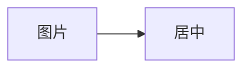

# 正文图片居中回归文档


[](#正文图片居中回归文档)


<picture><source srcset="data:image/png;base64,iVBORw0KGgoAAAANSUhEUgAAABAAAAAQCAIAAACQkWg2AAAAFklEQVR4nGMI6r5EEmIY1TCqYfhqAAChra8QqdkevQAAAABJRU5ErkJggg==" type="image/png"></picture>

前文  后文。

 

<svg xmlns="http://www.w3.org/2000/svg" width="120" height="60" viewBox="0 0 120 60" role="img" aria-label="原生 SVG"><rect width="120" height="60" fill="steelblue"/></svg>

<div><svg xmlns="http://www.w3.org/2000/svg" width="120" height="60" viewBox="0 0 120 60" role="img" aria-label="容器内 SVG"><rect width="120" height="60" fill="seagreen"/></svg></div>



```vega-lite
{
  "width": 160,
  "height": 100,
  "data": {"values": [{"x": "甲", "y": 2}, {"x": "乙", "y": 3}]},
  "mark": "bar",
  "encoding": {
    "x": {"field": "x", "type": "nominal"},
    "y": {"field": "y", "type": "quantitative"}
  }
}
```

> [!NOTE]
> Alert layout regression.
