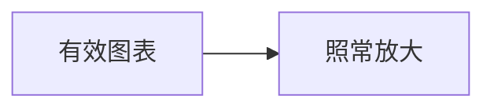

# 无效 Mermaid 图表回归文档

这份文档用于真实浏览器环境下的无效 Mermaid 图表边界回归测试。正文先放置一个语法无效的图表，再放置一个正常图表：无效图表的容器不携带 Lightbox 标记，其放大按钮保持隐藏；正常图表照常提供放大。两个图表的先后顺序保证断言运行时无效图表的渲染尝试已经结束（渲染按文档顺序串行进行）。

```mermaid
this is [ not a valid diagram ( at all [[[
```

这是两个图表之间的第 1 段。无效图表的容器保留原始源代码文本，永远不产生 SVG；放大按钮虽然注入在稳定的外框上，但通过 hidden 属性隐藏，点击与键盘都无法触达。

这是两个图表之间的第 2 段。Lightbox 的可用性由 SVG 是否真实存在决定：主题切换重绘失败时旧 SVG 仍在，放大按钮与 Lightbox 继续可用；只有从未渲染出 SVG 的图表才收回放大能力。



这是有效图表之后的第 1 段。下方的段落只为撑起足够的滚动空间，保证断言运行时页面可以稳定滚动。

这是有效图表之后的第 2 段。到这里文档的高度已经足够，最后一段之后不再有任何内容。
