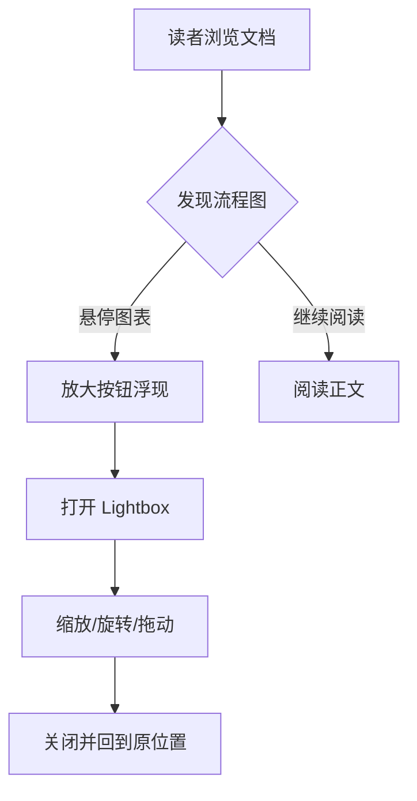

# Mermaid Lightbox 回归文档

这份文档用于真实浏览器环境下的混合视觉内容 Lightbox 回归测试。正文按 图片 → Mermaid 图表 → 图片 的顺序排列，验证普通图片与图表进入同一个上一张/下一张序列，编号与实际显示内容对应。图表使用纵向流程图，使旋转与拖动断言覆盖与普通图片不同的纵横比。图片与图表之间由段落填充垂直空间，保证关闭 Lightbox 前后阅读位置断言远离文档顶部与底部。

这是图片与图表之间的第 1 段。Mermaid 图表与普通图片共用同一个 Lightbox：底部工具栏的上一张/下一张按视觉元素在正文中的顺序编号，缩放、旋转与拖动逻辑也完全一致。

这是图片与图表之间的第 2 段。图表的放大按钮位于图表区域右上角，与图片的放大按钮同一时机浮现：鼠标悬停图表区域或键盘聚焦按钮时出现，触屏设备保持常显。

这是图片与图表之间的第 3 段。主题切换只替换图表内部的 SVG，图表外框与放大按钮保持不动，已打开的 Lightbox 也不会因此关闭。

这是图表与图片之间的第 1 段。Lightbox 中的图表以 SVG 矢量形式呈现，放大到五倍仍然保持清晰，不会像位图一样出现模糊。

这是图表与图片之间的第 2 段。关闭 Lightbox 有三个入口：右上角关闭按钮、Esc 键与点击遮罩空白区域，全程不改变正文滚动位置与地址栏锚点。

这是图表与图片之间的第 3 段。图表在序列中处于中间位置，上一张与下一张按钮都可用，首尾两端的按钮禁用规则与纯图片序列一致。

这是图表与图片之间的第 4 段。切换视觉元素时，缩放、旋转与拖动状态全部重置，每个元素都从适配状态开始。

这是图片之后的第 1 段。下方的段落只为撑起足够的滚动空间，让阅读位置断言在预设偏移处停留在视口之内。

这是图片之后的第 2 段。如果滚动触底，偏移值会被截断，断言就会因为与触底无关的原因失败，因此文档必须在末尾保留冗余高度。

这是图片之后的第 3 段。视口高度在不同设备上差异可观，末尾的余量段落在各类屏幕尺寸下都提供缓冲。

这是图片之后的第 4 段。到这里文档的高度已经足够，最后一段之后不再有任何内容。
