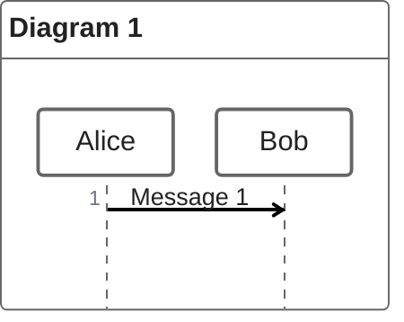
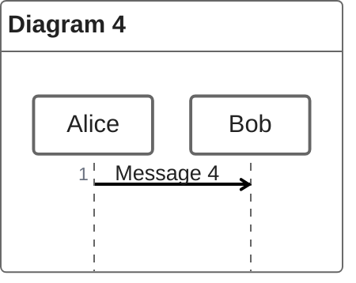
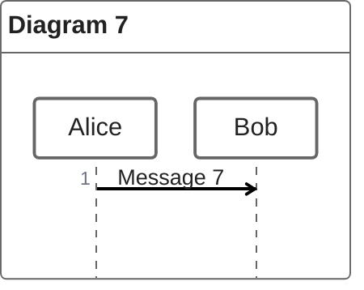
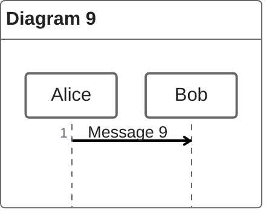
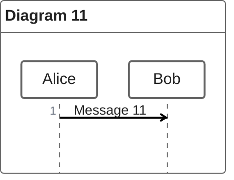
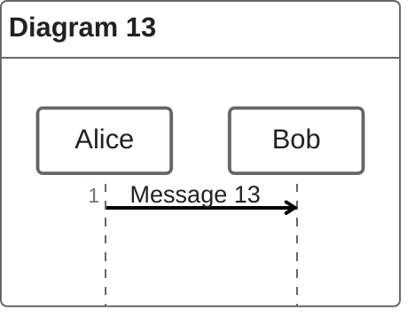
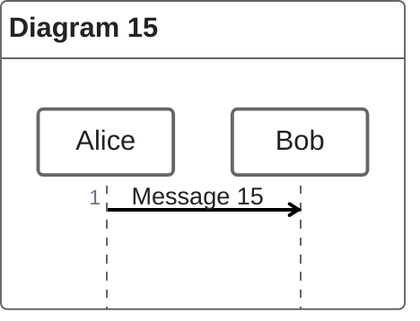
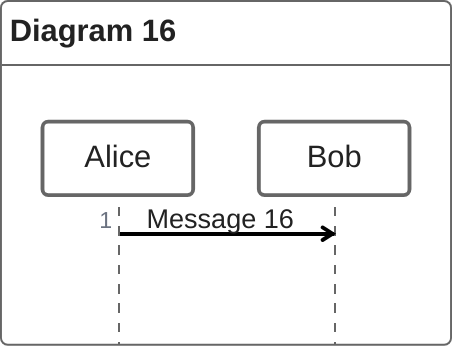

# ZenUML 多图隔离回归文档

这份文档模拟真实语法参考页在一次渲染中加载大量 ZenUML 图表的场景。每张图都必须生成 SVG，但插件注册不得向宿主页面遗留全局样式。

## 图表 1

## 图表 2

## 图表 3

## 图表 4

## 图表 5

## 图表 6

## 图表 7

## 图表 8

## 图表 9

## 图表 10

## 图表 11

## 图表 12

## 图表 13

## 图表 14

## 图表 15

## 图表 16

