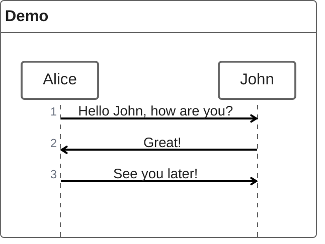

# ZenUML 图表回归文档

这份文档用于真实浏览器环境下的 ZenUML external diagram 回归测试。ZenUML 是 Mermaid 官方的 external diagram 插件，Mermaid Core 本身不识别 `zenuml` 图表类型，必须按 load → register → initialize → render 的顺序完成插件注册后才能渲染；本图使用官方最小示例，任何一环断裂都会退化为语法错误提示而不是序列图。图表与普通 Mermaid 图表共用同一套外框与 Lightbox，无需任何针对 ZenUML 的特殊交互逻辑。

## 图表示例

这是图表之后的第 1 段。ZenUML 最终渲染为普通 SVG，因此放大按钮、Lightbox 序列、主题切换重绘等能力都应与 flowchart 完全一致。

这是图表之后的第 2 段。主题切换只替换图表内部的 SVG，外框与放大按钮保持不动；深色主题下重绘失败会退回浅色 SVG，但绝不允许退化为源代码文本或语法错误提示。

这是图表之后的第 3 段。下方的段落只为撑起足够的滚动空间，保证断言运行时页面可以稳定滚动。

这是图表之后的第 4 段。到这里文档的高度已经足够，最后一段之后不再有任何内容。
