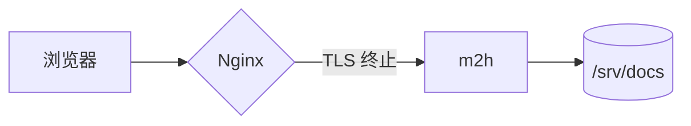
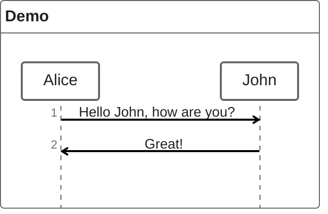
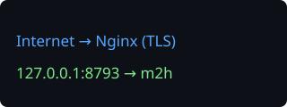

# 安全头富内容回归文档

这份文档用于真实浏览器环境下的内容安全策略回归测试：页面在 `script-src 'self'` 等严格 CSP 指令下渲染，正文同时包含 Mermaid 图表、ZenUML 时序图、KaTeX 公式、可排序表格、Vega-Lite 图表、SVG 图片、外部图片与代码块。任何一类富内容因为内容安全策略而被浏览器拒绝，本文件对应的断言都会失败；这比只检查响应头字符串更接近用户实际看到的行为。

## Mermaid 流程图



## ZenUML 时序图



## 数学公式

行内公式 $E = mc^2$ 与行间公式：

$$\int_0^1 x^2 \, dx = \frac{1}{3}$$

金额写法（如 $5 与 $10）不受单美元分隔影响，保持普通文本。

## 可排序表格

| 组件 | 默认端口 |
| --- | --- |
| m2h | 8793 |
| Nginx | 443 |
| Tinyauth | 3000 |

## Vega-Lite 图表

```vega-lite
{
  "data": {
    "values": [
      {"component": "m2h", "port": 8793},
      {"component": "Nginx", "port": 443},
      {"component": "Tinyauth", "port": 3000}
    ]
  },
  "mark": "bar",
  "encoding": {
    "x": {"field": "component", "type": "nominal"},
    "y": {"field": "port", "type": "quantitative"}
  }
}
```

图表表达式通过 AST 解释器求值，不依赖 `unsafe-eval`；若策略或解释器路径失效，图表会退化为源码文本而不是渲染出 SVG。

## 图片

本地 SVG 图片：



外部图片：


## 代码块

```go
func healthz(w http.ResponseWriter, r *http.Request) {
	fmt.Fprintln(w, "ok")
}
```
