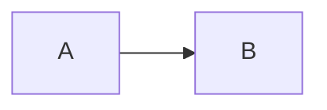

# Vega-Lite Lightbox 回归文档

这份文档用于真实浏览器环境下的 Vega-Lite Lightbox 回归测试。图片、Mermaid 图表与 Vega-Lite 图表按文档顺序混排，共用同一查看器；点击任一放大按钮进入后，上一张/下一张应按 DOM 顺序在三种视觉项之间切换。

## 图片


## Mermaid 图表



## Vega-Lite 图表

```vega-lite
{
  "data": {
    "values": [
      {"kind": "A", "count": 28},
      {"kind": "B", "count": 55}
    ]
  },
  "mark": "bar",
  "encoding": {
    "x": {"field": "kind", "type": "nominal"},
    "y": {"field": "count", "type": "quantitative"}
  }
}
```

三者的放大按钮都应在渲染成功后可用，Lightbox 中的顺序与正文一致。
