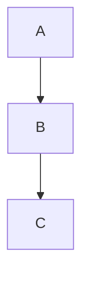

# Vega-Lite 主题回归文档

这份文档用于真实浏览器环境下的 Vega-Lite 主题切换回归测试。图表 chrome（坐标轴文字、网格、图例）从阅读器主题的 CSS 变量取色，切换浅色/深色主题时只重嵌入图表 SVG，外框与放大按钮的 DOM 身份保持不变；数据配色不由宿主覆盖，主题切换不应改变作者的色彩语义。

## 数值分类图

```vega-lite
{
  "data": {
    "values": [
      {"category": "A", "value": 28, "group": "one"},
      {"category": "B", "value": 55, "group": "one"},
      {"category": "C", "value": 43, "group": "two"},
      {"category": "D", "value": 91, "group": "two"}
    ]
  },
  "mark": "bar",
  "encoding": {
    "x": {"field": "category", "type": "nominal"},
    "y": {"field": "value", "type": "quantitative"},
    "color": {"field": "group", "type": "nominal"}
  }
}
```

这是图表之后的段落。图例文字颜色应随主题切换，而两个分组使用的 mark 颜色保持作者定义的语义。

## 与 Mermaid 共存



同一文档中的 Mermaid 图表与 Vega-Lite 图表应同时重绘，且互不影响。
