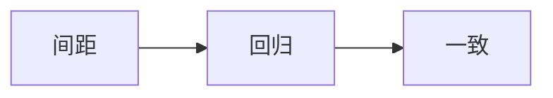

# 视觉内容间距回归文档

这份文档用于真实浏览器环境下的视觉内容垂直间距回归测试。正文按 段落 → 图片 → 段落 → Mermaid 图表 → 段落 → Vega-Lite 图表 → 段落 的顺序排列，三种视觉内容与前后正文的实际间距必须一致：独立图片段落与图表外框共用同一条外部间距契约（上下各 1rem，与相邻段落边距折叠后呈一致间隙），图片段落内的行盒不再产生额外的撑高。每一段正文都保持相近的行数，让像素级断言聚焦于视觉内容与正文的间隙本身。

这是第一段正文。图片、Mermaid 图表与 Vega-Lite 图表在正文里都是块级视觉元素：它们与上下正文的距离由外层块统一决定，内部图片或图表容器不再自行叠加外部间距。本段之后是独立图片段落。


这是图片之后的段落。独立图片段落与正文之间的上下间隙应当与图表一致：如果图片段落保留了段落行盒的行高撑高，或者图片外框自行叠加了不同的外边距，这里的断言会捕获到间隙的不一致。本段之后是 Mermaid 图表。



这是 Mermaid 图表之后的段落。图表外框与正文之间的间隙由外框统一承担，图表容器自身的边距为空，主题切换重绘图表时外框与间隙保持稳定。本段之后是 Vega-Lite 图表。

```vega-lite
{
  "$schema": "https://vega.github.io/schema/vega-lite/v5.json",
  "description": "间距回归用最小柱状图",
  "data": {
    "values": [
      {"类别": "甲", "数量": 28},
      {"类别": "乙", "数量": 55}
    ]
  },
  "mark": "bar",
  "encoding": {
    "x": {"field": "类别", "type": "nominal"},
    "y": {"field": "数量", "type": "quantitative"}
  }
}
```

这是 Vega-Lite 图表之后的段落。到这里三种视觉内容的上下间隙都已经过断言：图片、图表共用一条外部间距契约，任何一种视觉内容与正文间距的不一致都会被像素级比较捕获。

这是最后一个段落。文档到这里结束，最后一段之后不再有任何内容。
